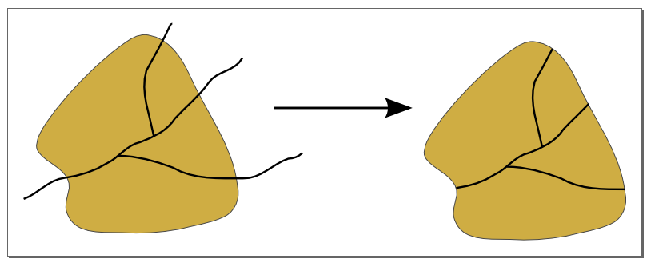
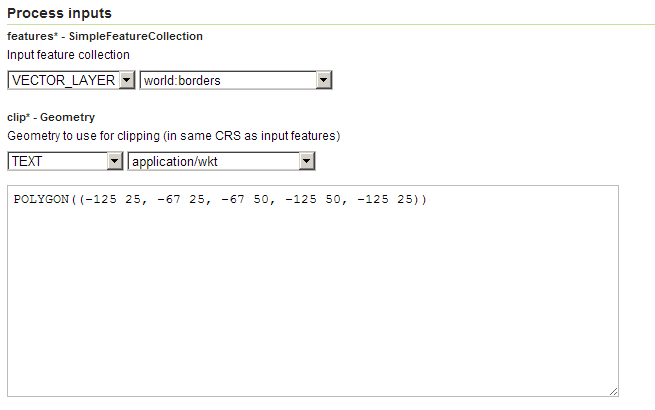
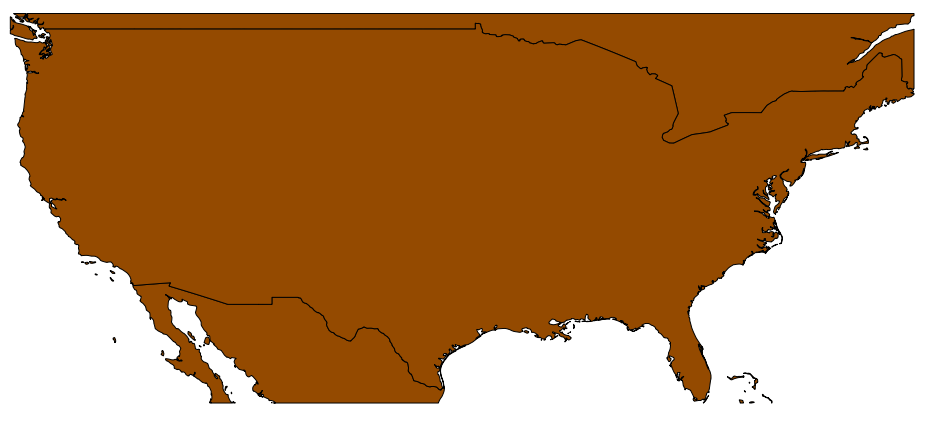
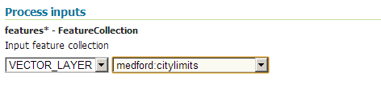
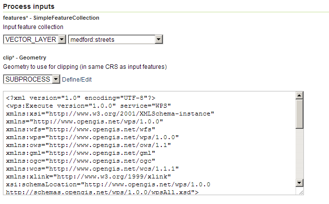
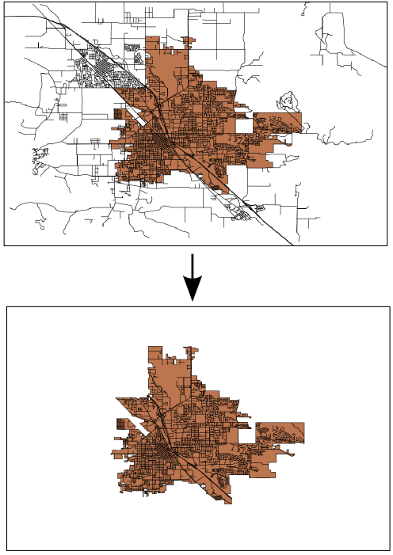

.. _processing.processes.vector.clip:

Clip
====

.. warning:: Document status: **Requires copyedit review (MP)**

Description
-----------

The ``gs:Clip`` process will clip a feature collection by a given geometry, typically a polygon or multipolygon. Attributes names and values are not affected by this process, and will be passed to the output feature collection without modification.

In the output, all features that partially intersect with the clipping geometry will return with their geometries cropped, while all features that do not intersect with the clipping geometry at all will be eliminated entirely.

   *gs:Clip*

Inputs and outputs
------------------

This process accepts both :ref:`processing.processes.formats.fcin` and :ref:`processing.processes.formats.geomin`, and returns :ref:`processing.processes.formats.fcout`.

Inputs
~~~~~~

.. list-table::
   :header-rows: 1

   * - Name
     - Description
     - Type
     - Usage
   * - ``features``
     - Input feature collection
     - :ref:`SimpleFeatureCollection <processing.processes.formats.fcin>`
     - Required
   * - ``clip``
     - Geometry to use for clipping (in same CRS as input features)  
     - Geometry
     - Required

Outputs
~~~~~~~

.. list-table::
   :header-rows: 1

   * - Name
     - Description
     - Type
   * - ``result``
     - Clipped feature collection
     - :ref:`SimpleFeatureCollection <processing.processes.formats.fcout>`

Usage notes
-----------

* The clipping geometry must be in the same :term:`CRS` as the feature collection.
* The clipping geometry may be a point or line, but this is uncommon.

Examples
--------

Clipping by rectangle
~~~~~~~~~~~~~~~~~~~~~

The following example clips the ``world:borders`` feature collection to an rectangle than just covers the continental part of the United States. The clipping geometry is manually entered as a WKT string.

Input parameters:
  
* ``features``: ``world:borders``
* ``clip``: ``POLYGON((-125 25, -67 25, -67 50, -125 50, -125 25))``

:download:`Download complete XML request <xml/clipexample2.xml>`

.. todo:: Swap file names of XML examples to match example number

   *gs:Clip example #1 parameters*

   *gs:Clip example #1 output*

Clipping by feature
~~~~~~~~~~~~~~~~~~~

The geometry used for the clipping operation can be obtained from another feature collection, instead of entered explicitly. The following example clips the feature collection ``medford:streets`` by the polygon contained in the feature collection ``medford:citylimits``. The result is a new feature collection with just those street sections within the city limits.

Since the ``gs:Clip`` process takes a ``Geometry`` object as input and not a feature collection, the ``gs:CollectGeometries`` process is used to create a single geometry from the ``medford:citylimits`` feature collection.

.. todo:: link to gs:CollectGeometries.

.. note:: This is an example of a "chained" process, where the output of a process is used as the input of another.

Input parameters for ``gs:CollectGeometries``:
  
* ``features``: ``medford:citylimits`` 

Input parameters for ``gs:Clip``:
  
* ``features``: ``medford:streets``
* ``clip``: output from ``gs:CollectGeometries`` process

:download:`Download complete chained XML request <xml/clipexample.xml>`

   *gs:Clip example #2 parameters (part 1)*

   *gs:Clip example #2 parameters (part 2)*

   *gs:Clip example output*

Related processes
-----------------

* The :ref:`gs:IntersectionFeatureCollecion <processing.processes.vector.intersectionfc>` process performs a similar operation on the input geometries, but the attributes of the result are not directly copied over. Instead, a list of attributes from each of the input layers is entered as a configuration parameter.
* As shown in the example above, to crop a feature collection using another feature collection instead of a geometry, use the ``gs:CollectGeometries`` process to create a ``GeometryCollection`` object from the feature collection, and then use it as a ``clip`` (geometry) input to this process.

