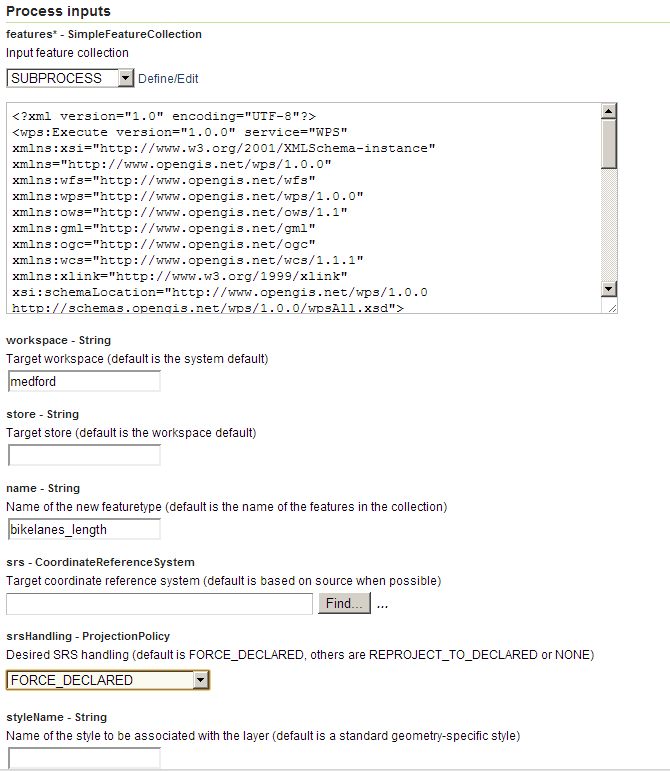
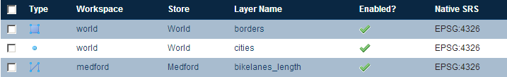

.. _processing.processes.vector.import:

Import
======

.. warning:: Document status: **Requires copyedit review (MP)**

Description
-----------

The ``gs:Import`` process takes a feature collection and adds it to the GeoServer catalog as a layer. The process acts as a simple data loader; the contents of the feature collection are unchanged.

.. todo:: Graphic needed.

Inputs and outputs
------------------

This process accepts :ref:`processing.processes.formats.fcin` and returns a string containing the fully qualified layer name (with workspace prefix) only.

Inputs
~~~~~~

.. list-table::
   :header-rows: 1

   * - Name
     - Description
     - Type
     - Usage
   * - ``features``
     - Input feature collection
     - :ref:`SimpleFeatureCollection <processing.processes.formats.fcin>`
     - Required
   * - ``workspace``
     - Target workspace (default is the system default)
     - String
     - Optional
   * - ``store``
     - Target store (default is the workspace default)
     - String
     - Optional
   * - ``name``
     - Name of the new featuretype (default is the name of the features in the collection)
     - String
     - Optional
   * - ``srs``
     - Target coordinate reference system (default is based on source when possible)
     - CoordinateReferenceSystem
     - Optional
   * - ``srsHandling``
     - Desired SRS handling (default is FORCE_DECLARED, others are REPROJECT_TO_DECLARED or NONE)
     - ProjectionPolicy
     - Optional
   * - ``styleName``
     - Name of the style to be associated with the layer (default is a standard geometry-specific style)
     - String
     - Optional

Outputs
~~~~~~~

.. list-table::
   :header-rows: 1

   * - Name
     - Description
     - Type
   * - ``layerName``
     - Name of the new layer, with workspace (``workspace:layer``)
     - String

Usage notes
-----------

* The desired workspace name, store name, :term:`CRS`, and CRS handling policy can all be used as input parameters, but if any of these are omitted, the server defaults will be used.
* The name of the resulting layer can also be specified, but if omitted it will be set to the name contained in the input feature collection.
* The name of an existing style on the server can be specified, but if omitted, a default style will be chosen based on the geometry type contained in the feature collection.

Examples
--------

Importing result of process output
~~~~~~~~~~~~~~~~~~~~~~~~~~~~~~~~~~

This process is useful for automatically incorporating results from other processes into the GeoServer catalog. The following example shows how the result of a transform operation (using the :ref:`gs:Transform <processing.processes.vector.transform>` process), is imported into GeoServer after it is computed.

.. note:: This is an example of a "chained" process, where the output of a process is used as the input of another.

Input parameters for ``gs:Transform``:

* ``features``: ``medford:bikelanes``   
* ``transform``: ``the_geom=the_geom; street_name=streetname; length = length(the_geom)`` 

Input parameters for ``gs:Import``:
  
* ``features``: output from ``gs:Transform``
* ``workspace``: ``medford``
* ``store``: [blank]
* ``name``: ``bikelanes_length``
* ``srs``: [blank]
* ``srsHandling``: ``FORCE_DECLARED``
* ``styleName``: [blank]

:download:`Download complete chained XML request <xml/importexample.xml>`

   *gs:Import example parameters*

The resulting feature collection is added to the corresponding datastore and published:

   *gs:Import example result*