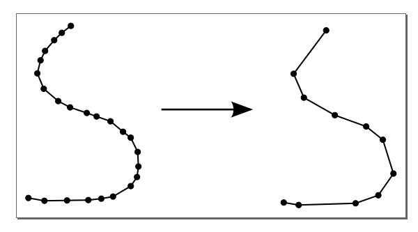
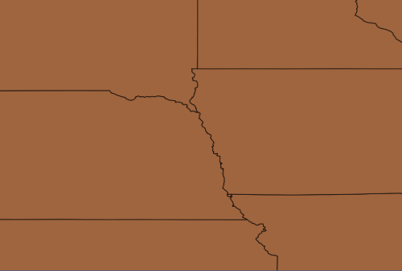
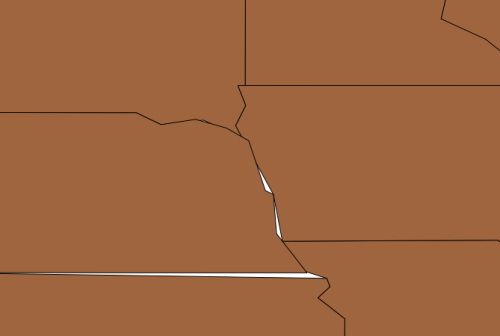
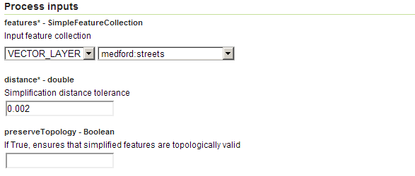
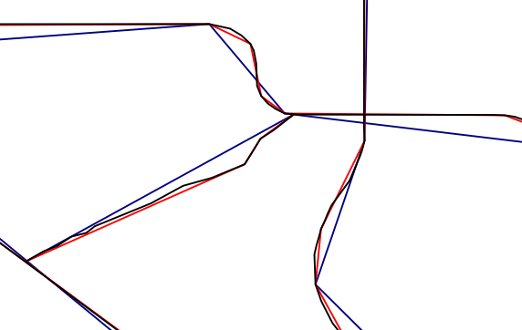

.. _processing.processes.vector.simplify:

Simplify
========

.. warning:: Document status: **Requires copyedit review (MP)**

Description
-----------

The ``gs:Simplify`` process takes a feature collection and reduces the number of vertices in each feature, thus simplifying the geometries.

The method used to do the simplification is known as the `Douglas-Peucker algorithm <http://en.wikipedia.org/wiki/Douglas-Peucker_algorithm>`_. It uses as input a distance value which determines how the geometries are to be simplified. For a given distance, all vertices in the simplified geometry will be within this distance of the original geometry. Therefore, higher values denote more intense simplification.

The output feature collection can be optionally set to preserve the topology of the features.

   *gs:Simplify*

Inputs and outputs
------------------

This process accepts :ref:`processing.processes.formats.fcin` and returns :ref:`processing.processes.formats.fcout`.

Inputs
~~~~~~

.. list-table::
   :header-rows: 1

   * - Name
     - Description
     - Type
     - Usage
   * - ``features``
     - Input feature collection
     - :ref:`SimpleFeatureCollection <processing.processes.formats.fcin>`
     - Required
   * - ``distance``
     - Simplification distance tolerance. Must be non-negative. 
     - double
     - Required
   * - ``preserveTopology``
     - If True, ensures that simplified features are topologically valid
     - Boolean
     - Optional

Outputs
~~~~~~~

.. list-table::
   :header-rows: 1

   * - Name
     - Description
     - Type
   * - ``result``
     - The simplified feature collection
     - :ref:`SimpleFeatureCollection <processing.processes.formats.fcout>`

Usage notes
-----------

* The distance value is assumed to be in the same units as the feature collection.
* This process can be applied to feature collections with linear and areal geometries. If the input feature collection contains points, the output feature collection will be identical to the input.
* If the ``preserveTopology`` parameter is set to True, the process ensures that each simplified geometry has the same dimension and number of components as the input geometry. In particular, if the input is an areal geometry: the result will have the same number of shells and holes (rings) as the input in the same order, and the resulting rings will touch at *no more* than the number of touching points in the input (they may touch at fewer points).
* When simplifying a layer of contiguous polygons, it is not guaranteed that they will remain contiguous after being simplified. Empty spaces between polygon edges may appear, or the polygons may overlap in places. This is seen in the image below, which shows a close up of the ``usa:states`` layer before and after being simplified.

   *Detail of usa:states layer prior to simplification*

   *Detail of usa:states layer following simplification*

Examples
--------

Simplifying street geometries
~~~~~~~~~~~~~~~~~~~~~~~~~~~~~

The following example shows the result of applying a simplification to the ``medford:streets`` feature collection, run with different distance values.

Input parameters:

* ``features``: ``medford:streets``
* ``distance``: ``0.002``

:download:`Download complete XML request <xml/simplifyexample.xml>`

   *gs:Simplify example parameters*

The following shows the output of the process on a detail of the feature collection. This image actually shows two different process outputs, each with a different value for ``distance``. In addition to the original features (in black) and the process output with a ``distance`` value of 0.002 (in red), there is also a second process output with a ``distance`` value of 0.005 (in blue).

   *gs:Simplify example output*

.. The following example show the differences between using the default simplyfing algorithm, with no topology preserving, and the alternative one that ensures that topology is preserved.

.. any ideas for this??

