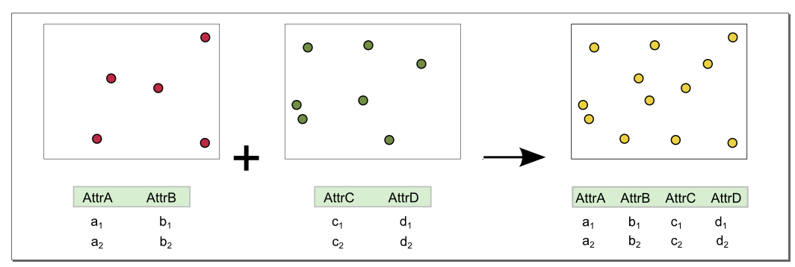

.. _processing.processes.vector.unionfc:

UnionFeatureCollection
======================

.. warning:: Document status: **Requires copyedit review (MP)**

Description
-----------

The ``gs:UnionFeatureCollection`` process works like a merge. It takes as input two feature collections and outputs a single feature collection, containing all features and attributes. This is useful for combining similar sets of features, such as layers that cover different geographic areas, but otherwise contain the same type of information.

The attributes list in the output will be a union of the input attributes. If one of the input features doesn't have a particular attribute present in the other input, the attribute value will be left blank.

If both feature collections have attributes with the same name, that will not result in two attributes with the same name in the output feature collection. Instead a single attribute with that name is added, and values taken from both input feature collections. If the types of attributes with the same name do not match, one attribute of type ``String`` with that name will be added to the output feature collection, and the string representation of values from the input feature collections will be used.

   *gs:UnionFeatureCollection*

Inputs and outputs
------------------

This process accepts :ref:`processing.processes.formats.fcin` and returns :ref:`processing.processes.formats.fcout`.

Inputs
~~~~~~

.. list-table::
   :header-rows: 1

   * - Name
     - Description
     - Type
     - Usage
   * - ``first feature collection``
     - First feature collection 
     - :ref:`SimpleFeatureCollection <processing.processes.formats.fcin>`
     - Required
   * - ``second feature collection``
     - Second feature collection
     - :ref:`SimpleFeatureCollection <processing.processes.formats.fcin>`
     - Required

Outputs
~~~~~~~

.. list-table::
   :header-rows: 1

   * - Name
     - Description
     - Type
   * - ``result``
     - Output feature collection
     - :ref:`SimpleFeatureCollection <processing.processes.formats.fcout>`

Usage notes
-----------

* While this process takes only two inputs, it is possible to chain this process together with itself in order to combine more than two feature collections.
* Both input feature collections must have the same default geometry.
* Make sure that the :term:`CRS` of each input feature collection are the same, as unexpected output may occur with data in mismatched coordinate systems.
* The :term:`CRS` of the first input feature collection is used for the output feature collection.
* Identical features in both input collections will both be preserved as individual features, and will not be combined.
* If two fields with the same name exist in both input feature collections, only one attribute with that name will be added to the output feature collection. If attributes with the same name have different types in each input feature collection, an attribute of type ``String`` will be added.

.. todo:: Example needed

Related processes
-----------------

* The :ref:`gs:IntersectionFeatureCollection <processing.processes.vector.intersectionfc>` process performs an intersection operation on two feature collections instead of a merge.

