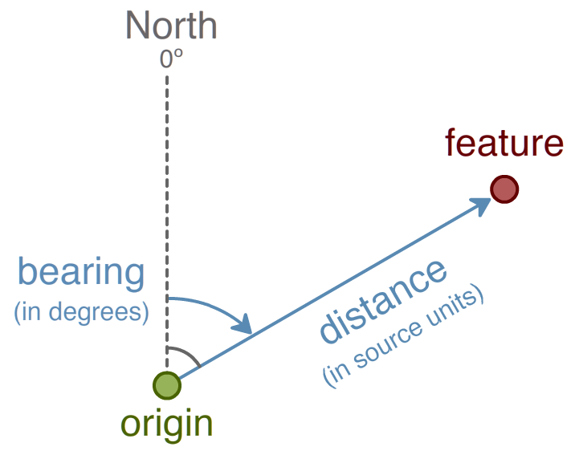

.. _processing.scripting.processcreate:

Creating a process with a script
================================

This tutorial will show how to create a script that creates a new :term:`WPS` process. As the scripting engine has bindings for both Python and JavaScript, examples from both languages will be shown here.

Process definition
------------------

This tutorial will create a process called **"Distance and Bearing"** with the following functionality: Given a feature collection and a single point, process will return a feature collection with the same number of elements as the source feature collection and with the same geometries, but with attributes containing the distance and bearing (angle of orientation) to the source point.

   *Distance and Bearing process*

Distance is measured in the source units. Bearing will be an `absolute bearing <http://en.wikipedia.org/wiki/Bearing_%28navigation%29>`_, in degrees measured from true north and increasing in the clockwise direction (so due east would be 90 degrees and due west would be -90 or 270 degrees).

While there is a distance function in both Python and JavaScript, the bearing will be calculated, measured from origin to point, according to the following:

.. figure:: img/processcreate_bearingequation.png

.. This is the LaTeX source for the equation:

   \text{Bearing} = 90^{\circ} - \arctan(\frac{y_{point} - y_{origin}}{x_{point} - x_{origin}})\times\frac{180^{\circ}}{\pi}

Authoring the script
--------------------

The complete scripts are below:

**Python** (:download:`download <distbear.py>`):

.. literalinclude:: distbear.py
   :language: python

**JavaScript** (:download:`download <distbear.js>`):

.. literalinclude:: distbear.js
   :language: javascript

Save as :file:`distbear.py` or :file:`distbear.js`, depending on the language used.

A description of the script functionality follows.

Process headers
~~~~~~~~~~~~~~~

The script requires a number of import statements, including access to the GeoServer catalog, geometry and feature types, and WPS process hooks:

**Python**

.. literalinclude:: distbear.py
   :language: python
   :lines: 1-5

**JavaScript**

.. literalinclude:: distbear.js
   :language: javascript
   :lines: 1-2

Process inputs and metadata
~~~~~~~~~~~~~~~~~~~~~~~~~~~

Next define the process inputs and metadata. Enclose all of these definitions in a process block:

**Python**

.. literalinclude:: distbear.py
   :language: python
   :lines: 7,6,17

**JavaScript**

.. literalinclude:: distbear.js
   :language: javascript
   :lines: 4,5,66

Add a title and description for better readability:

**Python**

.. literalinclude:: distbear.py
   :language: python
   :lines: 8-9

**JavaScript**

.. literalinclude:: distbear.js
   :language: javascript
   :lines: 6-7

The process has two inputs, as described above: a feature collection (``features``), and a point from which to compute distance and bearing (``origin``). Create the inputs list with these two definitions, along with a description:

**Python**

.. literalinclude:: distbear.py
   :language: python
   :lines: 10-13

**JavaScript**

.. literalinclude:: distbear.js
   :language: javascript
   :lines: 9-20

The single output will return a feature collection, and is defined similarly:

**Python**

.. literalinclude:: distbear.py
   :language: python
   :lines: 14-16

**JavaScript**

.. literalinclude:: distbear.js
   :language: javascript
   :lines: 22-28

Process computation
~~~~~~~~~~~~~~~~~~~

Now that our inputs and outputs are defined, create the computation through a function called ``run``. Define a layer container to hold the results of the computation (only necessary in the JavaScript example):

**JavaScript**

.. literalinclude:: distbear.js
   :language: javascript
   :lines: 34-41

Note that the schema for the layer will contain the identical point geometry as the source features, along with two attributes called ``distance`` and ``bearing``.

The computation iterates over each of the features in our feature collection. Define the calculation as follows:

**Python**

.. literalinclude:: distbear.py
   :language: python
   :lines: 20-25

**JavaScript**

.. literalinclude:: distbear.js
   :language: javascript
   :lines: 43-63

where:

* ``p``--Point geometry of the layer
* ``d``--Distance calculation from the ``origin``
* ``b``--Angle measure clockwise from true north between origin and point.

These three variables as a list are then returned.

Activating the script
---------------------

After the script is created, it must be added to GeoServer. Place the script in the GeoServer data directory in the location: :file:`<data_dir>/scripts/wps/`. (Create this path if it doesn't already exist.) The script will be activated automatically when copied to that location, with *no server restart necessary*.

.. todo:: You can also upload scripts through the REST API. Please see the section on processing.scripting.rest for more details.

Testing the script
------------------

Once the script is in place and activated, the next step is to test it. Use the WPS Request Builder in the GeoServer UI to verify this script's functionality.

#. Access the WPS Request Builder in the GeoServer UI by clicking on :guilabel:`Demos` then :guilabel:`WPS Request Builder`.

   .. figure:: img/demos.png

   .. figure:: img/requestbuilder.png

      *Accessing the WPS Request Builder*

#. Select the process in the menu. It will be named :file:`py:distbear` or :file:`js:distbear`, depending on the language used.

   .. figure:: img/processcreate_list.png

      *Scripts listed as WPS processes*

#. The following values will work for testing:

   Use the origin as our source point::

     POINT(0 0)

   Source features will consist of four points in the Cartesian plane::

     POINT(1 0)
     POINT(0 2)
     POINT(-1 1)
     POINT(6 3)

   Converting these features from WKT into JSON yields the following:

   .. code-block:: json

        {
          "type":"FeatureCollection",
          "features":[
            {
              "type":"Feature",
              "geometry":{
                "type":"Point",
                "coordinates":[
                  1,
                  0
                ]
              }
            },
            {
              "type":"Feature",
              "geometry":{
                "type":"Point",
                "coordinates":[
                  0,
                  2
                ]
              }
            },
            {
              "type":"Feature",
              "geometry":{
                "type":"Point",
                "coordinates":[
                  -1,
                  1
                ]
              }
            },
            {
              "type":"Feature",
              "geometry":{
                "type":"Point",
                "coordinates":[
                  6,
                  3
                ]
              }
            }
          ]
        }

#. Fill out the form. Enter the above JSON in the box named :guilabel:`features`, making sure to select :guilabel:`TEXT` and :guilabel:`application/json` as the source format.

   .. figure:: img/processcreate_features.png

      *Input features*

#. Then enter ``POINT(0 0)`` in the box named :guilabel:`origin`, making sure to select :guilabel:`TEXT` and :guilabel:`application/wkt` as the source format.

   .. figure:: img/processcreate_origin.png

      *Origin point*

#. Finally, select :guilabel:`application/json` as the output format under the :guilabel:`Process outputs` section.

   .. figure:: img/processcreate_result.png

      *Result format*

#. Click on :guilabel:`Execute process`.

   .. note:: If you are curious about what the actual process request looks like, click on :guilabel:`Generate XML from process inputs/outputs`.

#. The process will execute. The output will look something like this:

   .. code-block:: json

        {
          "type":"FeatureCollection",
          "features":[
            {
              "type":"Feature",
              "geometry":{
                "type":"Point",
                "coordinates":[
                  6,
                  3
                ]
              },
              "properties":{
                "distance":6.708203932499369,
                "bearing":63.43494882292201
              },
              "id":"fid--ad4a787_1394a31a374_-7bba"
            },
            {
              "type":"Feature",
              "geometry":{
                "type":"Point",
                "coordinates":[
                  -1,
                  1
                ]
              },
              "properties":{
                "distance":1.4142135623730951,
                "bearing":-45.0
              },
              "id":"fid--ad4a787_1394a31a374_-7bb8"
            },
            {
              "type":"Feature",
              "geometry":{
                "type":"Point",
                "coordinates":[
                  0.0,
                  2
                ]
              },
              "properties":{
                "distance":2.0,
                "bearing":0.0
              },
              "id":"fid--ad4a787_1394a31a374_-7bb6"
            },
            {
              "type":"Feature",
              "geometry":{
                "type":"Point",
                "coordinates":[
                  1,
                  0.0
                ]
              },
              "properties":{
                "distance":1.0,
                "bearing":90.0
              },
              "id":"fid--ad4a787_1394a31a374_-7bb4"
            }
          ]
        }

   Or, in a more compact representation:

   .. list-table::
      :widths: 10 10 40 40 
      :header-rows: 1

      * - X
        - Y
        - Distance
        - Bearing
      * - 1
        - 0
        - 1.0
        - 90.0
      * - 0
        - 2
        - 2.0
        - 0
      * - -1
        - 1
        - 1.41
        - -45.0
      * - 6
        - 3
        - 6.71
        - 63.43

   Graphically:

   .. figure:: img/processcreate_example.png

      *Distance and Bearing example*
