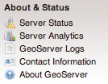
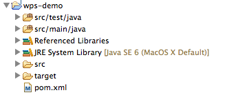
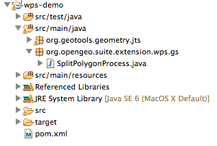
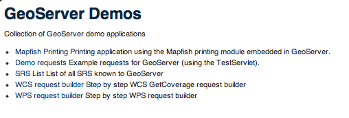
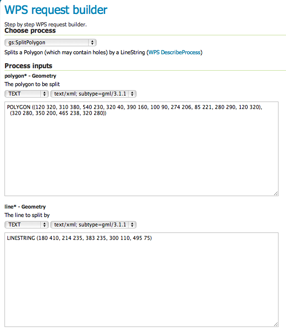

.. _processing.tutorials:

Creating WPS processes with Java
================================

Overview
--------

A WPS process is a Java class that provides an execute method. The execute method accepts parameters which correspond to the WPS parameters, and it returns a value which becomes the output of the process. 

The class must also provide metadata to specify things like the process name and description, and the names and descriptions of the process parameters.  

GeoTools provides a convenient framework for building process classes with a minimum of boilerplate code.  It uses Java annotations to specify the metadata.  It infers the types of process parameters and outputs via reflection, and it automatically handles the complex marshalling between XML representations and Java objects at runtime.

A WPS process is able to perform almost any kind of computation. GeoServer includes many useful libraries for geospatial processing, including the full set of GeoTools libraries.  The process can also use external Java libraries if required.  Of course, if an external library is used, it must be deployed along with the process JAR in the GeoServer instance.

A WPS process class is instantiated each time it is called, so the class can contain state (instance variables) if required.

To create a custom WPS process, you will need to create a new Java project, either with an IDE or from the command line. The rest of this tutorial assumes that you are using Maven as the build tool and Eclipse as the IDE, which is a very common combination in today's Java development environment.
Maven is used to build GeoTools and GeoServer, and is recommended for dependency management and project building. Eclipse is a very popular IDE, but others like Netbeans or IntelliJ IDEA work just as well (or for the brave, purely command-line Java tools can also be used).

Create Java Project
-------------------

We are going to use Maven to create the project for us. In order to do that, we can use the Maven Archetypes, a Maven project templating toolkit. A custom WPS process is packaged as a regular JAR file, so we don’t need any special configuration for this project. Just type the following on a console:

.. code-block:: console

   mvn archetype:generate

This will start the generation of your project, and write a valid POM file that describes this Maven project. We are using a simple project here, so you shouldn’t have to choose any special number from the list of available archetypes. You should however, fill out the project metadata as follows:

.. code-block:: console

   groupId: org.opengeo.suite.extension.wps
   artifactId: wps-demo
   version: 1.0-SNAPSHOT
   package: org.opengeo.suite.extension.wps.gs

.. note:: The rightmost part of the package name defines the namespace of the WPS process being created (gs in this case)

You should end up with a project named wps-demo, inside which you will be able to find the Maven POM file. Add the following dependencies to this file:

.. code-block:: xml

   <dependency>
      <groupId>org.geotools</groupId>
      <artifactId>gt-process</artifactId>
      <version>8-SNAPSHOT</version>
   </dependency>
   <dependency>
      <groupId>org.geotools</groupId>
      <artifactId>gt-geometry</artifactId>
      <version>8-SNAPSHOT</version>
    </dependency>

Make sure the GeoTools version is the same as the one used by your OpenGeo Suite. You can check the version of GeoServer and GeoTools by going to the About Geoserver section in the About & Status section of the GeoServer Web interface as seen below.

Your whole POM file should look like this:

.. code-block:: xml

 <project xmlns="http://maven.apache.org/POM/4.0.0" xmlns:xsi="http://www.w3.org/2001/XMLSchema-instance"
  xsi:schemaLocation="http://maven.apache.org/POM/4.0.0 http://maven.apache.org/xsd/maven-4.0.0.xsd">
  <modelVersion>4.0.0</modelVersion>

  <groupId>org.opengeo.suite.extension.wps</groupId>
  <artifactId>wps-demo</artifactId>
  <version>1.0-SNAPSHOT</version>
  <packaging>jar</packaging>

  <name>wps-demo</name>
  <url>http://maven.apache.org</url>

  <properties>
    <project.build.sourceEncoding>UTF-8</project.build.sourceEncoding>
  </properties>

  <dependencies>
    <dependency>
      <groupId>org.geotools</groupId>
      <artifactId>gt-process</artifactId>
      <version>8-SNAPSHOT</version>
    </dependency>
    <dependency>
      <groupId>org.geotools</groupId>
      <artifactId>gt-geometry</artifactId>
      <version>8-SNAPSHOT</version>
    </dependency>
    <dependency>
      <groupId>junit</groupId>
      <artifactId>junit</artifactId>
      <version>3.8.1</version>
      <scope>test</scope>
    </dependency>
  </dependencies>
  <repositories>
   <repository>
    <id>opengeo</id>
      <url>http://repo.opengeo.org</url>
   </repository>
  </repositories>
 </project>

Now that we have the project definition and dependencies set up, we can create the Eclipse project by going to the wps-demo directory and issuing the following command:

.. code-block:: console

  mvn eclipse:eclipse

This will create an Eclipse Java project that we can import into a workspace in order to start working on the code. The initial project structure should look like this:

Create custom WPS functionality
-------------------------------

The previous steps have created a package where we will implement our custom WPS functionality, ``org.opengeo.suite.extension.wps.gs``

First, we are going to create another package that will contain helper methods for our functionality, let's call it ``org.geotools.geometry.jts``. We will add a class called PolygonTools with the following code:

.. code-block:: java
  
  package org.geotools.geometry.jts;

  import java.util.ArrayList;
  import java.util.Collection;
  import java.util.List;

  import com.vividsolutions.jts.geom.Geometry;
  import com.vividsolutions.jts.geom.GeometryFactory;
  import com.vividsolutions.jts.geom.Polygon;
  import com.vividsolutions.jts.geom.util.LineStringExtracter;
  import com.vividsolutions.jts.operation.polygonize.Polygonizer;

  public class PolygonTools {

    public static Geometry polygonize(Geometry geometry) {
        List lines = LineStringExtracter.getLines(geometry);
        Polygonizer polygonizer = new Polygonizer();
        polygonizer.add(lines);
        Collection polys = polygonizer.getPolygons();
        Polygon[] polyArray = GeometryFactory.toPolygonArray(polys);
        return geometry.getFactory().createGeometryCollection(polyArray);
    }

    public static Geometry splitPolygon(Geometry poly, Geometry line) {
        Geometry nodedLinework = poly.getBoundary().union(line);
        Geometry polys = polygonize(nodedLinework);

        // Only keep polygons which are inside the input
        List output = new ArrayList();
        for (int i = 0; i < polys.getNumGeometries(); i++) {
            Polygon candpoly = (Polygon) polys.getGeometryN(i);
            if (poly.contains(candpoly.getInteriorPoint())) {
                output.add(candpoly);
            }
        }
        return poly.getFactory().createGeometryCollection(GeometryFactory.toGeometryArray(output));
    }
  }

As you can see, this class contains two methods to polygonize a set of Geometries and to split a polygon with a line. 

Now we can implement our WPS process, in order to do that create a class called SplitPolygonProcess that will have a method called execute, and add it to the org.geotools.process.geometry.gs, with the following code:

.. code-block:: java 

  package org.geotools.process.geometry.gs;

  import org.geotools.geometry.jts.PolygonTools;
  import org.geotools.process.factory.DescribeParameter;
  import org.geotools.process.factory.DescribeProcess;
  import org.geotools.process.factory.DescribeResult;
  import org.geotools.process.gs.GSProcess;

  import com.vividsolutions.jts.geom.Geometry;

  /**
   * Splits a Polygon (which may contain holes) by a LineString.
   *  
   */

  @DescribeProcess(title = "splitPolygon",
  		   description = "Splits a Polygon (which may contain holes) by a LineString")
  public class SplitPolygonProcess implements GSProcess {

    @DescribeResult(name = "result", description = "The collection of result polygons")
    public Geometry execute(
          @DescribeParameter(name = "polygon", description = "The polygon to be split") Geometry poly,
          @DescribeParameter(name = "line", description = "The line to split by") Geometry line)
          throws Exception {
        return PolygonTools.splitPolygon(poly, line);
    }
  }

The execute method takes two parameters of the Geometry type, the first one is a polygon to be split, the second one is the line that will split this polygon. As you can see, there is some metadata embedded with the source code by using Java annotations, which provide the metadata for the process to be described in the Capabilities document of the WPS service. Let’s describe each one of them briefly

* ``DescribeProcess``: gives the WPS process a name and a short description of what it does
* ``DescribeResult``: gives a short description of the expected outcome of executing this process
* ``DescribeParameter``: for each input parameter that the execute method accepts, this annotation provides the name that will be exposed in the Capabilities file, as well as a short description of what this parameter is

The execute method contains the logic of the WPS process, and will be called when the input request is parsed and sent to the WPS module. In this case, we are wrapping a simple method in an auxiliary class:

     ``PolytonTools.splitPolygon(poly, line);``

Configuration in GeoServer
--------------------------

The functionality is ready to be deployed, but GeoServer does not know how to start up these classes when they are required. GeoServer uses the Dependency Injection mechanisms present in the Spring Framework. This allows GeoServer to be a very modular and extensible application, while retaining a relatively lightweight “core” and only starting up the components that are going to be used. For the GeoServer startup component to pick up new Spring Beans, we need to configure their names and classes where their functionality resides. Add the following ``applicationContext.xml`` file in **src/main/resources** to achieve this:

.. code-block:: xml

  <?xml version="1.0" encoding="UTF-8"?>
  <!DOCTYPE beans PUBLIC "-//SPRING//DTD BEAN//EN" "http://www.springframework.org/dtd/spring-beans.dtd">
  <beans>
    <bean id="splitPolygon" class="org.opengeo.suite.extension.wps.gs.SplitPolygonProcess"/>
  </beans>

Your final project structure should look something like this:

Build, deploy and test
----------------------

In order to build your custom process, open a terminal at the root of your project and build it by issuing the following command:

.. code-block:: console
  
  mvn clean install

This will clean previous runs and compile your code, execute any unit tests that you might have created (which is highly recommended, by the way), and create a JAR file in the target directory. 

In order to use this new functionality, copy this JAR file inside the ``WEB-INF/lib`` folder of GeoServer. In a typical OpenGeo Suite installation this would be located at ``<install_dir>/suite/webapps/geoserver/WEB-INF/lib``. You must restart the Suite for the changes to take effect, once you have GeoServer running again you can check this new functionality by going to the Demos section and entering the WPS request builder, an utility that will allow us to test existing WPS processes that ship with the OpenGeo Suite out of the box, as well as custom processes developed and deployed to it. 

Once in the WPS request builder, select the split polygon process called ``gs:splitPolygon`` from the first dropdown. The WPS request builder will create the necessary UI to be able to test the process, depending on the parameters and expected outputs that are described in the capabilities of the corresponding WPS process. 

An example of a request using the WPS Request Builder with our custom Split Polygon WPS process is shown below, taking a polygon and a line as paramaters to the request

