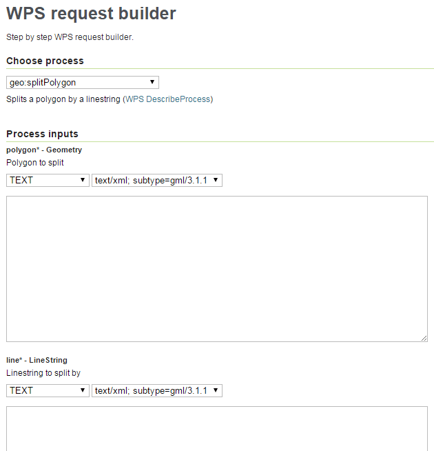

.. _processing.wpsclient

Working with WPS in OpenLayers
==============================

With the Web Processing Services (WPS) Client that is included in OpenLayers, it is easy to use server-side processes in browser based mapping application The most common use case is to perform geometry manipulations that are not
available in a browser environment with OpenLayers. The WPS Client also
supports process chaining, to perform complex operations without loading the
result of every step into the client and sending it back to the sever for the
next process.

This section describes how to consume the process created in the :ref:`processing.wpsjava` section to manipulate a client-side created geometry
in the browser, and how to perform more complex geometry operations by chaining
processes. We will be using the :ref:`Client SDK <apps.sdk.client.dev>` to create our examples.

Creating an OpenLayers.WPSClient Instance
-----------------------------------------

The starting point for interacting with WPS processes is an
OpenLayers.WPSClient. Upon instance creation, the servers that the client
should have access to are configured:

.. code-block:: javascript

    var wpsClient = new OpenLayers.WPSClient({
        servers: {
            local: '/geoserver/wps'
        }
    });

This snippet creates a WPSClient that knows about the local GeoServer instance, and configures that server with the defaults.

Using a Single Process to Manipulate Geometries
-----------------------------------------------

Let's say we have a polygon and want to split it along the line. Polygon and
line geometries could be programmatically created like this:

.. code-block:: javascript

    var polygon = OpenLayers.Geometry.fromWKT(
        'POLYGON(' +
            '(110 20,120 20,120 10,110 10,110 20),' +
            '(112 17,118 18,118 16,112 15,112 17)' +
        ')'
    );
    var line = OpenLayers.Geometry.fromWKT(
        'LINESTRING(117 22,112 18,118 13, 115 8)'
    );

The process we are going to use here is the one we created in the :ref:`processing.wpsjava` section. With our OpenLayers.WPSClient instance, we
can easily use this process in our web application:

.. code-block:: javascript

    wpsClient.execute({
        server: 'local',
        identifier: 'gs:SplitPolyon',
        inputs: {
            polygon: polygon,
            line: line
        },
        success: function(outputs) {
            for (var i=0, ii=outputs.result.length; i<ii; ++i) {
                alert(outputs.result[i].geometry.toString());
            }
        }
    });

This snippet executes the 'gs:SplitPolygon' process with the polygon and the
line as inputs. The keys of the ``inputs`` object have to match the input identifiers of the process.

Process execution is asynchronous. Behind the scenes, the WPSClient first
sends a DescribeProcess request to the server, so the process knows the
available inputs and outputs and the supported formats. With this information,
the process can create the correct configuration for the Execute request. Once
the response from that request is available, the callback function we
configured with the ``success`` option will be executed. Outputs for spatial
processes are always an array of ``OpenLayers.Feature.Vector`` instances. In
the above snippet, we just open alert boxes that show the WKT representation
of the resulting split geometries.

Chaining Processes for Complex Operations
-----------------------------------------

Calling the ``execute`` method of the WPSClient is useful for operation that do
not require chaining of multiple processes. Now let's see how we can perform a
more complex operation on the polygon and line geometries we created above: we want to intersect them, and then create buffers around the resulting
intersection lines. On a map, the result (including the source geometries)
would look like this:

.. figure:: img/intersect-buffer.png

In a scenario like this, ``execute`` only needs to be called on the last
process in the processing chain. The other processes are configured separately,
and their output is assigned as input to another process. Now instead of
calling ``execute`` directly from the WPSClient, let's get WPSProcess instances
of the processes we need from the WPSClient:

.. code-block:: javascript

    var intersection = wpsClient.getProcess('local', 'JTS:intersection');
    var buffer = wpsClient.getProcess('local', 'JTS:buffer');

The buffer process will be the last process in our chain, so let's first
configure the ``intersection`` process:

.. code-block:: javascript

    intersection.configure({
        inputs: {
            a: polygon,
            b: line
        }
    });

How do we know the input identifiers (`a` and `b`) of this process? We can
easily look them up in the WPS Request Builder (found under 'Demos') of our
local GeoServer instance:

We want to use the result of the intersection process as input for the buffer
process. So let's configure and execute the buffer process to see how this
works:

.. code-block:: javascript

    buffer.execute({
        inputs: {
            geom: intersection.output(),
            distance: 1
        },
        success: function(outputs) {
            for (var i=0, ii=outputs.result.length; i<ii; ++i) {
                alert(outputs.result[i].geometry.toString());
            }
        }
    });

The intersection process has an ``output`` method which we use to get a handle
that we can pass as input to the buffer process. That's all we need to chain
processes. The rest of the snippet is equivalent to the configuration for the
'gs:SplitPolygon' process above.

Putting it All Together in an Interactive Application
-----------------------------------------------------

Using the :ref:`Client SDK <apps.sdk.client.dev>`, we can easily create a small
demo application that allows us to interactively draw geometries and apply our
SplitPolygon and Intersect+Buffer processes to them. We will create a minimal
``app.js`` file and a custom ``app_wpsdemo`` plugin in its own ``WPSDemo.js``
file. First let's have a look at ``app.js``:

.. code-block:: javascript

    /**
     * @require OpenLayers/Layer/Vector.js
     * @require OpenLayers/Renderer/Canvas.js
     * @require OpenLayers/Renderer/VML.js
     * @require GeoExt/widgets/ZoomSlider.js
     * @require widgets/Viewer.js
     * @require plugins/OLSource.js
     * @require plugins/OSMSource.js
     * @require WPSDemo.js
     */

    var app = new gxp.Viewer({
        // Our custom plugin that provides drawing and processing actions
        tools: [{ ptype: "app_wpsdemo" }],
        sources: {
            osm: { ptype: "gxp_osmsource" },
            ol: { ptype: "gxp_olsource" }
        },
        map: {
            projection: "EPSG:3857",
            center: [-10764594.758211, 4523072.3184791],
            zoom: 3,
            layers: [{
                source: "osm",
                name: "mapnik",
                group: "background"
            }, {
                // A vector layer to display our geometries and processing results
                source: "ol",
                name: "sketch",
                type: "OpenLayers.Layer.Vector"
            }],
            items: [{
                xtype: "gx_zoomslider",
                vertical: true,
                height: 100
            }]
        }
    });

This is a very minimal application. The things to note are the dependencies,
the 'app_wpsdemo' plugin, and the vector layer we create from the 'ol' source.
For the vector layer, we need renderers (``OpenLayers/Renderer/Canvas.js`` and ``OpenLayers/Renderer/VML.js`` in addition to ``OpenLayers/Layer/Vector.js``.
We also need to include our ``WPSDemo.js`` file, which needs to be created in
the same folder as ``app.js``. This is the content of ``WPSDemo.js``:

.. code-block:: javascript

    /**
     * @require plugins/Tool.js
     * @require GeoExt/widgets/Action.js
     * @require OpenLayers/Control/DrawFeature.js
     * @require OpenLayers/Control/DragFeature.js
     * @require OpenLayers/Handler/Polygon.js
     * @require OpenLayers/Handler/Path.js
     * @require OpenLayers/WPSClient.js
     */

    var WPSDemo = Ext.extend(gxp.plugins.Tool, {
    
        ptype: 'app_wpsdemo',
        
        /** Initialization of the plugin */
        init: function(target) {
            WPSDemo.superclass.init.apply(this, arguments);

            // Create a WPSClient instance for use with the local GeoServer
            this.wpsClient = new OpenLayers.WPSClient({
                servers: {
                    local: '/geoserver/wps'
                }
            });
        
            // Add action buttons when the viewer is ready
            target.on('ready', function() {
                // Get a reference to the vector layer from app.js
                this.layer = target.getLayerRecordFromMap({
                    name: 'sketch',
                    source: 'ol'
                }).getLayer();
                // Some defaults
                var actionDefaults = {
                    map: target.mapPanel.map,
                    enableToggle: true,
                    toggleGroup: this.ptype,
                    allowDepress: true
                };
                this.addActions([
                    // Action for drawing new geometreis
                    new GeoExt.Action(Ext.apply({
                        text: 'Draw',
                        control: new OpenLayers.Control.DrawFeature(
                            this.layer, OpenLayers.Handler.Polygon
                        )
                    }, actionDefaults)),
                    // Action for dragging existing geometries
                    new GeoExt.Action(Ext.apply({
                        text: 'Drag',
                        control: new OpenLayers.Control.DragFeature(this.layer)
                    }, actionDefaults)),
                    // Action for splitting by drawing a line
                    new GeoExt.Action(Ext.apply({
                        text: 'Split',
                        control: new OpenLayers.Control.DrawFeature(
                            this.layer, OpenLayers.Handler.Path, {
                            eventListeners: {
                                featureadded: this.split,
                                scope: this
                            }
                        })
                    }, actionDefaults)),
                    // Action for intersection+buffer by drawing a line
                    new GeoExt.Action(Ext.apply({
                        text: 'Intersect+Buffer',
                        control: new OpenLayers.Control.DrawFeature(
                            this.layer,OpenLayers.Handler.Path, {
                            eventListeners: {
                                featureadded: this.intersectBuffer,
                                scope: this
                            }
                        })
                    }, actionDefaults))
                ]);
            }, this);
        },
    
        /** Handler function for splitting geometries */
        split: function(evt) {
            var line = evt.feature;
            var poly;
            for (var i=this.layer.features.length-1; i>=0; --i) {
                poly = this.layer.features[i];
                if (poly !== line && poly.geometry.intersects(line.geometry)) {
                    this.wpsClient.execute({
                        server: 'local',
                        process: 'gs:SplitPolygon',
                        inputs: { polygon: poly, line: line },
                        success: this.addResult,
                        scope: this
                    });
                    this.layer.removeFeatures([poly]);
                }
            }
            this.layer.removeFeatures([line]);
        },
    
        /** Handler function for intersection+buffer */
        intersectBuffer: function(evt) {
            var line = evt.feature;
            var poly;
            for (var i=this.layer.features.length-1; i>=0; --i) {
                poly = this.layer.features[i];
                if (poly !== line && poly.geometry.intersects(line.geometry)) {
                    this.wpsClient.execute({
                        server: 'local',
                        process: 'JTS:buffer',
                        inputs: {
                            distance:
                                // buffer distance is 10 pixels
                                10 * this.target.mapPanel.map.getResolution(),
                            geom:
                                this.wpsClient.getProcess(
                                    'local', 'JTS:intersection'
                                ).configure({
                                    inputs: { a: line, b: poly }
                                }).output()
                        },
                        success: this.addResult,
                        scope: this
                    });
                }
            }
            this.layer.removeFeatures([line]);
        },
    
        /** Helper function for adding process results to the vector layer */
        addResult: function(outputs) {
            this.layer.addFeatures(outputs.result);
        }
    
    });

    Ext.preg(WPSDemo.prototype.ptype, WPSDemo);

This plugin creates four action buttons in the ``init`` method: Actions for
drawing, dragging and processing ('Split' and 'Intersect+Buffer'). Both
splitting and intersection+buffer is performed when the user has finished
drawing a line. The ``split`` and ``intersectBuffer`` methods are responsible
for configuring and executing the required processes, and the ``addResult``
method adds the resulting geometries to a map.

After drawing two polygons, splitting them, dragging them around a bit, and
then doing two 'Intersect+Buffer' operation, our map could look like this:

.. figure:: img/wpsdemo.png
