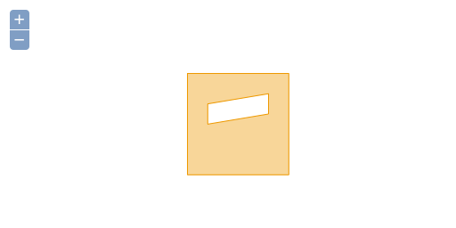
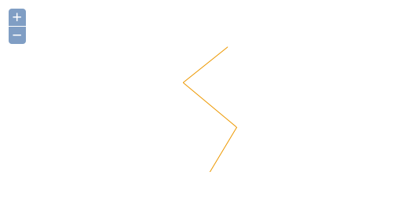
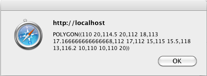
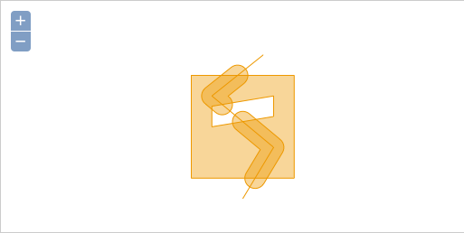
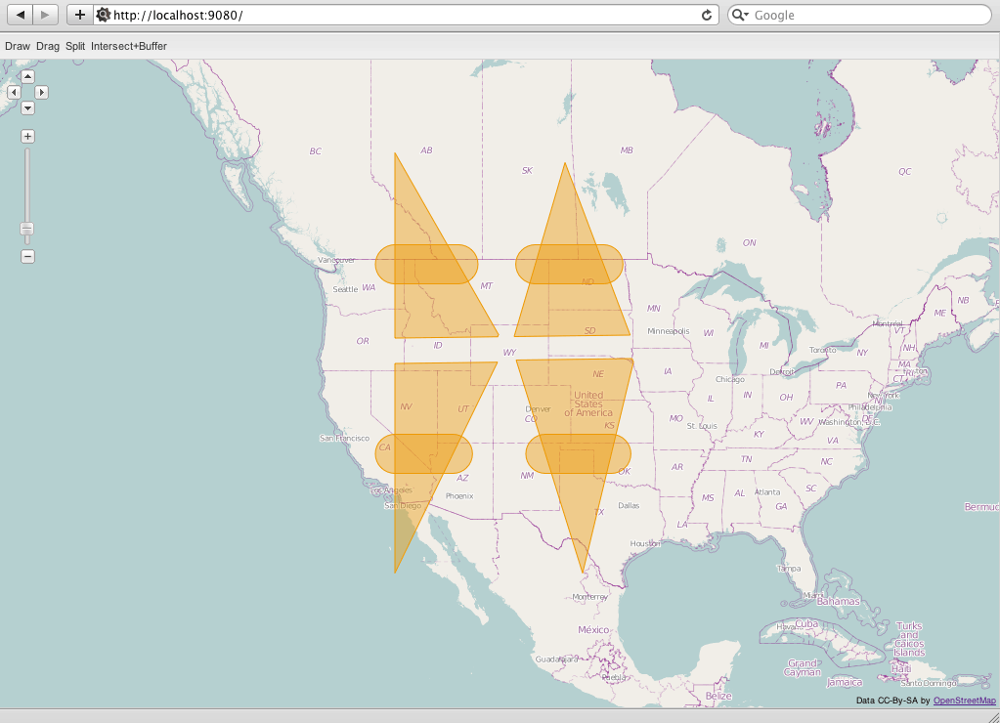

.. _processing.wpsclient:

Using WPS with OpenLayers and the Boundless SDK
===============================================

OpenLayers includes a Web Processing Service (WPS) client. With this client you can employ server processes in browser-based mapping applications. For example, you could perform certain geometry manipulations on the server that are not available in a browser environment. The WPS client also supports process chaining, which allows the server to perform more complex operations without the need to return the result to the client at each intermediate step.

This tutorial will describe how to use a WPS process to manipulate a locally-created geometry in the browser, first using OpenLayers, and then by creating an interactive application using the :ref:`Boundless SDK <webapps.sdk>`.

Creating an OpenLayers.WPSClient instance
-----------------------------------------

The starting point for interacting with WPS processes is an ``OpenLayers.WPSClient`` instance. Upon creation, the servers that the client should have access to are configured:

.. code-block:: javascript

    var wpsClient = new OpenLayers.WPSClient({
        servers: {
            local: '/geoserver/wps'
        }
    });

This code block creates a ``OpenLayers.WPSClient`` instance that points to the local GeoServer. This instance is configured with the server defaults.

Using a single process to manipulate geometries
-----------------------------------------------

Suppose you have a polygon::

    POLYGON((110 20,120 20,120 10,110 10,110 20),
            (112 17,118 18,118 16,112 15,112 17))

   *Sample polygon*

and you want to split it along this line::

    LINESTRING(117 22,112 18,118 13, 115 8)

   *Sample line for splitting*

These geometries can be programmatically created in OpenLayers using ``OpenLayers.Geometry.fromWKT``:

.. code-block:: javascript

    var mypolygon = OpenLayers.Geometry.fromWKT(
        'POLYGON(' +
            '(110 20,120 20,120 10,110 10,110 20),' +
            '(112 17,118 18,118 16,112 15,112 17)' +
        ')'
    );
    var myline = OpenLayers.Geometry.fromWKT(
        'LINESTRING(117 22,112 18,118 13, 115 8)'
    );

The specific process we are going to employ here is the ``JTS:splitPolygon`` process. This takes a polygon and line as inputs, and returns a geometry collection consisting of polygons that are created through bisecting the polygon with the line. With the ``OpenLayers.WPSClient`` instance, you can use this process in a web application. The following code block executes the ``JTS:splitPolygon`` process with the polygon and line geometries as inputs.

.. code-block:: javascript

    wpsClient.execute({
        server: 'local',
        process: 'JTS:splitPolygon',
        inputs: {
            polygon: mypolygon,
            line: myline
        },
        success: function(outputs) {
            for (var i=0, ii=outputs.result.length; i<ii; ++i) {
                alert(outputs.result[i].geometry.toString());
            }
        }
    });

Process execution is asynchronous. Behind the scenes, the ``WPSClient`` first sends a WPS DescribeProcess request to the server, so the process knows the available inputs and outputs as well as the supported formats. With this information, the process can build the correct configuration for the actual WPS Execute request, which then follows. Once the response from that Execute request is available, the callback function configured with the ``success`` option (``outputs``) will be executed.

Outputs for spatial processes are always an array of ``OpenLayers.Feature.Vector`` instances.

The final ``success`` function opens alert boxes that display the Well Known Text representation of the two resulting split geometries.

    *WKT representation of one of the result geometries*   

.. _processing.wpsclient.identifiers:

Determining process input identifiers
~~~~~~~~~~~~~~~~~~~~~~~~~~~~~~~~~~~~~

The names of the ``inputs`` must match the input identifiers of the process. In this case, the input identifiers for the ``JTS:splitPolygon`` process are named ``polygon`` and ``line``. There are two ways to find this information.

#. It is simplest to look up the input identifiers in the WPS Request Builder of the GeoServer instance. The WPS Request Builder can be found in the :guilabel:`Demos` section of the UI.

   .. figure:: img/requestbuilder.png

      *WPS Request Builder in GeoServer*

#. You can find the input identifiers manually by running a DescribeProcess request and noting the ``<ows:Identifier>`` for each ``<Input>``. For example::

      http://GEOSERVER_HOME/ows?service=wps&version=1.0.0&request=DescribeProcess&Identifier=JTS:splitPolygon

   This would return:

   .. code-block:: xml

      <ProcessDescription>
          ...
          <DataInputs>
              <Input maxOccurs="1" minOccurs="1">
                  <ows:Identifier>polygon</ows:Identifier>
                  ...
              </Input>
              <Input maxOccurs="1" minOccurs="1">
                  <ows:Identifier>line</ows:Identifier>
                  ...
              </Input>
          </DataInputs>
          ...
      </ProcessDescription>

Chaining processes for more complex operations
----------------------------------------------

Chaining processes involves taking the output of one process and routing it to the input of another. In this case, the ``execute`` method of the ``WPSClient`` only needs to be called on the final process in the processing chain, while the other processes are configured separately.

An example that uses chaining involves determining the intersection of polygon and line geometries and then creating buffers around the resulting intersection lines. On a map, the result (including the source geometries) would look like this:

   *Result of intersection/buffer processes*

Instead of calling ``execute`` directly from the ``WPSClient`` as in the previous section, we will get instances of the processes we need:

.. code-block:: javascript

    var intersection = wpsClient.getProcess('local', 'JTS:intersection');
    var buffer = wpsClient.getProcess('local', 'JTS:buffer');

The ``JTS:intersection`` process is the first process in the chain, so configure it first:

.. code-block:: javascript

    intersection.configure({
        inputs: {
            a: mypolygon,
            b: myline
        }
    });

.. note:: We are using the same WKT geometries (``mypolygon``, ``myline``) as defined in the previous section. Also, see the note on :ref:`processing.wpsclient.identifiers` to see where the ``a`` and ``b`` identifiers are determined.

With the intersection function defined, let's configure and execute the buffer process with the output of the intersection process as its input:

.. code-block:: javascript

    buffer.execute({
        inputs: {
            geom: intersection.output(),
            distance: 1
        },
        success: function(outputs) {
            for (var i=0, ii=outputs.result.length; i<ii; ++i) {
                alert(outputs.result[i].geometry.toString());
            }
        }
    });

The intersection process has an ``output`` method which we use to get a handle that we can pass as input to the buffer process. The rest of the code block is equivalent to the configuration for the ``JTS:splitPolygon`` example above.

Processes with multiple outputs
-------------------------------

Processes can have multiple inputs, but they can also have multiple outputs. When chaining a process output to an input, the ``output`` method can be called with an output identifier as argument.

In the same way, a configuration object for the ``execute`` method can take an optional ``output`` property. This will be available as a property in the outputs argument that is passed to the ``success`` callback. If omitted, the first output advertised in the DescribeProcess output will be available as ``outputs.result``, as was seen in the previous example.

.. note:: Outputs, like inputs, have identifiers that can be looked up through a DescribeProcess request or through the GeoServer WPS Request Builder. See :ref:`processing.wpsclient.identifiers` for more information.

The following code block shows how the intersection/buffer example in the previous section could be modified in order to accept multiple outputs.

.. code-block:: javascript

    buffer.execute({
        inputs: {
            // chain the 'result' output to the 'geom' input
            geom: intersection.output('result'),
            distance: 1
        },
        // make the 'result' output available in 'outputs'
        output: 'result',
        success: function(outputs) {
            for (var i=0, ii=outputs['result']length; i<ii; ++i) {
                alert(outputs['result'][i].geometry.toString());
            }
        }
    });

In this case, the ``JTS:buffer`` process doesn't produce multiple outputs, but it is trivial to replace this process in your code with one that does.

Building an interactive application
-----------------------------------

Using the :ref:`Boundless SDK <webapps.sdk>`, you can create a lightweight demo application that allows the user to draw geometries and execute the SplitPolygon and Intersection/Buffer processes as created above.

To create our custom application, we must first create a minimal :file:`app.js` file and a custom ``app_wpsdemo`` plugin in its own :file:`WPSDemo.js` file. These files will then be copied into a template application.

app.js
~~~~~~

The :file:`app.js` file is below (:download:`Download <script/app.js>`). Replace the existing :file:`app.js` file (found at :file:`<sdk_app>/src/app/app.js`) with this one:

.. literalinclude:: script/app.js
   :language: javascript

The important aspects of this minimal application are the dependencies, the ``app_wpsdemo`` plugin, and the vector layer created from the ``ol`` source. For the vector layer, we require renderers in addition to ``OpenLayers/Layer/Vector.js``:

* ``OpenLayers/Renderer/Canvas.js``
* ``OpenLayers/Renderer/VML.js``

Both renderers are used here for better compatibility. The Canvas renderer works for all modern desktop and mobile browsers, while VML works for Internet Explorer 8 and older. It is the application developer's decision for which platforms should be supported.

WPSDemo.js
~~~~~~~~~~

The :file:`WPSDemo.js` file is below (:download:`Download <script/WPSDemo.js>`). This file should be saved in the same directory as :file:`app.js` (:file:`<sdk_app>/src/app/WPSDemo.js`):

.. literalinclude:: script/WPSDemo.js
   :language: javascript

This script creates four action buttons in the ``init`` method:

* Draw
* Drag
* Split process
* Intersection+Buffer process

Both processes are executed when the user finishes drawing a line. The ``split`` and ``intersectBuffer`` methods are responsible for configuring and executing the required processes, and the ``addResult`` method adds the resulting geometries to a map.

Results
~~~~~~~

After these files have been created and placed in the proper directory, the application can be tested.

.. note:: Please see the :ref:`webapps.sdk.debug` section for more information on launching this application.

After drawing two polygons, splitting them, dragging them around a bit, and then executing two different Intersection/Buffer processes, our map could look like this:

   *Sample map showing process output*

