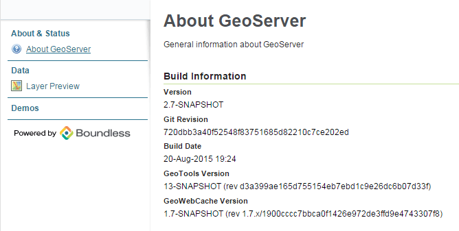
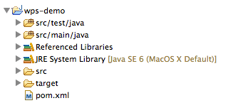
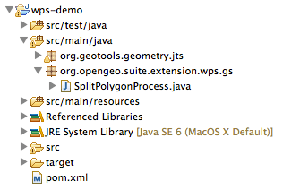
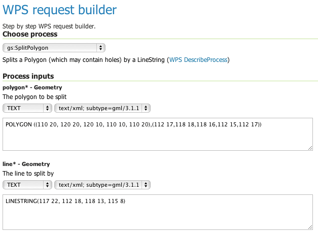
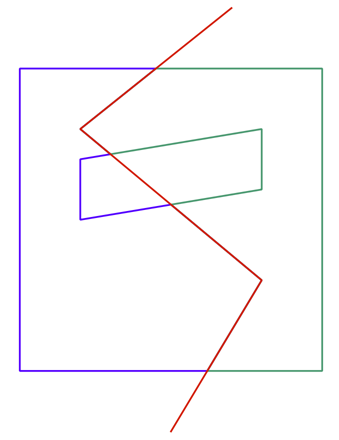

.. _processing.wpsjava:

Creating WPS processes with Java
================================

Web Processing Service (WPS) processes are able to perform almost any kind of computation.  
The OpenGeo Suite supplies many useful WPS processes built in to GeoServer.
For even more capability, GeoServer can be extended by adding new WPS processes.  
This section describes creating a custom WPS process in Java and how to deploy and run it in GeoServer.

Overview
--------

A WPS process is simply a **Java class** that provides an ``execute`` method. 
The ``execute`` method accepts parameters which correspond to the WPS parameters, and it returns a value which becomes the output of the process.  
The class also provides metadata to specify the names and descriptions of the process and its parameters.  

.. todo:: An diagram of this would be excellent.  

The GeoTools library used by GeoServer provides a convenient framework for building process classes with a minimum of boilerplate code.  
The GeoTools **Process API** has the following features:

* allows using Java annotations to specify the metadata
* infers the types of process parameters and outputs via reflection
* handles conversion between XML representations and Java objects
* handles reporting any exceptions thrown by a process

GeoServer includes many powerful libraries that can be leveraged in a process.  
A process can also use external Java libraries, but in that case the external libraries need to be deployed along with the process.

To create a custom WPS process, you will need to create a new Java project, either with an `IDE <http://en.wikipedia.org/wiki/Integrated_development_environment>`_ or using command-line tools. 
This tutorial shows the use of the popular `Eclipse <http://www.eclipse.org>`_ IDE.  
Other IDEs such as `Netbeans <http://www.netbeans.org>`_ or `IntelliJ IDEA <http://www.jetbrains.com/idea/>`_ can be used as well.
In addition, `Maven <http://maven.apache.org>`_ will be used to build the project and manage its dependencies.  

About the process
-----------------

We will create a process called ``gs:splitPolygon`` in a project called ``wps-demo``.  
This process splits a polygon geometry by a line crossing it.  
The inputs are the polygon to split, and the line to split by.
The output is the geometry representing the collection of polygons resulting from the split.

Create the Java project
-----------------------

We'll use Maven to create the Java project for the process.  
To do that we use the `Maven Archetype plugin <http://maven.apache.org/archetype/maven-archetype-plugin/>`_, a project templating tool. 
Since a custom WPS process is packaged as a regular JAR file the standard archetype can be used for this project.  
It will generate the project directory structure, a Maven POM file describing the project, and some useful Java artifacts.  
Enter the following in a console:

.. code-block:: console

   mvn archetype:generate -DarchetypeArtifactId='maven-archetype-quickstart' -DarchetypeVersion=1.1 -DgroupId=org.example.wps -DartifactId=wps-demo -Dversion=1.0 -DinteractiveMode=false

This command instructs Maven to generate a project using the following information:

* The Maven groupId and the project's Java package are named ``org.example.wps``
* The name of the project is ``wps-demo``
* The version for the project build artifacts is ``1.0``

You should end up with a project directory named ``wps-demo`` with the POM file :file:`pom.xml` inside it. 
Add the following GeoTools library dependencies to this file:

.. code-block:: xml

   <dependency>
      <groupId>org.geotools</groupId>
      <artifactId>gt-process</artifactId>
      <version>8-SNAPSHOT</version>
   </dependency>
   <dependency>
      <groupId>org.geotools</groupId>
      <artifactId>gt-geometry</artifactId>
      <version>8-SNAPSHOT</version>
    </dependency>

Please ensure that the GeoTools version matches the one used by the OpenGeo Suite being deployed into. 
You can check the version of GeoTools by clicking on the :guilabel:`About Geoserver` section at the bottom of the :guilabel:`About & Status` section of the `GeoServer Web Admin Interface <../../geoserver/webadmin/>`_.

.. todo:: Replace this image with an image of version 3.0 showing GeoTools 8

   *GeoServer showing GeoTools version*

You also need to add a reference to the OpenGeo Maven repository to provide access to the required libraries.

.. code-block:: xml

  <repositories>
   <repository>
    <id>opengeo</id>
      <url>http://repo.opengeo.org</url>
   </repository>
  </repositories>

Maven also needs to be directed to use the Java 1.5 compiler by adding the following:

.. code-block:: xml

  <build>
    <plugins>
      <plugin>
        <artifactId>maven-compiler-plugin</artifactId>
        <configuration>
          <source>1.5</source>
          <target>1.5</target>
        </configuration>
      </plugin>
    </plugins>
  </build>

The final POM file should look like this:

.. code-block:: xml

 <project xmlns="http://maven.apache.org/POM/4.0.0" xmlns:xsi="http://www.w3.org/2001/XMLSchema-instance"
  xsi:schemaLocation="http://maven.apache.org/POM/4.0.0 http://maven.apache.org/xsd/maven-4.0.0.xsd">
  <modelVersion>4.0.0</modelVersion>

  <groupId>org.example.wps</groupId>
  <artifactId>wps-demo</artifactId>
  <version>1.0-SNAPSHOT</version>
  <packaging>jar</packaging>

  <name>wps-demo</name>
  <url>http://maven.apache.org</url>

  <properties>
    <project.build.sourceEncoding>UTF-8</project.build.sourceEncoding>
  </properties>

  <dependencies>
    <dependency>
      <groupId>org.geotools</groupId>
      <artifactId>gt-process</artifactId>
      <version>8-SNAPSHOT</version>
    </dependency>
    <dependency>
      <groupId>org.geotools</groupId>
      <artifactId>gt-geometry</artifactId>
      <version>8-SNAPSHOT</version>
    </dependency>
    <dependency>
      <groupId>junit</groupId>
      <artifactId>junit</artifactId>
      <version>3.8.1</version>
      <scope>test</scope>
    </dependency>
  </dependencies>
  
  <repositories>
   <repository>
    <id>opengeo</id>
      <url>http://repo.opengeo.org</url>
   </repository>
  </repositories>
  
  <build>
    <plugins>
      <plugin>
        <artifactId>maven-compiler-plugin</artifactId>
        <configuration>
          <source>1.5</source>
          <target>1.5</target>
        </configuration>
      </plugin>
    </plugins>
  </build>
  
 </project>

With the project definition and dependencies set up, we can create the Eclipse project by going into the :file:`wps-demo` directory and issuing the following command:

.. code-block:: console

   mvn eclipse:eclipse

This creates a Java project that we can import into an Eclipse workspace in order to start working on the code. The project structure should look like this:

   *Eclipse project structure*

Implement process functionality
-------------------------------

The previous steps created a Java package ``org.example.wps`` in which to implement the custom WPS functionality.  
We first define an auxiliary class to contain the spatial processing code.  
Create a class called ``PolygonTools``.  This class contains two methods: one to polygonize a set of Geometries (``polygonize(Geometry geometry)``) and one to split a polygon with a line (``splitPolygon(Geometry poly, Geometry line)``).

The code for the ``PolygonTools`` class is:

.. code-block:: java
  
  package org.example.wps;

  import java.util.ArrayList;
  import java.util.Collection;
  import java.util.List;

  import com.vividsolutions.jts.geom.Geometry;
  import com.vividsolutions.jts.geom.GeometryFactory;
  import com.vividsolutions.jts.geom.Polygon;
  import com.vividsolutions.jts.geom.util.LineStringExtracter;
  import com.vividsolutions.jts.operation.polygonize.Polygonizer;

  public class PolygonTools {

    public static Geometry polygonize(Geometry geometry) {
        List lines = LineStringExtracter.getLines(geometry);
        Polygonizer polygonizer = new Polygonizer();
        polygonizer.add(lines);
        Collection polys = polygonizer.getPolygons();
        Polygon[] polyArray = GeometryFactory.toPolygonArray(polys);
        return geometry.getFactory().createGeometryCollection(polyArray);
    }

    public static Geometry splitPolygon(Geometry poly, Geometry line) {
        Geometry nodedLinework = poly.getBoundary().union(line);
        Geometry polys = polygonize(nodedLinework);

        // Only keep polygons which are inside the input
        List output = new ArrayList();
        for (int i = 0; i < polys.getNumGeometries(); i++) {
            Polygon candpoly = (Polygon) polys.getGeometryN(i);
            if (poly.contains(candpoly.getInteriorPoint())) {
                output.add(candpoly);
            }
        }
        return poly.getFactory().createGeometryCollection(GeometryFactory.toGeometryArray(output));
    }
  }

With this class in place, we can now implement the WPS process. 
Create a class called ``SplitPolygonProcess`` 
and populate it with the following code:

.. code-block:: java 

  package org.example.wps;

  import org.geotools.process.factory.DescribeParameter;
  import org.geotools.process.factory.DescribeProcess;
  import org.geotools.process.factory.DescribeResult;
  import org.geotools.process.gs.GSProcess;

  import com.vividsolutions.jts.geom.Geometry;

  /**
   * A GeoServer WPS Process which splits a Polygon by a LineString.
   */
  @DescribeProcess(title = "splitPolygon",
  		   description = "Splits a Polygon by a LineString")
  public class SplitPolygonProcess implements GSProcess {

    @DescribeResult(name = "result",
    			  description = "The collection of result polygons")
    public Geometry execute(
          @DescribeParameter(name = "polygon", description = "The polygon to be split") 
	  Geometry poly,
          @DescribeParameter(name = "line", description = "The line to split by") 
	  Geometry line)
    {
      return PolygonTools.splitPolygon(poly, line);
    }
  }

  
The process metadata is used to populate the WPS capabilities documents.  
It is specified in the source code using the following Java annotations:

* ``DescribeProcess`` - provides the name of the process and a short description of what it does.  GeoServer automatically adds the ``gs:`` namespace to the name.
* ``DescribeResult`` - provides the name and a short description of the output of the process
* ``DescribeParameter`` - for each input parameter, provides the name exposed in the capabilities document and a short description of what the parameter is

The process ``execute`` method will be called when the WPS request is processed by GeoServer. 
The method takes two parameters of type ``Geometry``: a polygon to be split and the line to split it by.
It contains the logic implementing the process, which in this case is simply delegated to a method in the auxiliary class:

     ``PolygonTools.splitPolygon(poly, line);``

.. note:: While beyond the scope of this tutorial, we recommend creating **unit tests** for your process.

Other aspects of process implementation not shown in this example are:

* The ``execute`` method may throw exceptions if necessary to report errors
* A process class is instantiated each time it is called, so the class can contain state (instance variables) if required.
* Any number of auxiliary classes and packages may be used to implement a process

Configure GeoServer
-------------------

GeoServer uses the `Dependency Injection <http://en.wikipedia.org/wiki/Dependency_injection>`_ mechanism of the `Spring Framework <http://www.springsource.org/spring-framework/>`_ to allow instantiating components only when they are used. 
For GeoServer to discover the new process, we need to configure it as a Spring Bean by providing a id and the process class. 
To do this, create the directory :file:`src/main/resources` and add the following :file:`applicationContext.xml` file to it:

.. code-block:: xml

  <?xml version="1.0" encoding="UTF-8"?>
  <!DOCTYPE beans PUBLIC "-//SPRING//DTD BEAN//EN" "http://www.springframework.org/dtd/spring-beans.dtd">
  <beans>
    <bean id="splitPolygon" class="org.example.wps.SplitPolygonProcess"/>
  </beans>

The final project structure should look like this:

   *Final Eclipse project structure*
   
  

Build and deploy
----------------

In order to build the custom process, run the following command in the root directory of the project:

.. code-block:: console
  
  mvn clean install

This cleans up artifacts from previous builds, compiles the code, executes any unit tests that are present, and creates the process JAR file in the :file:`target` directory. 
The JAR file name is taken from the project name and version (``wps-demo-1.0.jar`` in this example).

To deploy, copy the process JAR file into the application container's ``webapps/geoserver/WEB-INF/lib`` directory and then restart GeoServer.  

Test the process
----------------

Once GeoServer is running, you can verify that the new process was deployed successfully by using the **WPS Request Builder**.  
The WPS Request Builder is a utility that can run WPS processes through the UI.  
You can access it by navigating to the :guilabel:`WPS Request Builder` inside the :guilabel:`Demos` section of the `GeoServer Web Admin Interface <../../geoserver/webadmin/>`_.  

An example of using the WPS Request Builder with the Split Polygon WPS process is shown below.
Select the ``gs:splitPolygon`` process from the dropdown. The request builder will generate the necessary interface to be able to test the process, based on the parameters and outputs described in the process capabilities.

   *Newly created process in WPS request builder*

The following input polygon and line can be used to test the process:

.. code-block:: sql

   POLYGON ((110 20, 120 20, 120 10, 110 10, 110 20),(112 17, 118 18, 118 16, 112 15, 112 17))

   LINESTRING (1117 22, 112 18, 118 13, 115 8)

Visually, the inputs and output from this test look like:   
   

   *Polygon split by line*

