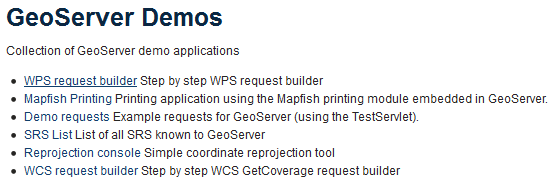

.. _processing.wpsjava:

Creating WPS processes with Java
================================

.. todo:: Split into multiple pages?

Web Processing Service (WPS) processes are able to perform almost any kind of computation. Boundless Suite supplies many useful WPS processes built in to GeoServer.

However, for even more capability, GeoServer can be extended by adding new WPS processes. This section describes creating a custom WPS process in Java and how to deploy and run it in GeoServer.

Overview
--------

A WPS process is implemented as a Java service provider, allowing GeoServer to discover and publish your custom process. It is a Java class that provides an ``execute`` method. The ``execute`` method accepts parameters which correspond to the WPS parameters, and it returns a value which becomes the output of the process. The class also provides metadata to specify the names and descriptions of the process and its parameters.

.. todo:: An diagram of this would be excellent.  

The GeoTools library used by GeoServer provides a convenient framework for building process classes with a minimum of boilerplate code. The GeoTools **Process API** has the following features:

* Allows using Java annotations to specify the metadata
* Infers the types of process parameters and outputs via reflection
* Handles conversion between XML representations and Java objects
* Handles reporting any exceptions thrown by a process

GeoServer includes many powerful libraries that can be leveraged in a process. A process can also use external Java libraries, but in that case the external libraries need to be deployed along with the process.

To create a custom WPS process, you will need to create a new Java project, either with an `IDE <http://en.wikipedia.org/wiki/Integrated_development_environment>`_ or using command-line tools.

This tutorial shows the use of the popular `Eclipse <http://www.eclipse.org>`_ IDE.  
Other IDEs such as `Netbeans <http://www.netbeans.org>`_ or `IntelliJ IDEA <http://www.jetbrains.com/idea/>`_ can be used as well. In addition, `Maven <http://maven.apache.org>`_ will be used to build the project and manage its dependencies.  

About the process
-----------------

We will create a process called ``splitPolygon`` in a project called ``wps-demo``. This process splits a polygon geometry by a line crossing it. The inputs are the polygon to split and the line to split by. The output is the geometry representing the collection of polygons resulting from the split.

Create the Java project
-----------------------

We'll use Maven to create the Java project for the process. To do that we use the `Maven Archetype plugin <http://maven.apache.org/archetype/maven-archetype-plugin/>`_, a project templating tool.

Since a custom WPS process is packaged as a regular JAR file the standard archetype can be used for this project. It will generate the project directory structure, a Maven POM file describing the project, and some useful Java artifacts.  

#. Enter the following in a console:

   .. code-block:: console

      mvn archetype:generate -DarchetypeArtifactId=maven-archetype-quickstart -DarchetypeVersion=1.1 -DgroupId=org.example.wps -DartifactId=wps-demo -Dversion=1.0 -DinteractiveMode=false

   This command instructs Maven to generate a project using the following information:

   * The Maven ``groupId`` and the project's Java package are named ``org.example.wps``
   * The name of the project is ``wps-demo``
   * The version for the project build artifacts is ``1.0``

#. You should end up with a project directory named :file:`wps-demo` with the :file:`pom.xml` file inside it. Open this file in a text editor and add the following GeoTools library dependencies to this file:

   .. code-block:: xml

      <dependency>
        <groupId>org.geotools</groupId>
        <artifactId>gt-process</artifactId>
        <version>${geotools.version}</version>
      </dependency>
      <dependency>
        <groupId>org.geotools</groupId>
        <artifactId>gt-process-geometry</artifactId>
        <version>${geotools.version}</version>
      </dependency>

#. In addition, add the following lines inside the ``<properties>`` block (typically beneath the line for ``<project.build.sourceEncoding>``, replacing ``GEOSERVER_VERSION`` and ``GEOTOOLS_VERSION`` with the versions used by Boundless Suite:

   .. code-block:: xml

      <geoserver.version>GEOSERVER_VERSION</geoserver.version>
      <geotools.version>GEOTOOLS_VERSION</geotools.version>

   .. warning:: You must make sure that the GeoServer and GeoTools versions match the ones used by Boundless Suite. You can check the versions by navigating to the :guilabel:`About GeoServer` section of the GeoServer admin interface. The GeoServer version will be shown under :guilabel:`Version`, and the GeoTool version will be shown under :guilabel:`GeoTools Version`.

      .. figure:: img/gt-version.png

         GeoServer showing version numbers (yours will likely be different)

#. In the same file anywhere inside the ``<project>`` block, add a reference to the Boundless Maven repository. This will provide access to the required libraries.

   .. code-block:: xml

      <repositories>
        <repository>
          <id>boundless</id>
          <name>Boundless Maven Repository</name>
          <url>http://repo.boundlessgeo.com/main</url>
        </repository>
      </repositories>

#. The final file should look similar like this (but with different version numbers, as indicated above):

   .. code-block:: xml

      <project xmlns="http://maven.apache.org/POM/4.0.0" xmlns:xsi="http://www.w3.org/2001/XMLSchema-instance"
        xsi:schemaLocation="http://maven.apache.org/POM/4.0.0 http://maven.apache.org/xsd/maven-4.0.0.xsd">
        <modelVersion>4.0.0</modelVersion>

        <groupId>org.example.wps</groupId>
        <artifactId>wps-demo</artifactId>
        <version>1.0</version>
        <packaging>jar</packaging>

        <name>wps-demo</name>
        <url>http://maven.apache.org</url>

        <properties>
          <project.build.sourceEncoding>UTF-8</project.build.sourceEncoding>
          <geoserver.version>2.8-SNAPSHOT</geoserver.version>
          <geotools.version>14-SNAPSHOT</geotools.version>
        </properties>

        <repositories>
          <repository>
            <id>boundless</id>
            <name>Boundless Maven Repository</name>
            <url>http://repo.boundlessgeo.com/main</url>
          </repository>
        </repositories>

        <dependencies>
          <dependency>
            <groupId>junit</groupId>
            <artifactId>junit</artifactId>
            <version>3.8.1</version>
            <scope>test</scope>
          </dependency>
          <dependency>
            <groupId>org.geotools</groupId>
            <artifactId>gt-process</artifactId>
            <version>${geotools.version}</version>
          </dependency>
          <dependency>
            <groupId>org.geotools</groupId>
            <artifactId>gt-process-geometry</artifactId>
            <version>${geotools.version}</version>
          </dependency>
        </dependencies>
      </project>

#. Save and close this file.

#. With the project definition and dependencies set up, we can create the Eclipse project by going into the :file:`wps-demo` directory and issuing the following command:

   .. code-block:: console

      mvn eclipse:eclipse

#. We now have a Java project that can be imported into an Eclipse workspace in order to start working on the code. The project structure should look like this:

   .. figure:: img/project-structure.png

      Eclipse project structure

Implement process functionality
-------------------------------

The previous steps created a Java package ``org.example.wps`` in which to implement the custom WPS functionality. Now we will define the class that will contain the spatial processing code.  

#. Create a class called ``PolygonTools``. This class contains two methods: one to split a polygon with a line (``splitPolygon(Geometry poly, Geometry line)``) and one to polygonize a set of Geometries (``polygonize(Geometry geometry)``). The polygonize method is internal to the process and does not need to be exposed as a public method. The code for the ``PolygonTools`` class is:

   .. code-block:: java
  
      package org.example.wps;

      import java.util.ArrayList;
      import java.util.Collection;
      import java.util.List;

      import com.vividsolutions.jts.geom.Geometry;
      import com.vividsolutions.jts.geom.GeometryFactory;
      import com.vividsolutions.jts.geom.Polygon;
      import com.vividsolutions.jts.geom.util.LineStringExtracter;
      import com.vividsolutions.jts.operation.polygonize.Polygonizer;

      import org.geotools.process.factory.DescribeParameter;
      import org.geotools.process.factory.DescribeProcess;
      import org.geotools.process.factory.DescribeResult;
      import org.geotools.process.factory.StaticMethodsProcessFactory;
      import org.geotools.text.Text;

      public class PolygonTools extends StaticMethodsProcessFactory<PolygonTools> {

        public PolygonTools() {
          super(Text.text("Polygon Tools"), "custom", PolygonTools.class);
        }

        static Geometry polygonize(Geometry geometry) {
            List lines = LineStringExtracter.getLines(geometry);
            Polygonizer polygonizer = new Polygonizer();
            polygonizer.add(lines);
            Collection polys = polygonizer.getPolygons();
            Polygon[] polyArray = GeometryFactory.toPolygonArray(polys);
            return geometry.getFactory().createGeometryCollection(polyArray);
        }

        public static Geometry splitPolygon(Geometry poly, Geometry line) { 

            Geometry nodedLinework = poly.getBoundary().union(line);
            Geometry polys = polygonize(nodedLinework);

            // Only keep polygons which are inside the input
            List output = new ArrayList();
            for (int i = 0; i < polys.getNumGeometries(); i++) {
                Polygon candpoly = (Polygon) polys.getGeometryN(i);
                if (poly.contains(candpoly.getInteriorPoint())) {
                    output.add(candpoly);
                }
            }
            return poly.getFactory().createGeometryCollection(GeometryFactory.toGeometryArray(output));
        }
      }

   .. note:: If not using Eclipse, you can create a new file in :file:`wps-demo/src/main/java/org/example/wps` called :file:`PolygonTools.java`.

   Some things to note about the process:

   * The ``execute`` method will be called when the WPS request is processed by GeoServer. The method takes two parameters of type ``Geometry``: a polygon to be split and the line doing the splitting.
   * The ``polygonize`` method is not public because it is internal to the process and need not be exposed.
   * The return type of the polygonize(Geometry geometry) function is ``Geometry``. **Each process is required to return a result**, so a static void method cannot be advertised as a process.
   * The process will be given a namespace (prefix) of "custom".
   * The full name of the process will be **custom:splitPolygon**.

#. The code contains all of the mechanics necessary to perform the process. The next step is to use *annotations* to describe this process for publication. These will contain descriptions of the process and its inputs and outputs, which will be exposed via the WPS DescribeProcess and GetCapabilites requests. Add the following content right above the definition of the ``splitPolygon`` class:

   .. code-block:: java

      @DescribeProcess(title = "splitPolygon", description = "Splits a polygon by a linestring")
      @DescribeResult(description = "Geometry collection created by splitting the input polygon")

   The ``DescripeProcess`` annotation provides the process description for the DescribeProcess request. The ``DescribeResult`` annotation provides the description of the output of the process, which, as previously mentioned, is ``Geometry``.

#. Replace the initial definition line for the ``splitPolygon`` class:

   .. code-block:: java

       public static Geometry splitPolygon(Geometry poly, Geometry line) { 

   with the following:

   .. code-block:: java

       public static Geometry splitPolygon(
          @DescribeParameter(name = "polygon", description = "Polygon to be split") Geometry poly,
          @DescribeParameter(name = "line", description = "Line to split the polygon") Geometry line) {

   These ``DescribeParameter`` annotations provide descriptions of the process inputs.

#. The final file will look like this:

   .. code-block:: java
  
      package org.example.wps;

      import java.util.ArrayList;
      import java.util.Collection;
      import java.util.List;

      import com.vividsolutions.jts.geom.Geometry;
      import com.vividsolutions.jts.geom.GeometryFactory;
      import com.vividsolutions.jts.geom.Polygon;
      import com.vividsolutions.jts.geom.util.LineStringExtracter;
      import com.vividsolutions.jts.operation.polygonize.Polygonizer;

      import org.geotools.process.factory.DescribeParameter;
      import org.geotools.process.factory.DescribeProcess;
      import org.geotools.process.factory.DescribeResult;
      import org.geotools.process.factory.StaticMethodsProcessFactory;
      import org.geotools.text.Text;

      public class PolygonTools extends StaticMethodsProcessFactory<PolygonTools> {

        public PolygonTools() {
          super(Text.text("Polygon Tools"), "custom", PolygonTools.class);
        }

        static Geometry polygonize(Geometry geometry) {
            List lines = LineStringExtracter.getLines(geometry);
            Polygonizer polygonizer = new Polygonizer();
            polygonizer.add(lines);
            Collection polys = polygonizer.getPolygons();
            Polygon[] polyArray = GeometryFactory.toPolygonArray(polys);
            return geometry.getFactory().createGeometryCollection(polyArray);
        }

        @DescribeProcess(title = "splitPolygon", description = "Splits a polygon by a linestring")
        @DescribeResult(description = "Geometry collection created by splitting the input polygon")
        public static Geometry splitPolygon(
            @DescribeParameter(name = "polygon", description = "Polygon to be split") Geometry poly,
            @DescribeParameter(name = "line", description = "Line to split the polygon") Geometry line) {

            Geometry nodedLinework = poly.getBoundary().union(line);
            Geometry polys = polygonize(nodedLinework);

            // Only keep polygons which are inside the input
            List output = new ArrayList();
            for (int i = 0; i < polys.getNumGeometries(); i++) {
                Polygon candpoly = (Polygon) polys.getGeometryN(i);
                if (poly.contains(candpoly.getInteriorPoint())) {
                    output.add(candpoly);
                }
            }
            return poly.getFactory().createGeometryCollection(GeometryFactory.toGeometryArray(output));
        }
      }

.. note:: While beyond the scope of this tutorial, we also recommend creating **unit tests** for your process.

Configure GeoServer
-------------------

GeoTools/GeoServer uses the `Java Service Provider Interface <https://docs.oracle.com/javase/tutorial/sound/SPI-intro.html>`_ (or SPI) for plugins. We will now create the required directory and file structure for our process.

#. Create the :file:`wps-demo/src/main/resources/META-INF/services` directory structure.

#. Create a text file inside this directory titled :file:`org.geotools.process.ProcessFactory` containing the following content::

     org.example.wps.PolygonTools

#. Save this file.

The project is now complete.

Build and deploy
----------------

#. In order to build the custom process, run the following command in the root directory of the project:

   .. code-block:: console
  
      mvn clean install

   This cleans up artifacts from previous builds, compiles the code, executes any unit tests that are present, and creates the process JAR file in the :file:`target` directory. The JAR file name is taken from the project name and version (``wps-demo-1.0.jar`` in this example).

#. To deploy, copy the process JAR file into the application container's ``webapps/geoserver/WEB-INF/lib`` directory and then restart GeoServer.

.. note::

   Typical paths for this directory:

   * Windows: :file:`C:\\Program Files (x86)\\Apache Software Foundation\\Tomcat 8\\webapps\\geoserver\\WEB-INF\\lib`
   * Linux: :file:`/opt/boundless/suite/geoserver/WEB-INF/lib` or :file:`/usr/share/tomcat8/webapps/WEB-INF/lib`.

Test the process
----------------

Once GeoServer is running, you can verify that the new process was deployed successfully by using the **WPS Request Builder**. The WPS Request Builder is a utility that can run WPS processes through the UI. It can be accessed in the :guilabel:`Demos` section of the admin interface.

   WPS Request Builder link

#. First verify that the ``custom:splitPolygon`` process exists in the list.

   .. figure:: img/requestbuilderlist.png

      Locating the new process in the process list

#. Select this process. A form will be generated, showing the possible inputs and outputs.

   .. figure:: img/requestbuilderselected.png

      New process selected

#. Before filling out the form, click the :guilabel:`WPS DescribeProcess` link. This will generate a DescribeProcess request. Notice the content that was supplied in the annotations:

   .. figure:: img/describeprocess.png

      WPS DescribeProcess response

#. Fill out the form with the following options:

   .. list-table::
      :header-rows: 1
      :class: non-responsive

      * - Option
        - Value(s)
      * - Process inputs: polygon
        - ``TEXT``, ``application/wkt``, ``POLYGON((0 0, 2 0, 2 1, 0 1, 0 0))``
      * - Process inputs: line
        - ``TEXT``, ``application/wkt``, ``LINESTRING(1 0, 1 1)``
      * - Process outputs: result
        - ``checked``, Generate ``application/wkt``

   .. figure:: img/requestbuilderform.png

      Request builder form

#. Click :guilabel:`Execute process`. You may be asked to open the response in a text editor.

#. The correct output should be::

     GEOMETRYCOLLECTION (POLYGON ((1 0, 1 1, 2 1, 2 0, 1 0)), POLYGON ((1 0, 0 0, 0 1, 1 1, 1 0)))

   which shows the single rectangle being split into two.

.. todo:: Utilize WPS builder.
