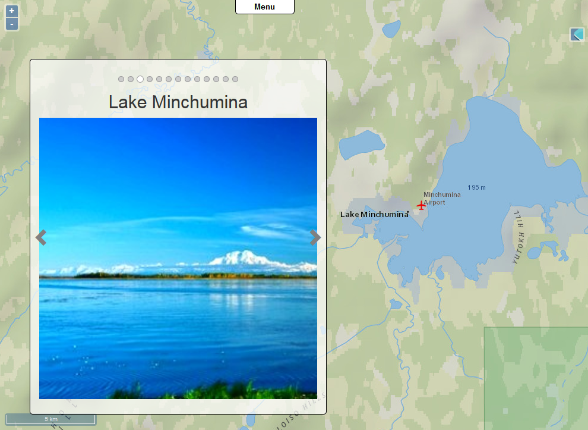
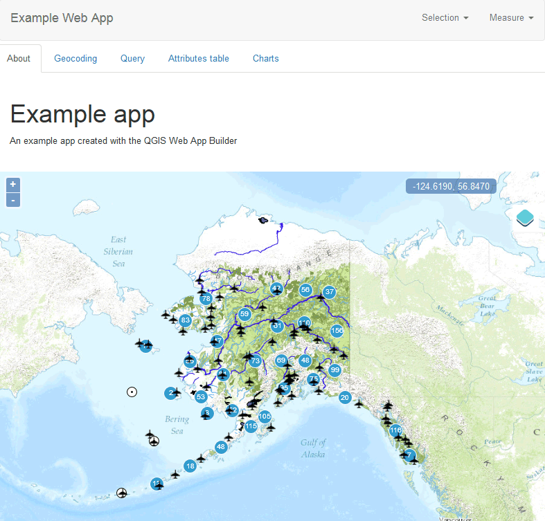

.. _qgis.webappbuilder.examples:

Example apps
============

Here are a few examples that demonstrate the type of apps that can be created with the Web App Builder.

:download:`Download the sample dataset <data/exampledata.zip>` used in these examples.

All applications are based on the above dataset. Along with layer data and a QGIS project, the dataset contains ``appdef`` files that can be used to recreate each of the example apps described.

**A narrative map that explores the lakes in Alaska** (`Live demo <http://boundlessgeo.github.io/qgis-app-builder/examples/lakes/index.html>`__)

**A complete web app that explores Alaska in detail** (`Live demo <http://boundlessgeo.github.io/qgis-app-builder/examples/tabbed/index.html>`__)

