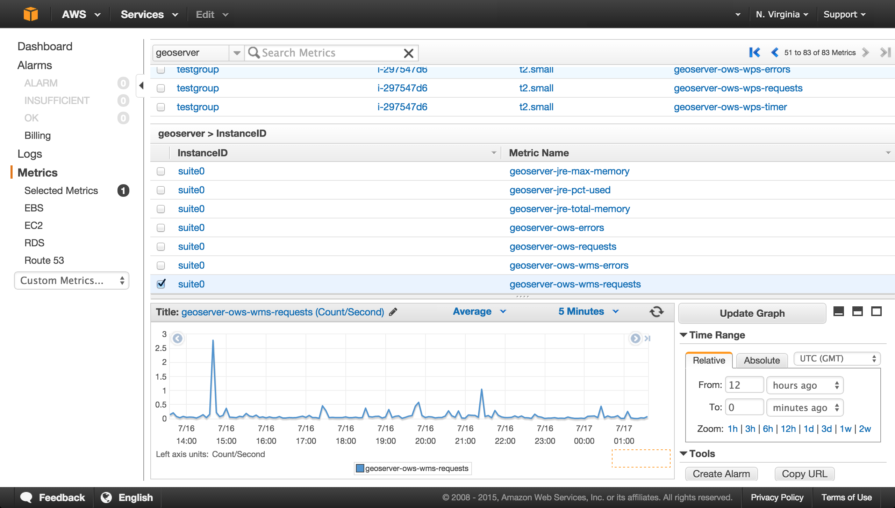

.. _sysadmin.cloudwatch:

Monitoring GeoServer with CloudWatch
====================================

Amazon CloudWatch is a monitoring service provided for use on Amazon Web Services. GeoServer maintains performance and monitoring information that can be integrated with CloudWatch.

This section will describe how to send those GeoServer performance metrics to CloudWatch.

.. note:: This tutorial assumes familiarity with Amazon CloudWatch For more information, please see the `CloudWatch documentation <http://aws.amazon.com/cloudwatch/>`_.

Installation
------------

Amazon CloudWatch support isn't enabled by default, so it must be separately installed.

Installing Amazon CloudWatch support is the same as most :ref:`OpenGeo Suite Extensions <intro.extensions>`.

.. note:: The CloudWatch extension is only available with `OpenGeo Suite Enterprise <http://boundlessgeo.com/solutions/opengeo-suite/>`_. For more information on OpenGeo Suite Enterprise, please `contact us <http://boundlessgeo.com/about/contact-us/sales/>`_.

Windows
~~~~~~~

The CloudWatch extension can be added during the installation process. On the :guilabel:`Components` page, check the box for :guilabel:`CloudWatch` in the section named :guilabel:`GeoServer Extensions`.

.. todo:: ADD FIGURE

If OpenGeo Suite has already been installed and you wish to install CloudWatch support at a later time, simply run the installer once more and uncheck all other items except for :guilabel:`CloudWatch`. This will add CloudWatch support to the existing OpenGeo Suite installation.

OS X
~~~~

The CloudWatch extension can be added to OpenGeo Suite by copying the contents of the :file:`cloudwatch` extension folder (not the folder itself) to the GeoServer library folder. The GeoServer library folder can be found by selecting :guilabel:`Open Webapps Directory` from the GeoServer menu and then navigating to :file:`geoserver/WEB-INF/lib`.

   .. figure:: ../../intro/installation/mac/img/ext_webappsmenu.png

      Opening the webapps directory from the GeoServer menu

Once copied, GeoServer will need to be restarted to take effect.

Ubuntu Linux
~~~~~~~~~~~~

The CloudWatch extension can be added to OpenGeo Suite by installing the ``geoserver-cloudwatch`` package:

.. code-block:: console

   apt-get install geoserver-cloudwatch

.. note:: This command will need to be run as root or with :command:`sudo`.

Red Hat Linux
~~~~~~~~~~~~~

The CloudWatch extension can be added to OpenGeo Suite by installing the ``geoserver-cloudwatch`` package:

.. code-block:: console

   yum install geoserver-cloudwatch

.. note:: This command will need to be run as root or with :command:`sudo`.

Application servers
~~~~~~~~~~~~~~~~~~~

The CloudWatch extension can be added to OpenGeo Suite by copying the contents of the :file:`geopackage` extension directory (not the directory itself) to the GeoServer library directory. If GeoServer is installed at :file:`/opt/tomcat/webapps/geoserver`, the GeoServer library directory will be found at :file:`/opt/tomcat/webapps/geoserver/WEB-INF/lib`.

After copying files, the application server or GeoServer will need to be restarted.

Configuration
-------------

Next, a number of variables will need to be configured.

These can be configured in the standard three ways: by setting environment variables, by employing Java command line parameters, or by adding system parameters to the GeoServer :file:`web.xml` file. (See more on :ref:`sysadmin.startup`.)

The following are the parameters, along with their description:

.. list-table::
   :class: non-responsive
   :header-rows: 1
   :stub-columns: 1

   * - Variable
     - Description
     - Suggested Value
   * - ``GS_CW_INTERVAL``
     - Interval in milliseconds at which to send metrics
     - ``10000``
   * - ``AWS_ACCESS_KEY``
     - AWS Access Key
     - Credentials specific to the AWS account. To generate AWS credentials, please see the `AWS documentation <http://docs.aws.amazon.com/AWSSimpleQueueService/latest/SQSGettingStartedGuide/AWSCredentials.html>`_.
   * - ``AWS_SECRET_KEY``
     - AWS Secret Key
     - Credentials specific to the AWS account. To generate AWS credentials, please see the `AWS documentation <http://docs.aws.amazon.com/AWSSimpleQueueService/latest/SQSGettingStartedGuide/AWSCredentials.html>`_.
   * - ``GS_CW_ENABLE_PER_INSTANCE_METRICS``
     - Instance-specific metrics. If disabled, ``GS_CW_AUTOSCALING_GROUP_NAME`` should be populated.
     - ``true`` or ``false``
   * - ``GS_CW_INSTANCE_ID``
     - Overrides the instance identifier
     - Any name, such as ``testgroup``
   * - ``GS_CW_AUTOSCALING_GROUP_NAME``
     - Use if the server is part of an EC2 autoscaling group.
     - Name of the group
   * - ``GS_CW_JMX``
     - JMX metrics
     - ``true`` or ``false``
   * - ``GS_CW_WATCH_WMS``
     - Monitors the WMS
     - ``true`` or ``false``
   * - ``GS_CW_WATCH_WFS``
     - Monitors the WFS
     - ``true`` or ``false``
   * - ``GS_CW_WATCH_WPS``
     - Monitors the WPS
     - ``true`` or ``false``
   * - ``GS_CW_WATCH_WCS10``
     - Monitors the WCS version 1.0
     - ``true`` or ``false``
   * - ``GS_CW_WATCH_WCS111``
     - Monitors the WCS version 1.1.1
     - ``true`` or ``false``
   * - ``GS_CW_WATCH_WCS20``
     - Monitors the WCS version 2.0
     - ``true`` or ``false``
   * - ``GS_CW_WATCH_OWS``
     - Monitors the OWS
     - ``true`` or ``false``
   * - ``GS_CW_WATCH_WCS20``
     - Monitors the Catalog service
     - ``true`` or ``false``

Each of the enabled OWS watchers will produce three metrics.

- The number of requests per second.
- The number of errors per second.
- The median processing time per request (windowed over approximately five minutes).

As an example of usage, on Linux running Tomcat, one could edit the :file:`/usr/share/tomcat7/setenv.sh` file and add the following block:

.. code-block:: bash

    GS_CW_INTERVAL=60000

    # AWS Authentication
    export AWS_ACCESS_KEY_ID=MY_KEY
    export AWS_SECRET_KEY=MY_SECRET_KEY

    # Instance specific settings
    export GS_CW_ENABLE_PER_INSTANCE_METRICS=true

    # GeoServer metrics
    export GS_CW_WATCH_WMS=true
    export GS_CW_WATCH_WFS=true
    export GS_CW_WATCH_WPS=true

The exact same usage in the Windows installer would be accomplished by adding the following to the :file:`start.ini` file (often in :file:`C:\\Program Files\\Boundless\\OpenGeo\\jetty\\` or :file:`C:\\Program Files (x86)\\Boundless\\OpenGeo\\jetty\\`):

.. code-block:: console

    -DGS_CW_INTERVAL=60000

    # AWS Authentication
    -DAWS_ACCESS_KEY_ID=MY_KEY
    -DAWS_SECRET_KEY=MY_SECRET_KEY

    # Instance specific settings
    -DGS_CW_ENABLE_PER_INSTANCE_METRICS=true

    # GeoServer metrics
    -DGS_CW_WATCH_WMS=true
    -DGS_CW_WATCH_WFS=true
    -DGS_CW_WATCH_WPS=true

After these changes have been made, restart GeoServer.

Verifying installation
----------------------

To confirm that the extension is working as intended:

#. Access your account's `CloudWatch panel <https://console.aws.amazon.com/cloudwatch/home>`_.

#. Select :guilabel:`geoserver` in the menu on the left.

#. There should now be a list of metrics. Click on the checkboxes to add or remove them from the chart.

   CloudWatch panel showing GeoServer

You can now monitor the load on your GeoServer instance and enable alarms to notify you of extreme events.
