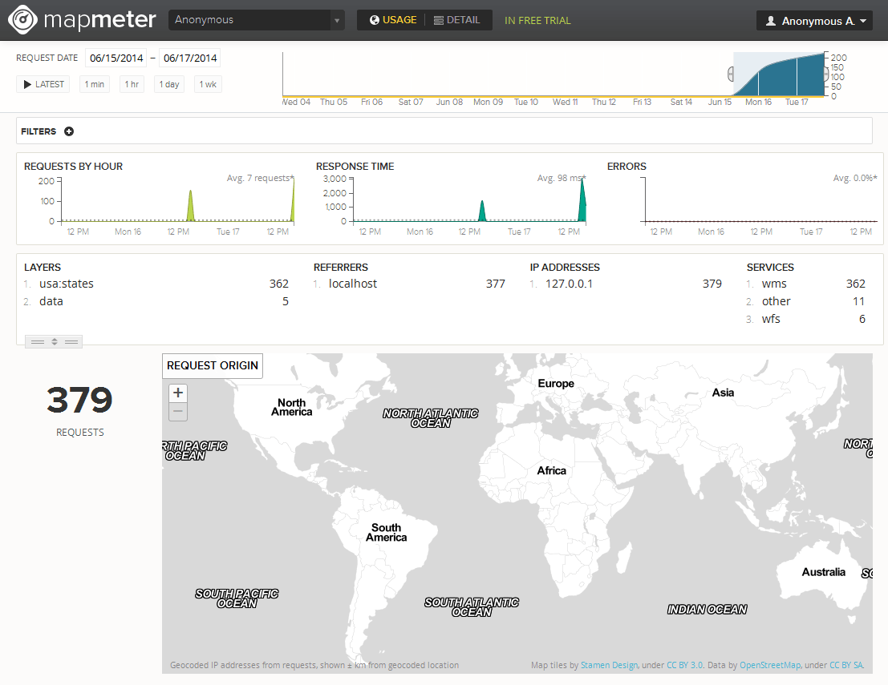

.. _sysadmin.mapmeter:

Using Mapmeter
==============

Mapmeter is a cloud-based service to enable you to monitor the usage and health of GeoServer.

Whereas administrator utilities are focused on application-agnostic metrics (network throughput, uptime) Mapmeter adds **geospatial-specific metrics** such as:

* Number and type of OGC requests
* Location of source requests
* Filters by layer, service, IP address, and more

Mapmeter is free for Enterprise clients, but all users are eligible to create a free two-week trial account of Mapmeter.

If you are interested in becoming an Enterprise client, please `contact us <http://boundlessgeo.com/about/contact-us/sales/>`_.

   Mapmeter

.. todo:: Add more details about using the service.

.. toctree::
   :maxdepth: 2

   install
   activate
