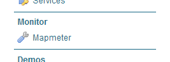

.. _sysadmin.mapmeter.install:

Installing Mapmeter
===================

Mapmeter is an optional extension for OpenGeo Suite.

Installation
------------

Windows
~~~~~~~

Mapmeter can be installed during the installation process. When running the installer, on the :ref:`Components <installation.windows.install.components>` page, expand the :guilabel:`GeoServer Extensions` tree and select :guilabel:`Mapmeter`.

.. note:: If you have already installed OpenGeo Suite for Windows, you can always run the installer again to install just the Mapmeter extension. In this case, make sure that no other components are checked aside from Mapmeter.

OS X
~~~~

Mapmeter can be installed at any time after OpenGeo Suite is installed. In the OpenGeo folder, there will be a folder called :guilabel:`GeoServer Extensions` which contains a :guilabel:`Mapmeter` folder. Copy the contents of this folder as described in the :ref:`OS X extension installation section <installation.mac.install.extensions>`.

Ubuntu Linux
~~~~~~~~~~~~

Mapmeter is available as an individual package, installed through standard package management. The package is called ``geoserver-mapmeter``.

.. code-block:: console

   sudo apt-get install geoserver-mapmeter

Red Hat-based Linux
~~~~~~~~~~~~~~~~~~~

Mapmeter is available as an individual package, installed through standard package management. The package is called ``geoserver-mapmeter``.

.. code-block:: console

   sudo yum install geoserver-mapmeter

Application Servers
~~~~~~~~~~~~~~~~~~~

For installation when using OpenGeo Suite for Application Servers, please `contact us <http://boundlessgeo.com/about/contact-us/>`_.

Post-installation
-----------------

To verify that Mapmeter is installed correctly, open the GeoServer web interface, log in as an administrator, and verify that there is a :guilabel:`Monitor` section in the configuration menu on the left.

   Mapmeter in the GeoServer admin menu
