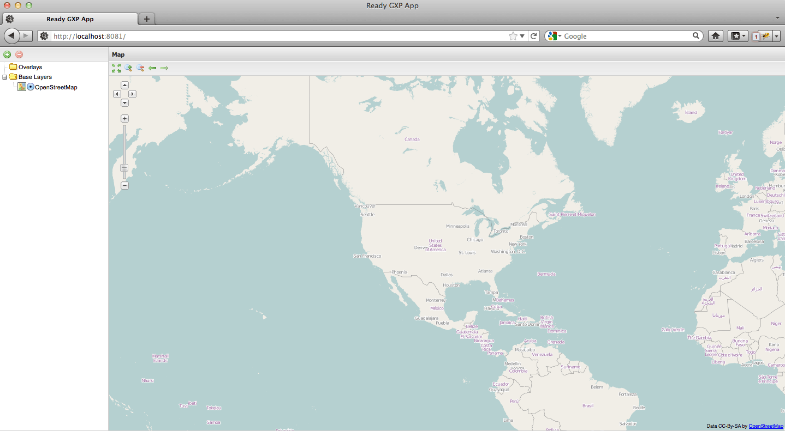

.. _webapps.gxp.basic:

Creating a basic viewer
=======================

In this section we will create a viewer application.

Background
----------

The central object in the architecture of the Boundless SDK is the **viewer** (`gxp.Viewer <../../../sdk-api/lib/widgets/Viewer.html>`_). Primarily, a viewer combines a map panel with tools, but it can do much more. 

The main configuration options for a ``gxp.Viewer`` are:

.. list-table::
   :widths: 20 80
   :header-rows: 1

   * - Option
     - Description
   * - ``proxy``
     - Sets the proxy to use in order to bypass the Same Origin Policy when accessing remote resources through JavaScript. Only needed when external resources (as in, from outside the OpenGeo Suite instance that your app lives in) are used. Will be set as ``OpenLayers.ProxyHost``.
   * - ``portalItems``
     - The items to add to the portal, in addition to the map panel that the viewer will create automatically.
   * - ``portalConfig``
     - Configuration object for the wrapping container (usually an ``Ext.Viewport``) of the viewer
   * - ``tools``
     - A set of tools that you want to use in the application, such as measure tools or a layer tree
   * - ``mapItems``
     - Any items to be added to the map panel, such as a zoom slider
   * - ``sources``
     - Configuration of layer sources available to the viewer, such as MapQuest or a WMS server
   * - ``map``
     - The configuration for the actual map part of the viewer, such as projection, layers, center and zoom

We will see many of these options in the following sections.

By default a viewer will fill up the whole viewport.

Setting up a new project
------------------------

We will use the ``suite-sdk`` script to set up a new viewer application called
"myviewer".

.. note:: For more information on the ``suite-sdk`` script, please see the section on :ref:`webapps.sdk`.

Run the following command, replacing ``path/to/myviewer`` with the desired name of and path to your application::

  suite-sdk create /path/to/myviewer gxp

This will generate a template application using the ``gxp`` template.  Now run the following command::

  suite-sdk debug /path/to/myviewer

The application will now run in debug mode on port 9080 of the local machine. Now start up a browser, and type in the address of the application (such as ``http://localhost:9080/``:

What you get is a basic web mapping application which contains a layer tree, a map panel and some map tools. The map panel contains an OpenStreetMap base layer.

.. note:: If you want to run on a different port, specify it with the ``-l`` flag (for example: ``suite-sdk debug -l 9090 /path/to/myviewer``).

Dissecting the application
--------------------------

To examine how this project was set up, use your browser's debugging tool (Chrome/Safari Developer Tools, Firebug in Firefox, or equivalent). Select the :guilabel:`Script` tab and look for the file :file:`app.js`.

.. note:: You're looking for the *second* instance of :file:`app.js` in the Scripts list; the first one is the loader file.

.. figure:: img/basic_firebug.png

Dependency management
---------------------

The :file:`app.js` file can be found in :file:`/src/app/` from the root of your application.

The first thing to see in :file:`app.js` is the list of JavaScript dependencies that are required to run the application. Whenever you add a component to the application, be sure to add a line to this file with the relative path to the file it is defined in, using the following pattern:

.. code-block:: javascript
    
   * @require path/to/Dependency.js

Everything listed here will be pulled in by the application build tool. The result is a small application footprint, because only the required components are included in the build.

.. note::  Whenever you add dependencies to :file:`app.js`, the debug server will need to be restarted. To do so, go to the console where you ran ``suite-sdk``, hit Ctrl+C, and run the ``suite-sdk debug`` command again as above.

Application details
-------------------

In the example application, the main component (``gxp.Viewer``) is created with a single configuration object, exposing a single global variable named ``app``.

The ``gxp.Viewer`` instance is configured to create a viewport filled with a border layout, which has two items, a container in the 'west' region 200 pixels wide, and the map in the 'center' region. Please note that all tools in the Boundless SDK are Ext plugins, so they can be created with a ``ptype`` shortcut in the config, similar to the ``xtype`` shortcut for Ext components. This viewer application defines the following tools:

* A **Layer Tree**, which will be rendered in the 'west' panel defined in the portalConfig.
* The **Add Layers** tool, a button that, when clicked, creates a dialog to add new layers to the map. This tool will be part of the top toolbar of the layer tree.
* The **Remove Layer** tool, which will be shown both in the top toolbar of the layer tree and in the context menu of the layer tree. This tool can be used to remove a layer from the map.
* The **Zoom to Extent** tool, which will be shown in the top toolbar of the map. This can be used to zoom to the maximum extent of the map.
* The **Zoom** tool, which will create two buttons in the map top toolbar, to zoom in and zoom out with a factor 2 centered on the current map center.
* The **Navigation History** tool, which will create two buttons in the map's top toolbar, to navigate through visited map extents.

The viewer configuration defines two layer sources, a WMS-C (cacheable WMS) source to a local GeoServer (with the embedded GeoWebCache), and an OpenStreetMap source. Layer sources are also implemented as Ext plugins, so configured with a ``ptype``. The configuration for the map defines the initial map extent (centered on the USA) and the layers to load in the map, in this case an OSM base layer and the ``usa:states`` layer from an OpenGeo Suite's default GeoServer setup. (See :ref:`webapps.gxp.basic.proxy` for how to link this application to a GeoServer instance.)  Finally, a zoom slider is defined. Note that this can also be done using ``mapItems``.

.. _webapps.gxp.basic.proxy:

Proxying GeoServer
------------------

A GeoServer instance will not be accessible by default unless you add the ``-g`` option to the ``debug`` command. This will proxy a remote GeoServer, or just one running on a different port. If you have a GeoServer instance running locally on port 8080, use the following command::

  suite-sdk debug -g http://localhost:8080/geoserver /path/to/myviewer 

To proxy a remote GeoServer, simply replace the URL with the location of the remote GeoServer instance::

  suite-sdk debug -g http://demo.opengeo.org/geoserver /path/to/myviewer 

.. note::  Pressing ``Ctrl-C`` in the terminal will shut down the server and allow the new command to be issued.

The commands above will allow GeoServer to be accessible to the application at the relative path of :file:`/geoserver`.

.. figure:: img/basic_states.png

   Application with a GeoServer proxy showing usa:states layer

