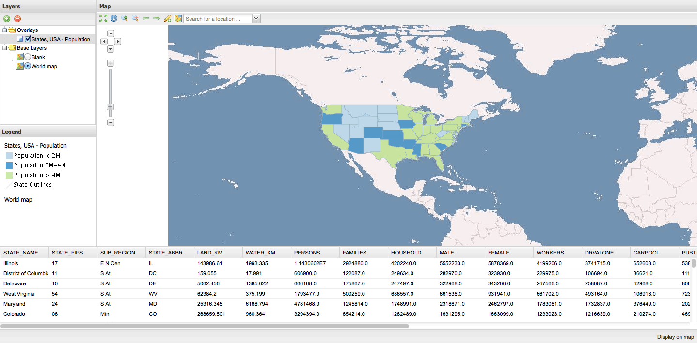

.. _webapps.gxp.editor.featuregrid:

Adding a feature grid
=====================

A feature grid can be used to show the features in a table (as well as in the map).

In the `API documentation <../../../sdk-api/>`_, find the `gxp.plugins.FeatureGrid <../../../sdk-api/lib/plugins/FeatureGrid.html>`_ tool. This provides the functionality for creating a table of features. The ``ptype`` for ``gxp.plugins.FeatureGrid`` is ``gxp_featuregrid``. 

First we will need to create a Ext container for the grid in the layout. Open up :file:`app.js` and edit the ``items`` section of ``portalConfig`` by adding a container in the 'south' region:

.. code-block:: javascript

    {
        id: "south",
        xtype: "container",
        layout: "fit",
        region: "south",
        border: false,
        height: 200
    }

Then go to the ``tools`` section, and add a feature grid:

.. code-block:: javascript

    {
        ptype: "gxp_featuregrid",
        featureManager: "states_manager",
        outputConfig: {
            loadMask: true
        },
        outputTarget: "south"
    }

The grid will still be empty, since the feature manager only loads a feature in our current application when there is a click on the map matching a state. So go to the feature manager section in :file:`app.js`, and add ``autoLoadFeatures: true`` to the feature manager's configuration (``gxp_featuremanager``):

.. code-block:: javascript

    autoLoadFeatures: true

At the top of :file:`app.js`, add :file:`plugins/FeatureGrid.js` as dependency:

.. code-block:: javascript

    * @require plugins/FeatureGrid.js

Restart the application and reload the browser. Now there will be a feature grid in the bottom of the application, which is initially loaded with all the states:

When the button :guilabel:`Display on map` is pressed, all the features are rendered client-side, and when walking through the grid the respective state is highlighted in the map:

