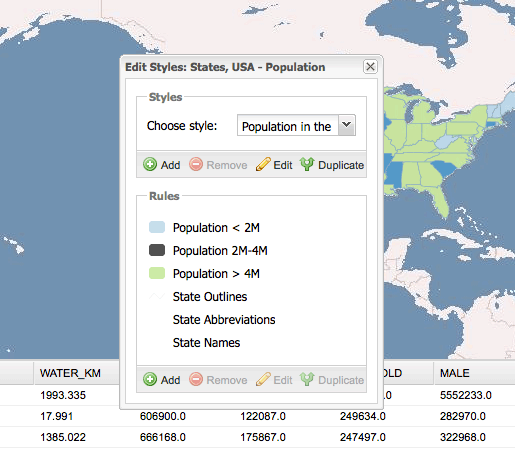

.. _webapps.gxp.styler:

Adding a Styler plugin
======================

The Styler plugin makes it possible to edit layer styles. This uses the REST config module of OpenGeo Suite's GeoServer.

.. note:: By default the Styler plugin will only work with the GeoServer of the same OpenGeo Suite instance where your app is deployed.

In the `API documentation <../../../sdk-api/>`_, find the `gxp.plugins.Styler <../../../sdk-api/lib/plugins/Styler.html>`_ tool. This provides the functionality for editing layer styles. The ``ptype`` for ``gxp.plugins.Styler`` is ``gxp_styler``.

First, we need to prepare the build profile.  Open :file:`app.js` and add :file:`plugins/Styler.js` to the list of dependencies at the top of the file. 

.. code-block:: javascript

    * @require plugins/Styler.js

Search for the ``tools`` section, and add the Styler plugin:

.. code-block:: javascript

    {
        ptype: "gxp_styler"
    }

Restart the application and reload the browser:

There will now be a new button which will show a powerful and feature-rich :guilabel:`Styles` dialog.  When selecting a layer, the :guilabel:`Edit Styles` button will be enabled. You may also be prompted for a username and password to authenticate against the GeoServer host that serves the selected layer.

Improving Color Selection
-------------------------

The color field provided for editing colors is very basic. Users can enter color names or rgb color codes in hexadecimal notation (e.g. #FFFFFF for white). However, by adding another dependency in :file:`app.js`, users get a basic color picker for selecting colors from a palette.

.. code-block:: javascript

    * @require ColorManager.js

When done, restart the application and reload the browser.  It should now be possible to edit color in a styling rule with a nice color picker:

  .. figure:: img/styler_popup_color.png

