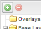

.. _webapps.gxp.viewer.addnewserver:

Adding an Add a New Server dialog
=================================

In the **Add Layers** dialog, there will be a listing of layers as defined by the application. In the demo application, only the OpenStreetMap layer is available.

The Add Layers dialog is accessed by clicking the :guilabel:`Add Layers` button.

   Click to open the Add Layers dialog

.. figure:: img/viewer_addlayersdialog.png

   Add layers dialog showing one available layer

It is possible to add an additional dialog for specifying a new server. This allows for connecting to layers hosted on a WMS server different from what was specified in the application. To enable this functionality, two additions will need to be made to the application :file:`src/app/app.js` file:

#. Add the following dependency to the top of the file::

      * @require overrides/override-ext-ajax.js

#. Add a proxy to the ``gxp.Viewer`` configuration::

      proxy: "<PROXY_URL>",

   substituting the location of the proxy for ``<PROXY_URL>``. This proxy is necessary to bypass the Same Origin Policy when accessing remote resources through JavaScript.

#. Restart the application. The dialog will be visible after clicking the :guilabel:`Add Layers` button. It is titled :guilabel:`View available data from:` and contains a list box.

   .. figure:: img/viewer_addnewserverdialog.png

      Add Layers dialog containing Add a New Server

#. Clicking on the list box and selecting :guilabel:`Add a New Server` will enable the user to enter a URL containing a WMS endpoint. The list of layers available through that endpoint will then be displayed.

   .. figure:: img/viewer_addnewserver.png

      Adding a new server

