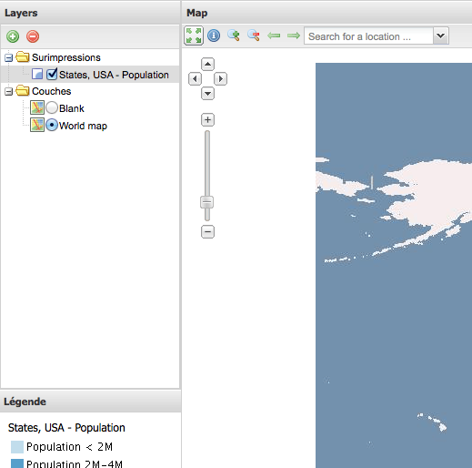

.. _webapps.gxp.viewer.locale:

Changing the locale of the viewer
=================================

It is possible to change your application to be in a different language (locale). This example will change the application locale to be French (fr).

Open up :file:`app.js` and add the following dependencies::

    * @require GeoExt/locale/GeoExt-fr.js
    * @require locale/fr.js

Next, add the following inside the main ``Ext.onReady(function() {`` code block:

.. code-block:: javascript

    GeoExt.Lang.set("fr");

Restart the web application and reload the browser:

This only translates the internal application strings. Any static strings provided in :file:`app.js` such as "Layers" and "Map" would need to be translated into French as well, but all the content which is being generated by the Boundless SDK will be in French, provided a French translation is available.

