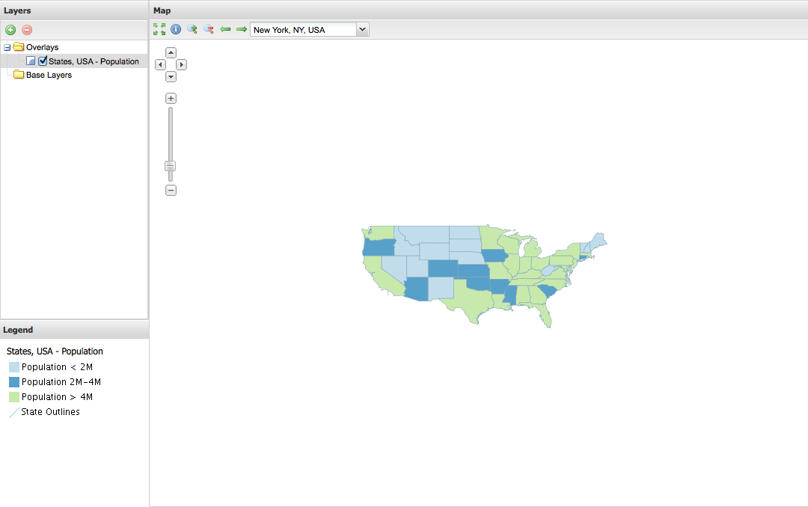
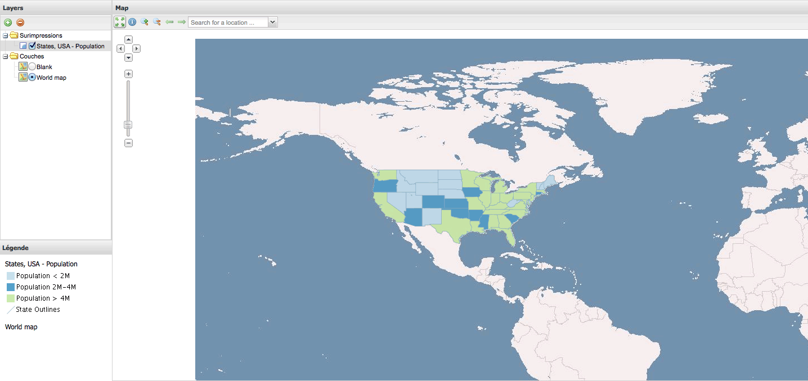

.. _webapps.gxp.viewer.projection:

Changing the projection
=======================

We will now change the viewer application to be in EPSG:4326 (WGS84) instead of the default Google Mercator. This will mean that our the two base layers (OSM and Google) are no longer available, so we will start by commenting them out in :file:`app.js`:

.. code-block:: javascript

    layers: [{
    //source: "osm",
    //name: "mapnik",
    //group: "background"
    //}, {
    //source: "google",
    //name: "ROADMAP",
    //group: "background"
    //}, {
        source: "local",
        name: "usa:states",
        selected: true
    }],

The map configuration contains a few projection related properties:

.. code-block:: javascript

    projection: "EPSG:900913",
    center: [-10764594.758211, 4523072.3184791],

To change the projection, substitute the lines above with the following:

.. code-block:: javascript

    projection: "EPSG:4326",
    center: [-97, 38],

Now reload the application in your browser:

Now we can add a WMS of the world as our new base layer, first defining a new source in the ``sources`` section:

.. code-block:: javascript

    ol: {
        ptype: "gxp_olsource"
    }

The ``ptype`` of ``gxp_olsource`` is an "OpenLayers Source", which will allow us to define any OpenLayers Layer type. (See the plugin `gxp.plugins.OLSource <../../../sdk-api/lib/plugins/OLSource.html>`_ in the `API documentation <../../../sdk-api/>`_.) We want to configure an ``OpenLayers.Layer.WMS`` to a vmap0 tilecache instance, so add the following to the ``layers`` configuration:

.. code-block:: javascript

    {
        source: "ol",
        type: "OpenLayers.Layer.WMS",
        args: ["World map", "http://vmap0.tiles.osgeo.org/wms/vmap0", {layers: 'basic'}],
        group: "background"
    }

This will result in:

As a last step, we will add a blank base layer to the application. Add the following to the ``layers`` configuration:

.. code-block:: javascript

    {
        source: "ol",
        type: "OpenLayers.Layer",
        args: ["Blank"],
        visibility: false,
        group: "background"
    }

The result will look like this:

.. figure:: img/viewer_projection_states_blank.png

