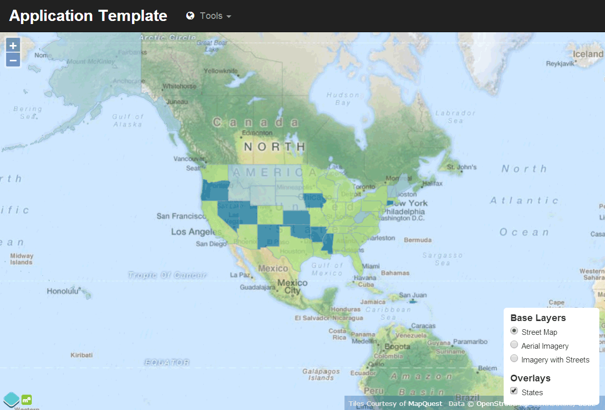
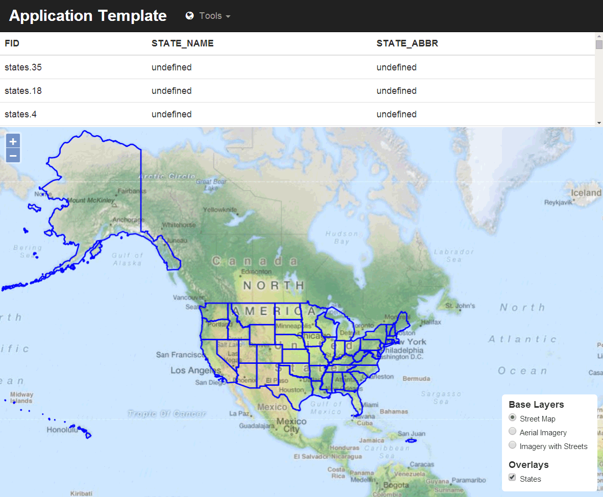

.. _webapps.ol3.templates:

OpenLayers 3 SDK templates
==========================

There are two SDK templates that use OpenLayers 3, a viewer (``ol3view``) and an editor (``ol3edit``)

This page will show the initial format of the applications created by the template, as well as where to customize them. 

Creating a viewer application
-----------------------------

A new application is generated using the viewer template::

  suite-sdk create /path/to/myapp ol3view

.. note:: For more information about generating and managing an application, see the page on :ref:`webapps.sdk`.

The application will be named ``myapp`` and will be placed in the :file:`/path/to/myapp`.

The initial form of the application can be seen by loading it using the ``debug`` option::

  suite-sdk debug /path/to/myapp

However, the default form of the application will look for the ``usa:states`` layer that is a part of the OpenGeo Suite. So you will need to proxy a GeoServer instance that contains this layer.

Locally::

  suite-sdk debug -g http://localhost:8080/geoserver /path/to/myapp

Or remotely::

  suite-sdk debug -g http://example.com/geoserver /path/to/myapp

The application generated will look like this:

   Viewer application

The application comes with the following options:

* **Zoom/Pan**—The standard OpenLayers Zoom and Pan options are active.
* **Layer Switcher**—The bottom right contains a layer switcher with three basemaps from MapQuest (:guilabel:`Street Map`, :guilabel:`Aerial Imagery`, and :guilabel:`Imagery with Streets`) as well as a single overlay (:guilabel:`States`).
* **Tool bar**—At the top is a tool bar with a title and a :guilabel:`Tools` drop-down list containing a single tool: :guilabel:`Zoom To Full Extent`.

Functions available on this map:

* Select :guilabel:`Zoom to Full Extent` to zoom to the largest extent that encompasses the layer data.

To customize this application, please see the :ref:`webapps.ol3.templates.customize` section.

Creating an editor application
------------------------------

A new application is generated using the editor template::

  suite-sdk create /path/to/myapp ol3edit

.. note:: For more information about generating and managing an application, see the page on :ref:`webapps.sdk`.

The application will be named ``myapp`` and will be placed in the :file:`/path/to/myapp`.

The initial form of the application can be seen by loading it using the ``debug`` option::

  suite-sdk debug /path/to/myapp

However, the default form of the application will look for the ``usa:states`` layer that is a part of the OpenGeo Suite. So you will need to proxy a GeoServer instance that contains this layer.

Locally::

  suite-sdk debug -g http://localhost:8080/geoserver /path/to/myapp

Or remotely::

  suite-sdk debug -g http://example.com/geoserver /path/to/myapp

The application generated will look like this:

   Editor application

The application comes with the following options:

* **Zoom/Pan**—The standard OpenLayers Zoom and Pan options are active.
* **Layer Switcher**—The bottom right contains a layer switcher with three basemaps from MapQuest (:guilabel:`Street Map`, :guilabel:`Aerial Imagery`, and :guilabel:`Imagery with Streets`) as well as a single overlay (:guilabel:`States`).
* **Tool bar**—At the top is a tool bar with a title and three tools: :guilabel:`Zoom To Full Extent`, :guilabel:`Draw feature` and :guilabel:`Delete Feature`.
* **Feature table**—Next to the map window is a table containing the list of features and their attributes for the ``states`` layer.

Functions available on this map:

* Select :guilabel:`Zoom to Full Extent` to zoom to the largest extent that encompasses the layer data.
* Click an entry in the table to zoom/pan to that feature in the map.
* Select :guilabel:`Draw Feature` and then click in the map to draw a new feature. Double-click to complete the drawing. To save the feature, you will need to supply administrator credentials to GeoServer.
* Select :guilabel:`Delete Feature` and then click on a feature to delete it. This action is not undoable.

.. _webapps.ol3.templates.customize:

Customizing the application
---------------------------

The method of customizing the application is the same whether the applications was generated with the Viewer template or the Editor template.

To customize the application, open the file :file:`src/app/app.js` inside the application directory. Most of the customization can be done here.

For more information on using OpenLayers 3 to customize an application, please see the `OpenLayers documentation <../../openlayers>`_.

.. todo:: Add more about specific customizations.
