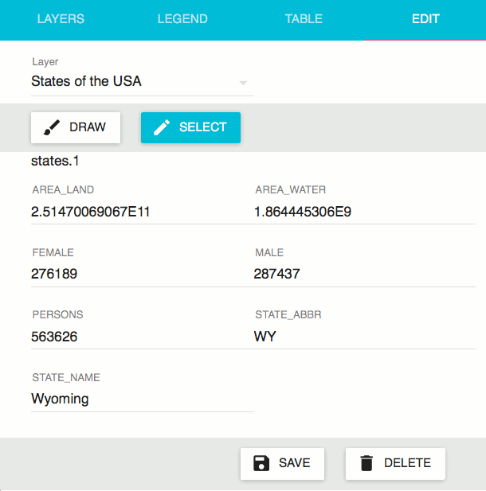
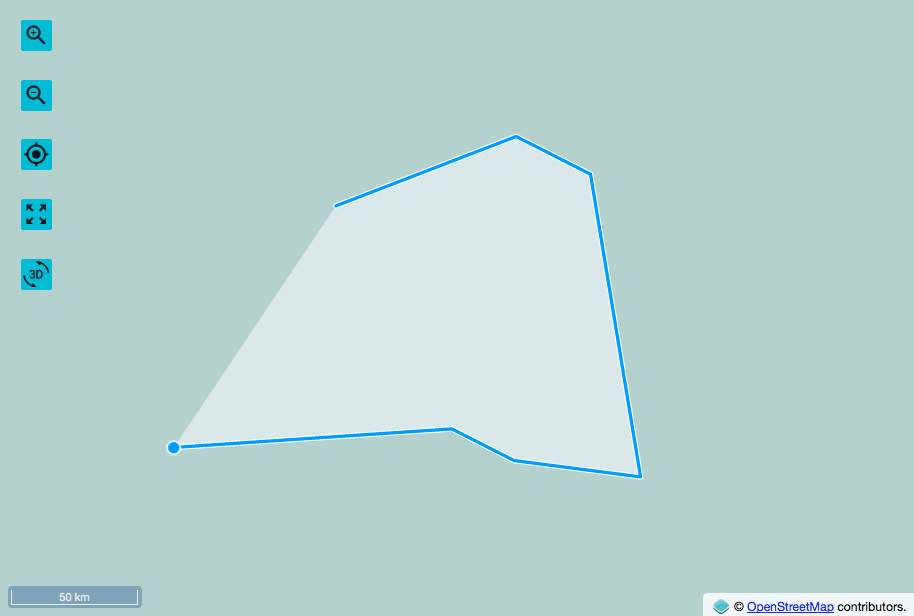

.. _webapps.sdk.quickview.edit:

Edit
====

The edit tab provides functionality for altering the attributes and geometry of vector layers in the map.
In order to use any of the functionality on this tab, `WFS Transactional must be enabled in GeoServer <../../geoserver/services/wfs/webadmin.html#service-levels>`_.

The :guilabel:`Layer` dropdown allows you to select which layer to edit. Below this, there are two buttons that control the edit mode: :guilabel:`Draw` and :guilabel:`Select`.

Draw
----

In the :guilabel:`Draw` mode, you can use your cursor to draw new features. Each click of the mouse will create a new vertex. A new feature is created whenever a closed polygon is formed. Once a new feature is created it, you can edit its attributed in the panel below the :guilabel:`Draw` button.

Select
------

In the :guilabel:`Select` mode, you can use your cursor to select and modify existing features. Clicking on a feature selects it. When a feature is selected, it will be surronded by a blue outline, and its attributes will be listed in the panel below the :guilabel:`Select` button. Existing vertices of the selected feature can be clicked on and dragged to new positions on the map. New vertices can be inserted into the feature by clicking on any line segment.

Attribute values for the selected feature can be modified by changing the values in the attribute list and clicking on the :guilabel:`Save` button.

Clicking on the :guilabel:`Delete` button will permanently delete the selected feature. This cannot be undone!
