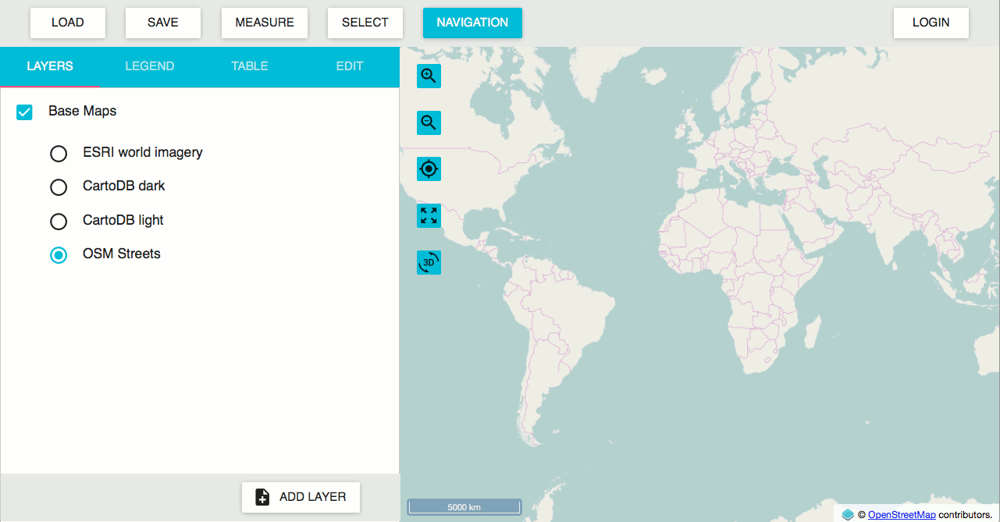
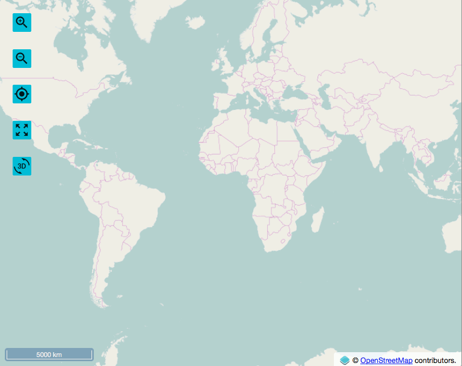
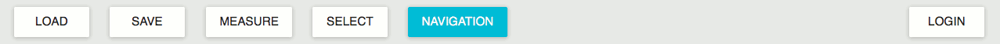
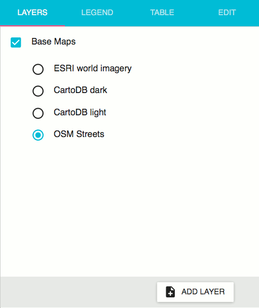

.. _webapps.sdk.quickview.intro:

Overview
========

The Web SDK QuickView application has three main zones. On the right is the map window, which displays a map and provides navigation controls. Along the top is the top bar, which contains several buttons. On the left is the side panel, which provides much of the core functionality of the QuickView application.

   Web SDK QuickView

Map Window
----------

The map window is used to view and interact with any layers you add to your map. Controls for navigating and interacting with the map can be found on the left side of the map window.

Map Controls
~~~~~~~~~~~~

.. list-table::
   :class: non-responsive
   :widths: 10 20 70
   :header-rows: 1

   * -
     - Name
     - Description
   * - .. image:: img/zoomin.png
     - ``Zoom in``
     - Increases the zoom level of the map.
   * - .. image:: img/zoomout.png
     - ``Zoom out``
     - Decreases the zoom level of the map.
   * - .. image:: img/geolocation.png
     - ``GeoLocation``
     - Toggles an indicator showing your current position.
   * - .. image:: img/zoomextent.png
     - ``Zoom to initial extent``
     - Zoom to the extent of the map when it was first opened.
   * - .. image:: img/3d.png
     - ``Toggle 3D View``
     - Toggle between the default 2D display and a 3D display. Certain functions are not available in 3D mode.

Top Bar
-------

The top bar contains several buttons which control how you interact with the map.

.. list-table::
   :class: non-responsive
   :widths: 20 80
   :header-rows: 1
   
   * - Name
     - Description
   * - ``Load``
     - Loads a saved map from the browser's local storage. The current map will be lost.
   * - ``Save``
     - Saves a map to the browser's local storage. This will overwrite any previously saved map.
   * - ``Measure``
     - Use the cursor to draw lines or polygons for measuring distance or area.
   * - ``Toggle 3D View``
     - Use the cursor to select layer features based on a rectangular bounding box.
   * - ``Navigation``
     - Use the cursor to pan the map. Enabled by default.
   * - ``Login``
     - Enter your GeoServer credentials to log into the local geoserver, in order to enable administrative functionality such as editing.

Side Panel
----------

The side panel consists of four tabs, each providing a different function. Clicking on the tab name will switch the panel to that tab. Refer to the following sections for more details on each tab.

.. list-table::
   :widths: 30 70
   :header-rows: 1

   * - Name
     - Description
   * - :ref:`webapps.sdk.quickview.layers`
     - Add, remove, and reorder layers
   * - :ref:`webapps.sdk.quickview.legend`
     - View the map legend
   * - :ref:`webapps.sdk.quickview.table`
     - View and search feature info for each layer.
   * - :ref:`webapps.sdk.quickview.edit`
     - Add, remove, or modify features for each layer. 
