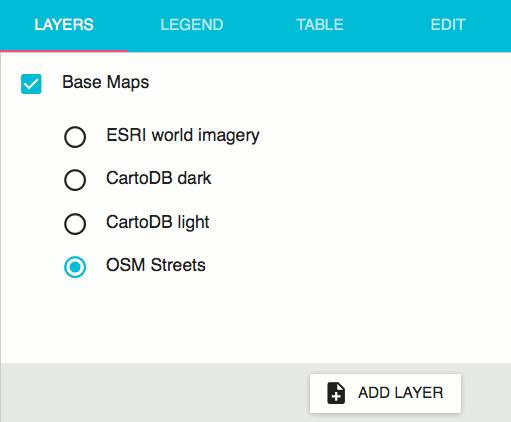
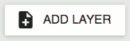
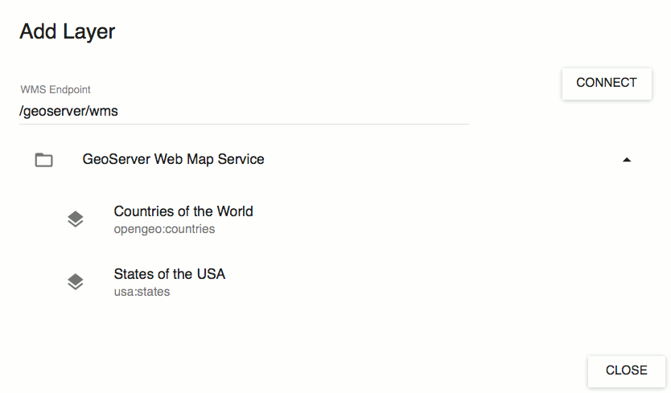
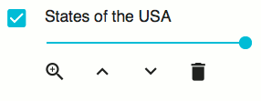

.. _webapps.sdk.quickview.layers:

Layers
======

All maps created with QuickView consist of some number of layers. The layers tab allows you add, remove, and reorder these layers.

QuickView starts out with an unmodifiable Base Map layer in the layer list. This layer serves as the background of your map. All other layers are displayed atop the basemap. You can switch between different basemaps by using the radio buttons, and can disable or enable the basemap by toggling the checkbox.

Adding Layers
-------------

Layers can be added to the map using the :guilabel:`Add Layers` button to the bottom right.

Quickvew can add any layers that are published by a GeoServer. By default, QuickView lists layers from the local GeoServer (assuming a local GeoServer exists and is available). You can list layers from a remote GeoServer by entering the URL to the GeoServer WMS endpoint into the appropriate text box and clicking :guilabel:`Connect`. For example, to add layers from `demo.opengeo.org <http://demo.opengeo.org/geoserver/web>`_, you would enter ``http://demo.opengeo.org/geoserver/wms``.

Click on any layer in the list to add it.

Layer Controls
--------------

Once a layer has been added to the map, it will be listed in the layer list and be displayed in the map window. You will see that each layer has several controls associated with it.

The checkbox toggles whether or not to display the layer. To the right of the checkbox is the title of the layer. Below the title is a slider, which controls the opacity of the layer. Underneath this slider, there are a series of buttons. From left to right:

* The zoom button will zoom the map to the layer bounds.
* The up and down arrows will arrange the layer above or below other layers in the map, with the first layer in the list being the topmost layer on the map.
* The trashcan will remove the layer from the map.
