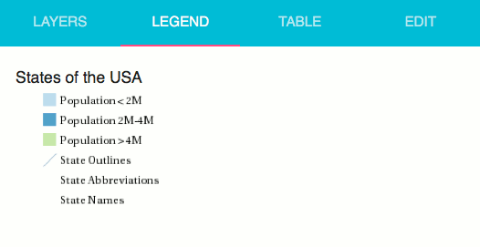

.. _webapps.sdk.quickview.legend:

Legend
======

The legend tab shows a legend for all the layers in the map.

This legend is generated based of the style assigned to the layer in GeoServer. Here, we see the legend for the states layer. The first three legend entries each represent one entry in the population choropleth map. The remaining three show the rules for the boundary lines and labels.

Note that the legend will only be as good as the GeoServer style that is assigned to the layer, as the legend is generated based on the rules and rule names in the style. Refer to :ref:`cartography.ysld` for more information about creating layer styles for GeoServer.