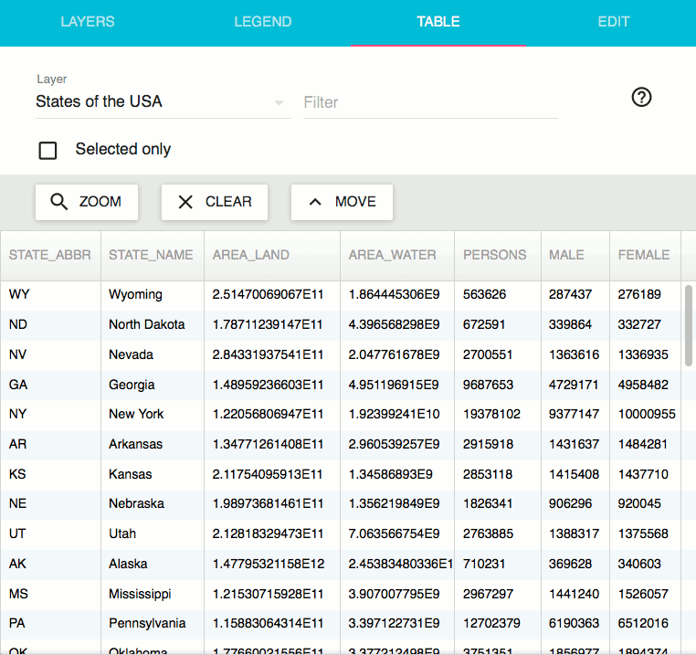

.. _webapps.sdk.quickview.table:

Table
=====

The table tab lists the contents of each feature in the map, and provides functions for filtering based on feature content.

The table tab is is split into two main sections - at the top are the controls, and at the bottom is the feature table

Controls
--------

The controls allow you to specify a layer to view features for, search the feature table, and manipulate the selected features

The :guilabel:`Layer` drop-down controls which layer is shown in the feature table. All actions performed in the :guilabel:`Table` tab will use only this layer.

The :guilabel:`Selected only` checkbox alters the feature table to only show features that are currently selected on the map.

The :guilabel:`Zoom` button zooms the map display to include all currently selected features.

The :guilabel:`Clear` button deselects all currently selected features.

The :guilabel:`Move` button alters the feature table to show features that are currently selected at the top of the table, and all other features below. It has no effect if the :guilabel:`Selected only` checkbox is checked.

The :guilabel:`Filter` field lets you search the feature table for specific features based on a general keyword or a more specific filter. If you just enter text into the :guilabel:`Filter` field, it will search all fields of the feature table for that text. Alternatively, you can use a filter expression to narrow your search based on certain attributes.

Filter Syntax
~~~~~~~~~~~~~

A filter expression consists of terms and operators. Terms represent values in the filter expression. Operators apply some operation to one or more terms in order to produce a result. When the result of an expression applied to a single feature is ``true``, that feature will be returned by the filter. 

.. highlight:: none

Valid terms are:

.. list-table::
   :widths: 20 60 20
   :header-rows: 1
   :class: non-responsive

   * - Term
     - Description
     - Example
   * - Literal
     - A literal is a String or a number. Strings can consist of any number of arbitrary characters, and must be surrounded by double quotes (``"``). Numbers consist of any number of digits and up to one decimal point.
     - ::

         "Wyoming"
   * - Attribute
     - Each column of the feature table represents an attribute; the text in the first row is the attribute name. When used in a filter expression, attribute names may be surrounded by single quotes (``'``) for clarity, but this is not required. When evaluating a filter, the attribute name is replaced by the value of that attribute for the current feature being evaluated.
     - ::

         'STATE_NAME'
   * - Expression
     - Any valid filter expression can itself be used as a term in a larger expression. This is most useful with the ``and`` and ``or`` operators, in order to construct a filter that depends upon multiple conditions. It is recommended to surround such sub-expressions in parentheses to reduce ambiguity, but this is not required.
     - ::

         ('PERSONS' > 50000000)

Valid operators are:

.. list-table::
   :widths: 10 60 30
   :header-rows: 1
   :class: non-responsive

   * - Operator
     - Description
     - Example
   * - ``==``
     - Compares two terms, and evaluates to true when both terms are equal.
     - ::

         'STATE_NAME' == "Wyoming"
   * - ``!=``
     - Compares two terms, and evaluates to true when they are not equal.
     - ::

         'STATE_NAME' != "Wyoming"
   * - ``<``
     - Compares two terms, and evaluates to true when the first is less than the second.
     - ::

         'PERSONS' < 1000000
   * - ``<=``
     - Compares two terms, and evaluates to true when the first is less than or equal to the second.
     - ::

         'PERSONS' <= 1000000
   * - ``>``
     - Compares two terms, and evaluates to true when the first is greater than the second.
     - ::

         'PERSONS' > 1000000
   * - ``>=``
     - Compares two terms, and evaluates to true when the first is greater than or equal to the second.
     - ::

         'PERSONS' >= 1000000
   * - ``like``
     - Compares two terms, and evaluates to true when the second term contains the first term (case-insensitive)
     - ::

         'STATE_NAME' like "New"
   * - ``in``
     - Compares one term with a comma-seperated list of terms, and evaluates to true if that term is equal to any term is the list.
     - ::

         'STATE_ABBR' in ("ID","MT","WY")
   * - ``and``
     - Compares two terms, and evaluates to true if both terms evaulate to true.
     - ::

         'AREA_LAND' < 5000000000 
         and 'PERSONS' > 50000000
   * - ``or``
     - Compares two terms, and evaluates to true if one or more terms evaulate to true.
     - ::

         'AREA_LAND' < 5000000000 
         or 'PERSONS' < 50000000
   * - ``not``
     - Applied to a single term; evaluates to true if that term does not evaluate to true.
     - ::

         not ('STATE_NAME' like "New")

Feature Table
-------------

The feature table is responsible for displaying the all the features in the current layer. Each row of the table displays the attribute values for a single feature. Each column represents an attribuite. The table header lists the attribute names. The width of a column can be changed by dragging the divider between any two columns in the table header.

Any features that are selected on the map are highlighted in yellow in the table. Selection can be toggled for a feature by clicking on a row in the table.

If you want to locate a specific feature in the map, you can clear the selection, click on the specific feature in the feature table to select it, then click on the zoom button to zoom to the selected feature.
