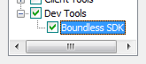

.. _webapps.sdk.remotedeploy:

Preparing a Servlet Container for Remote Application Deployment
===============================================================

The servlet containers used with OpenGeo Suite can be configured to accept 
remote deployments of applications. This allows a developer to build an application
locally and deploy to a remote server.

Containers use a role named "manager" to control deployment. In order to perform
a remote deployment the client must authenticate as a user with this role.

Configuring the servlet container is a two step process:

#. Install the necessary extensions to allow for remote deployment
#. Setup the password for the "manager" role. 

Follow the instructions below for the relevant platform.

It is necessary to set a "manager" password on the OpenGeo Suite servlet container so it can accept a deployed application.  This process only needs only to be done once per server.  Subsequent application deployments will use the same credentials.

Once this process is completed, you can use the included SDK scripts to :ref:`deploy the application <webapps.sdk.deploy>` to your instance of the OpenGeo Suite.

Windows
-------

In order to remote deploy on Windows the :guilabel:`Webapp SDK` component must be selected during install. If not installed simply re-run the installer and ensure it is selected.

   Installing the Webapp SDK on Windows

After the Webapp SDK is installed the manager password must be set in 
:file:`C:\Program Files\Boundless\OpenGeo\jetty\etc\realm.properties`. The file 
should have a line like the following::

  manager: mypassword,manager

This means that the username is "manager" (``manager:``), the password is "mypassword", and the user is assigned the "manager" role (``,manager``).

After changing the password restart the :guilabel:`OpenGeo Jetty` service.

Mac
---

.. todo:: this section, we don't yet have the webapp sdk installable for mac

Linux
-----

Unlike Windows and Mac, Linux installations use a Tomcat servlet container. In 
order to perform remote application deployment with Tomcat additional packages 
must be installed.

Feddora/CentOS/Red Hat
^^^^^^^^^^^^^^^^^^^^^^

For Red Hat based distributions install the ``tomcat6-admin-webapps`` package.

.. code-block:: bash

   yum install tomcat6-admin-webapps

.. note:: Depending on the specific distribution and version the Tomact admin package may be named "tomcat5-admin-webapps" or "tomcat-admin-webapps." Use the command ``yum search tomcat`` to determine which is appropriate. 

Jump to :ref:`tomact_users`.

Ubuntu
^^^^^^

For Ubuntu distributions install the ``tomcat6-admin`` package.

.. code-block:: bash

   apt-get install tomcat6-admin

.. _tomact_users:

Editing tomact-users.xml
^^^^^^^^^^^^^^^^^^^^^^^^

Once the admin package is installed set the manager password by editing the file :file:``/etc/tomcat6/tomcat-users.xml``. Within the ``tomcat-users`` element define a user with the role "manager":

.. code-block:: xml

   <tomcat-users>
     <user username="manager" password="mypassword" roles="manager"/>
   </tomcat-users>

The above sets up a user with user name ``manager`` and password ``mypassword``, with the role of ``manager``.

After editing the file restart Tomcat.
