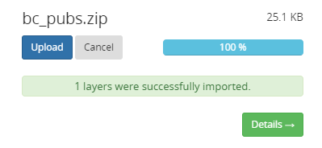
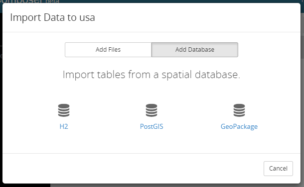
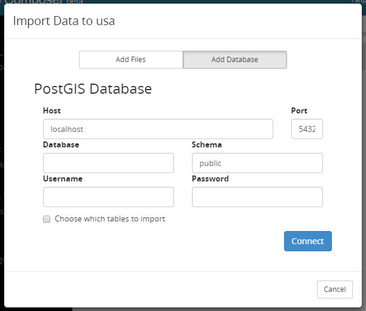

.. _webmaps.composer.configuration:

Configuration
=============

The configuration pages in Composer allow you to manage data, layers, and maps.

This section will describe the various configuration pages. For viewing and styling layers, please see the :ref:`next section <webmaps.composer.styleview>`.

All Project Workspaces
----------------------

This page, accessible from the navigation panel by clicking :guilabel:`Project Workspaces`, displays a list of all project workspaces.

.. figure:: img/allprojectworkspaces.png

   All Project Workspaces

The box at the top of the page provides options to sort the list of project workspaces by name or by last modification, and to filter which project workspaces are displayed based on a string.

For each workspace, links are available for the following functions:

* :guilabel:`Open`, for viewing the maps and layers in the project workspace
* :guilabel:`Settings`, for changing the project workspace name and settings
* :guilabel:`Info`, for showing the number of maps, layers, and stores associated with the project workspace

Project Workspace Settings
--------------------------

On a project workspace settings page, the following options are available:

* :guilabel:`Name`, for changing the project workspace name
* :guilabel:`Namespace URI`, for changing the namespace URI. This is a string that uniquely identifies the namespace to GeoServer. It must be in the form of a URL, but need not resolve to an actual web location
* :guilabel:`Default`, for specifying if this project workspace is the default. If a project is not specified in a GeoServer request, the default project workspace will be assumed.
* :guilabel:`Delete Workspace`, which will remove the project workspace, and **all of the contents of that project workspace**.

After making changes, click :guilabel:`Save Changes`.

.. figure:: img/workspacesettings.png

   Project workspace settings

Project Workspace contents
--------------------------

Clicking the name of a project workspace will bring up the contents of that project workspace.

.. figure:: img/workspace.png

   Project workspace contents

This page contains three tabs which show the following:

* :guilabel:`Maps` (default) shows the list of all maps created in the project workspace
* :guilabel:`Layers` shows the list of all layers published in the project workspace
* :guilabel:`Data` shows the connections to the underlying stores (file or database sources)

.. note:: These tabs can also be accessed through the navigation panel:

   .. figure:: img/tabsinpanel.png

      Accessing project workspace tabs from the navigation panel

At the top, three buttons persist regardless of the active tab:

* :guilabel:`New Map`, which creates a :ref:`new map <webmaps.composer.configuration.newmap>` from new or existing layers
* :guilabel:`Add Data`, which brings up a dialog for :ref:`loading new data <webmaps.composer.configuration.adddata>` to be published as layers
* :guilabel:`Settings`, which brings up the project workspace settings page

Maps tab
~~~~~~~~

The Maps tab lists of all maps created in the project workspace.

The box at the top of the page provides options to sort the list of maps by name or by last modification, and to filter which maps are displayed based on a string.

For each map, there is a small preview of the map, which will open the map for :ref:`styling and viewing <webmaps.composer.styleview>` when clicked. Details about the map are displayed beside the preview, including the number of layers, the spatial reference system used in the map, and how recently the map was modified.

Two other links are found below the map details. The link icon brings up a traditional GeoServer Layer Preview of the map. The gear icon brings up the :guilabel:`Map Settings` page, which allows details about the map to be entered:

* :guilabel:`Map Name`, for the name of the map used in URLs
* :guilabel:`Title`, for the human-readable name of the map
* :guilabel:`Projection` for the spatial reference system of the map
* :guilabel:`Description`, for long-form information about the map

.. figure:: img/mapsettings.png

   Map settings

Layers tab
~~~~~~~~~~

The Layers tab shows all of the layers contained in this project workspace.

As with the Maps tab, the list of layers can be sorted by name or by last modification, and can also be filtered using a string.

Layers listed on this page can be added to a map by clicking them, selecting a map in the :guilabel:`Select a map` dialog, and then clicking the :guilabel:`Add to Map` button.

.. figure:: img/layerstab.png

   Layers tab

For each layer, details are shown, including:

* Geometry type, as indicated by an icon
* Number of attributes, which when clicked will show details
* Last modified date

There are also three links associated with each layer:

* :guilabel:`Style`, to :ref:`edit the style and view the layer <webmaps.composer.configuration>`.
* :guilabel:`Settings`, for configuring details about the layer
* :guilabel:`Copy`, for duplicating the layer (publishing again)

The layer details popup (from the :guilabel:`Settings` link) allows you to set the layer name, title, spatial reference system, and description. There is also a direct link to the GeoServer Admin Edit Layer section, and an option to unpublish the layer if desired.

.. figure:: img/layersettings.png

   Layer Settings

The :guilabel:`Copy` link brings up a very similar dialog to the Layer Settings, used to publish a copy of the layer as a new layer in GeoServer.

.. figure:: img/copylayer.png

   Copying to a new layer

Data tab
~~~~~~~~

The Data tab shows information about the underlying data sources for the project workspace. Any layers published in this project workspace will have an associated data source shown here.

.. figure:: img/datatab.png

   Data tab

As with the Maps and Layers tabs, the list of data sources can be sorted by name or by last modification, and can also be filtered using a string.

Each data source listed can be :guilabel:`Enabled` or :guilabel:`Disabled` by clicking the appropriate button. There is also the option to :guilabel:`Delete` the data source, in which case all associated layers will also be deleted (and all those layers removed from associated maps). 

In certain data sources, one or more resources may be available, and these are shown on the right side. (For example, a PostGIS database may have multiple spatial tables, all of which can be published as layers). Each resource will be indicated as either :guilabel:`Published` or :guilabel:`Unpublished`. Clicking this indicator will show the layers associated with this resource (if any).

.. _webmaps.composer.configuration.adddata:

Add Data
--------

The :guilabel:`Add Data` wizard allows new data sources to be added (uploaded) to GeoServer, from which new layers can be published.

Selecting a source
~~~~~~~~~~~~~~~~~~

There are two options for the type of data to be added to GeoServer: **Files** and **Databases**.

**Spatial files** such as shapefiles or GeoTIFFs can be added to GeoServer. For multi-file formats such as shapefiles, all files must be inside a single ``.zip`` archive. You can click :guilabel:`Browse` to select the file, or drag and drop the file onto the dialog.

.. figure:: img/importdatafile.png

   Import data from files dialog

Once selected, clicking :guilabel:`Upload` will upload the data to the server.

   A succcessful import

Clicking :guilabel:`Details` will show the resources contained in the upload (and the resulting layers published). From here, you can add layers to an existing map, or create a new map.

.. figure:: img/importaddmap.png

   Options for a newly uploaded layer 

**Databases** may also be connected to GeoServer. You can connect to an :guilabel:`H2`, :guilabel:`PostGIS`, or :guilabel:`GeoPackage` database.

   Import data from databases dialog

Once selected, connection-specific details can be input.

   Import data from PostGIS

Click :guilabel:`Connect` to test the connection to the database. If successful, you will have the option of selecting resources to be added to GeoServer and published as layers. These layers can be added to a new or existing map, just like above.

.. _webmaps.composer.configuration.newmap:

New Map
-------

The goal of Composer is to make it easy to create maps, so there are a number of places where you can initiate the :guilabel:`New Map` dialog. In all cases, the process of creating a map is the same.

Creating a new map requires the following information:

* :guilabel:`Map Name`, for the way that the map will be referenced in URLs. It should not contain spaces or more than 10 characters.
* :guilabel:`Title`, the human-readable name of the map. It may contain spaces and be longer than 10 characters.
* :guilabel:`Projection`, the spatial reference system. The default is **Lat/Lon (WGS)**, though Web Mercator or any arbitrary spatial reference system code are allowed.
* :guilabel:`Description`, a longer string of information about the layer. 

.. figure:: img/newmap.png

   New map dialog

Clicking :guilabel:`Add Layers` will allow the layers to be selected for inclusion in the map. All layers in the project workspace will be shown in the list, and layers can be selectively included via check boxes.

.. figure:: img/addlayerstonewmap.png

   Adding layers to new map

Once layers have been selected, the map can be created via the :guilabel:`Create Map with Selected` button. The map will be created and listed in the Maps tab of the project workspace.

   

.. note:: Maps must be contained inside a project workspace, and there must exist layers published in that project workspace before a map can be created.