.. _webmaps.composer.configuration:

Configuration
=============

The configuration pages in Composer allow you to manage data, layers, and maps.

This page will describe the various configuration pages. The next page will discuss :ref:`viewing and styling layers <webmaps.composer.styleview>`.

All Project Workspaces
----------------------

This page, accessible from the navigation panel by clicking :guilabel:`Project Workspaces`, displays a list of all project workspaces.

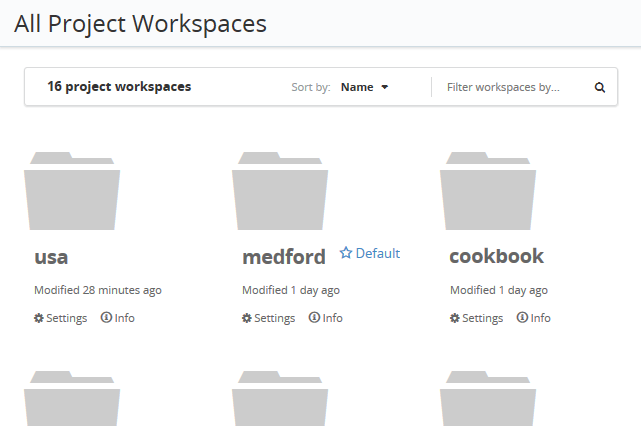

   All Project Workspaces

The box at the top of the page provides options to sort the list of project workspaces by name or by last modification, and to filter which project workspaces are displayed based on a string.

For each workspace, links are available for the following functions:

* Clicking the name of the project workspace will :guilabel:`Open` it, allowing the user to view the maps and layers in the project workspace.
* :guilabel:`Settings`, for changing the project workspace name and settings.
* :guilabel:`Info`, for showing the number of maps, layers, and stores associated with the project workspace.

.. _webmaps.composer.configuration.workspacesettings:

Project Workspace Settings
--------------------------

On a project workspace settings page, the following options are available:

* :guilabel:`Name`, for changing the project workspace name.
* :guilabel:`Namespace URI`, for changing the namespace URI. This is a string that uniquely identifies the namespace to GeoServer. It must be in the form of a URL, but need not resolve to an actual web location.
* :guilabel:`Default`, for specifying if this project workspace is the default. If a project is not specified in a GeoServer request, the default project workspace will be assumed.
* :guilabel:`Delete Workspace`, which will remove the project workspace, and **all of the contents of that project workspace**, including layers and styles.

After making changes, click :guilabel:`Save Changes`.

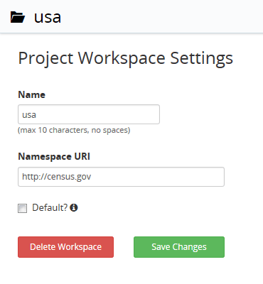

   Project workspace settings

.. _webmaps.composer.configuration.workspacecontents:

Project Workspace contents
--------------------------

Clicking the name of a project workspace will bring up the contents of that project workspace.

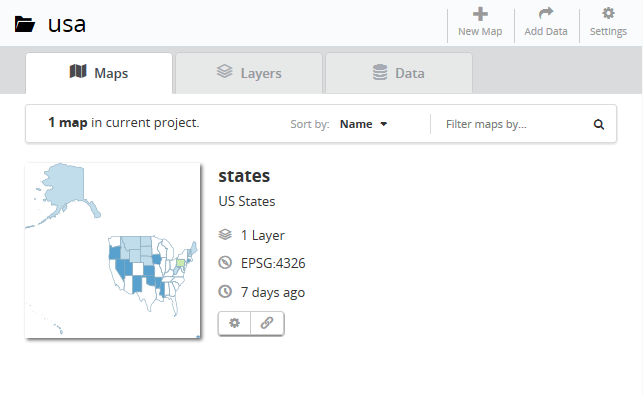

   Project workspace contents

This page contains three tabs which show the following:

* :guilabel:`Maps` *(default)* shows the list of all maps created in the project workspace
* :guilabel:`Layers` shows the list of all layers published in the project workspace
* :guilabel:`Data` shows the connections to the underlying stores (file or database sources)

.. note:: These tabs can also be accessed through the navigation panel:

   .. figure:: img/tabsinpanel.png

      Accessing project workspace tabs from the navigation panel

At the top, three buttons persist regardless of the active tab:

* :guilabel:`New Map`, which creates a :ref:`new map <webmaps.composer.configuration.newmap>` from new or existing layers
* :guilabel:`Add Data`, which brings up a dialog for :ref:`loading new data <webmaps.composer.configuration.adddata>` to be published as layers
* :guilabel:`Settings`, which brings up the :ref:`webmaps.composer.configuration.workspacesettings` page

.. _webmaps.composer.configuration.workspacecontents.maps:

Maps tab
~~~~~~~~

The :guilabel:`Maps` tab lists of all maps created in the project workspace, and is the default tab for a workspace.

The box at the top of the page provides options to sort the list of maps by name or by last modification, and to filter which maps are displayed based on a string.

For each map, there is a small preview of the map, which will open the map for :ref:`styling and viewing <webmaps.composer.styleview>` when clicked. Details about the map are displayed beside the preview, including the number of layers, the spatial reference system used in the map, and how recently the map was modified.

Three other buttons are found below the map details:

* The :guilabel:`gear` icon brings up the :guilabel:`Map Settings` page.
* The :guilabel:`link` icon brings up a traditional GeoServer Layer Preview of the map.
* The :guilabel:`js` icon brings up an OL3 Export dialog, for embedding the map in a web page.

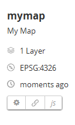

   Map details buttons

The :guilabel:`Map Settings` page allows details about the map to be entered:

* :guilabel:`Map Name`, for the name of the map used in URLs
* :guilabel:`Title`, for the human-readable name of the map
* :guilabel:`Projection`, for the spatial reference system of the map
* :guilabel:`Extent`, for the default region visible when rendering the map. 
* :guilabel:`Generate Extent`, to calculate the max extent based on the map contents. This can be useful when changing between projections with different units.
* :guilabel:`Description`, for long-form information about the map
* :guilabel:`Render Timeout`, for canceling long-running map requests when styling the map. 

  .. note:: If a map request exceeds its `timeout <../../geoserver/services/wms/vendor.html#format-options>`_, a `partial image <../../geoserver/services/wms/reference.html#exceptions>`_ may be returned.

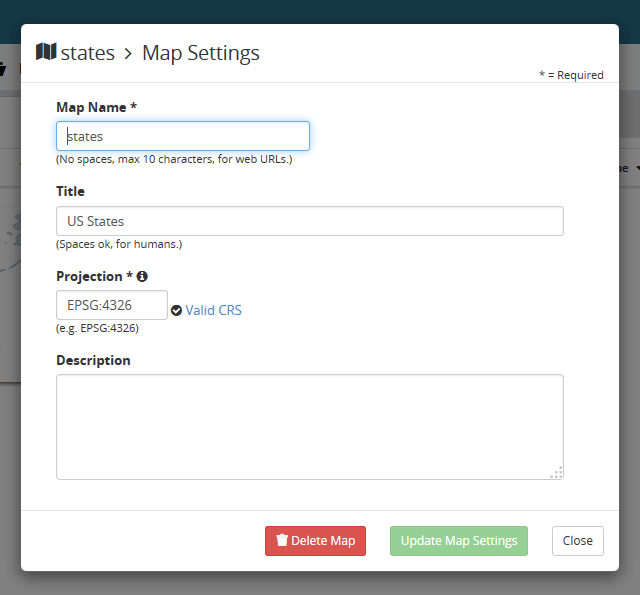

   Map settings

.. _webmaps.composer.configuration.workspacecontents.layers:

Layers tab
~~~~~~~~~~

The :guilabel:`Layers` tab shows all of the layers contained in this project workspace.

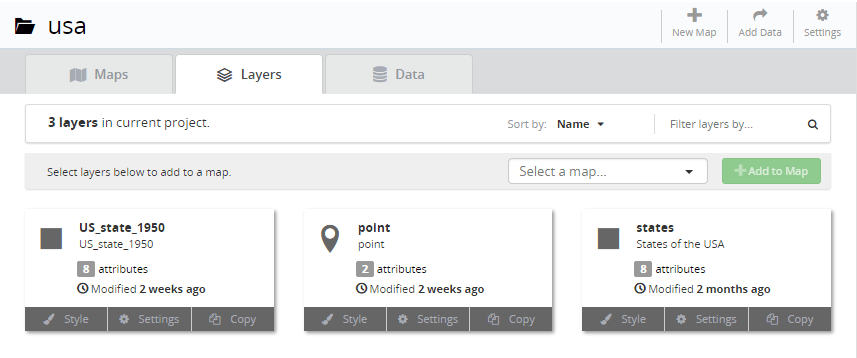

   Layers tab

As with the Maps tab, the list of layers can be sorted by name or by last modification, and can also be filtered using a string.

Layers listed on this page can be added to a map by clicking them, selecting a map in the :guilabel:`Select a map` dialog, and then clicking the :guilabel:`Add to Map` button.

For each layer, details are shown, including:

* Layer thumbnail
* Geometry type, as indicated by an icon
* Number of attributes, which when clicked will show details
* Last modified date

There are also three links associated with each layer:

* :guilabel:`Style`, to :ref:`edit the style and view the layer <webmaps.composer.configuration>`.
* :guilabel:`Settings`, for configuring details about the layer
* :guilabel:`Copy`, for duplicating the layer (publishing again)

The layer details popup (from the :guilabel:`Settings` link) allows you to set the layer name, title, spatial reference system (SRS), and description. There is also a direct link to the GeoServer Admin Edit Layer section, and an option to unpublish the layer if desired.

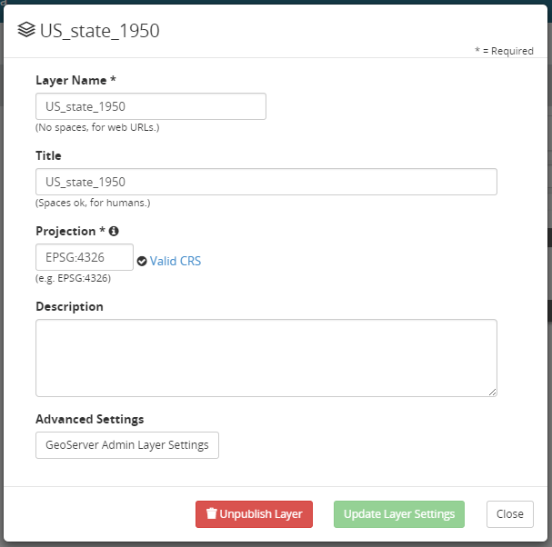

   Layer Settings

The :guilabel:`Copy` link brings up a very similar dialog to the Layer Settings, used to publish a copy of the layer as a new layer in GeoServer.

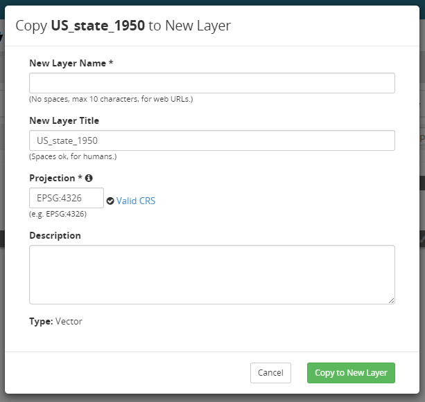

   Copying to a new layer

.. _webmaps.composer.configuration.workspacecontents.data:

Data tab
~~~~~~~~

The :guilabel:`Data` tab shows information about the underlying data sources for the project workspace. Any layers published in this project workspace will have an associated data source shown here.

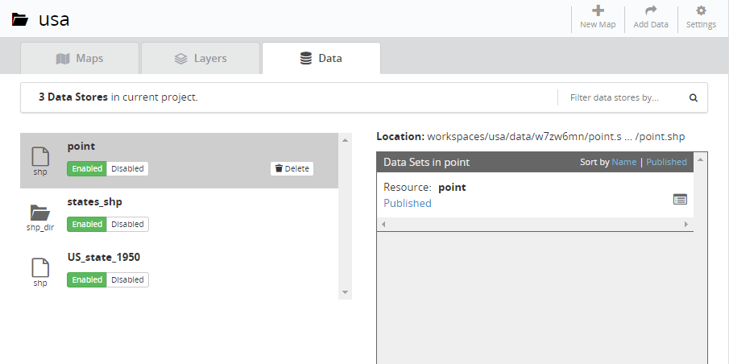

   Data tab

Similar to the :ref:`webmaps.composer.configuration.workspacecontents.maps` and :ref:`webmaps.composer.configuration.workspacecontents.layers`, the list of data sources can be sorted by name or by type, and can also be filtered using a string. 

Each data source listed can be :guilabel:`Enabled` or :guilabel:`Disabled` by clicking the appropriate button. There is also the option to :guilabel:`Delete` the data source, in which case all associated layers will also be deleted (and all those layers removed from associated maps). 

In certain data sources, one or more resources may be available, and these are shown on the right side. (For example, a PostGIS database may have multiple spatial tables, all of which can be published as layers). Each resource will be indicated as either :guilabel:`Published` or :guilabel:`Unpublished`. Clicking this indicator will show the layers associated with this resource (if any). 

The list of resources can be sorted by name or published status, and can be filtered using a string.

.. _webmaps.composer.configuration.adddata:

Add Data
--------

The :guilabel:`Add Data` wizard allows new data sources to be added (uploaded) to GeoServer, from which new layers can be published.

Selecting a source
~~~~~~~~~~~~~~~~~~

There are two options for the type of data that can be added to GeoServer: **Spatial files** and **Databases**.

**Spatial files** such as shapefiles or GeoTIFFs can be added to GeoServer. Certain :ref:`extensions <intro.extensions>` may add support for additional file types; clicking the information icon (:guilabel:`i`) will display the list of file types currently supported. 

You can click :guilabel:`Browse` to select one or more files, or drag and drop any number of files onto the dialog. For multi-file formats such as shapefiles, all files should be included in the import.

If you already have a store defined in the current workspace, you can choose to import the selected files into an existing store rather than creating a new store.

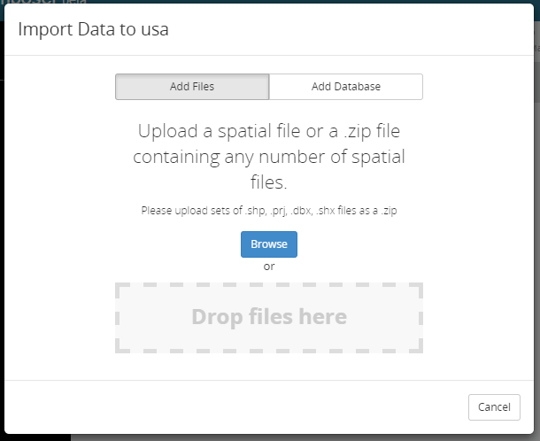

   Import data from files dialog

Once selected, clicking :guilabel:`Upload` will upload the data to the server.

Clicking :guilabel:`Load` will show the resources contained in the upload (and the resulting layers available for import). From here, you can select resources to add to GeoServer and publish as layers, add imported layers to an existing map, or create a new map.

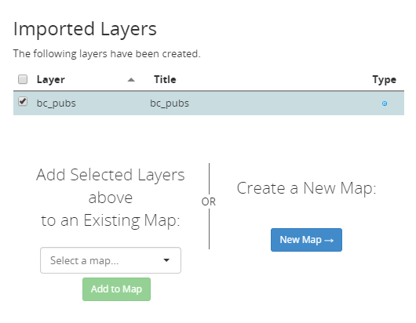

   Options for a newly uploaded layer 

**Databases** may also be connected to GeoServer. Specifically, the following databases are supported:

* PostGIS
* GeoPackage
* H2

Support for additional databases can be enabled by installing the appropriate :ref:`extension <intro.extensions>`.

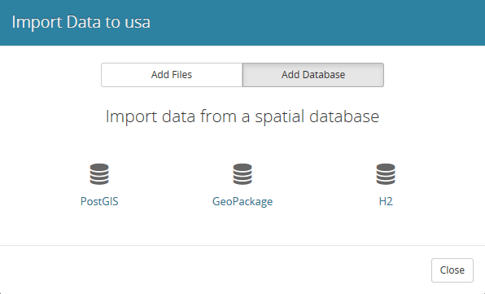

   Importing a database

Click the desired database to bring up a form. You will need to supply connection parameters for the specific database.

.. todo:: Add screenshots for each database.

Once the form is filled out, click :guilabel:`Connect` to test the connection to the database. If successful, you will have the option of selecting resources to be added to GeoServer and published as layers. These layers can be added to a new or existing map, just like above.

.. note:: If you encounter difficulties during import, check that the projection/SRS is correct, as this is typically the cause of errors.

.. _webmaps.composer.configuration.newmap:

New Map
-------

The goal of Composer is to make it easy to create maps, so there are a number of places where you can initiate the :guilabel:`New Map` dialog. In all cases, the process of creating a map is the same.

Creating a new map requires the following information:

* :guilabel:`Map Name`, for the way that the map will be referenced in URLs. It should not contain spaces or more than 10 characters.
* :guilabel:`Title`, the human-readable name of the map. It may contain spaces and be longer than 10 characters.
* :guilabel:`Projection`, the spatial reference system. The default is **Lat/Lon (WGS)**, though Web Mercator or any arbitrary spatial reference system code are allowed.
* :guilabel:`Description`, a longer string of information about the layer. 

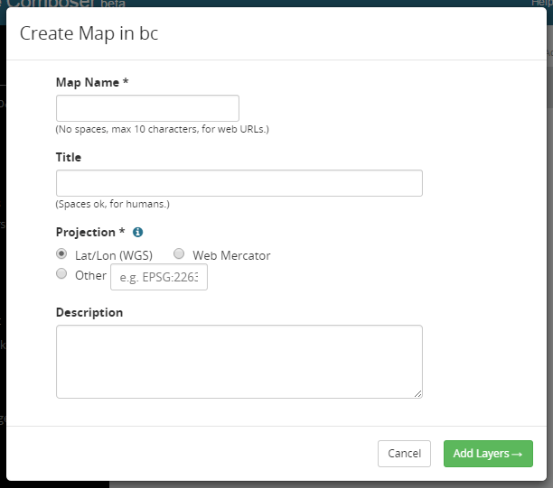

   New map dialog

Clicking :guilabel:`Add Layers` will allow the layers to be selected for inclusion in the map. All layers in the project workspace will be shown in the list, and layers can be selectively included via check boxes.

.. figure:: img/addlayerstonewmap.png

   Adding layers to new map

Once layers have been selected, the map can be created via the :guilabel:`Create Map with Selected` button. The map will be created and listed in the Maps tab of the project workspace.

.. note:: Maps must be contained inside a project workspace, and there must exist layers published in that project workspace before a map can be created.