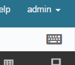
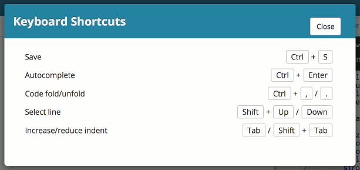
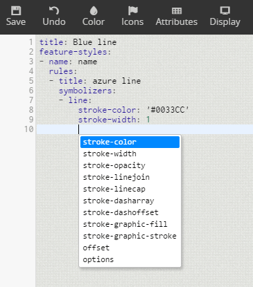
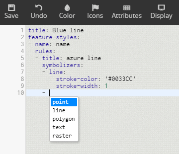
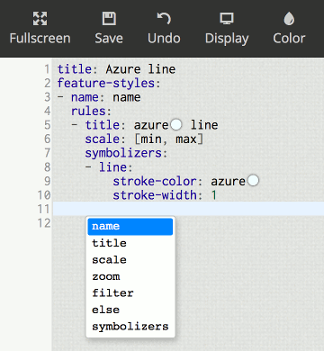
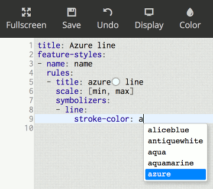
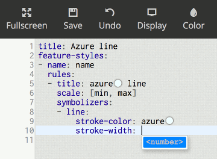
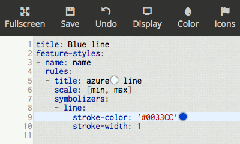
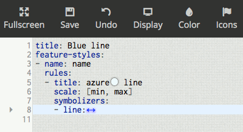
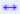

.. _webmaps.composer.keys:

Keyboard functions and shortcuts
================================

Navigating around the style editor interface is easy with the mouse, but there are some useful keyboard functions available that can make using Composer even easier.

.. list-table::
   :class: non-responsive
   :header-rows: 1
   :stub-columns: 1

   * - Function
     - Shortcut
   * - Save
     - :guilabel:`Ctrl` + :guilabel:`S`
   * - Autocomplete
     - :guilabel:`Ctrl` + :guilabel:`Enter`
   * - Code fold / unfold
     - :guilabel:`Ctrl` + :guilabel:`,` / :guilabel:`Ctrl` + :guilabel:`.`
   * - Comment / uncomment
     - :guilabel:`Ctrl` + :guilabel:`3`
   * - Select line
     - :guilabel:`Shift` + :guilabel:`Up` and :guilabel:`Shift` + :guilabel:`Down`
   * - Increase / reduce indent
     - :guilabel:`Tab` / :guilabel:`Shift` + :guilabel:`Tab`

This list can be retrieved by clicking the keyboard icon on the top right of the window.

   Icon to show keyboard shortcuts

The resulting list will be displayed.

   List of keyboard shortcuts

Save (:guilabel:`Ctrl` + :guilabel:`S`)
---------------------------------------

Like many typical programs, you can save your progress by pressing :guilabel:`Ctrl` + :guilabel:`S` (:guilabel:`Cmd` + :guilabel:`S` on OS X).

If there are no errors, you will see a :guilabel:`Style saved` note at the top of the window.

   Style saved

If there is an error, the line that contains the error will be highlighted, and any other details known about the error will be listed.

Auto-complete (:guilabel:`Ctrl` + :guilabel:`Enter`)
----------------------------------------------------

The style editor offers an easy way to explore and determine the correct syntax for functions by way of an auto-complete function.

Auto-complete is activated by pressing :guilabel:`Ctrl` + :guilabel:`Enter` (:guilabel:`Cmd` + :guilabel:`Enter` on OS X). A drop-down list will display showing a list of possible options. The location of the cursor and the context will determine what goes in this list.

   Auto-complete

This can also be useful during debugging, as you can verify if an option is in the right place by verifying that it appears in the appropriate list.

Not only does the auto-complete respect cursor location, but it also respects whether the expected option will be a list, a mapping, or a value.

.. note:: Read more about lists, mappings, and more :ref:`YSLD structure <cartography.ysld.reference.structure>`.

When auto-complete is triggered on a list item (noted by the dash prefix), only list options will be shown:

   Auto-complete on a list

Removing the dash and triggering auto-complete will show only mapping entries:

   Auto-complete on a mapping

When auto-complete is triggered on a value with a finite number of possible values, the list of values will be shown:

   Auto-complete on a named color

When auto-complete is triggered on a value with an infinite number of possible values, a hint will be shown:

   Auto-complete on a number

Code folding (:guilabel:`Ctrl` + :guilabel:`,` / :guilabel:`Ctrl` + :guilabel:`.`)
----------------------------------------------------------------------------------

It can sometimes be useful to hide and display certain portions of the code. This is known as "code folding".

Code folding is activated by pressing :guilabel:`Ctrl` + :guilabel:`,` (:guilabel:`Cmd` + :guilabel:`,` on OS X). The code to be folded is dependent on where the cursor is.

When the cursor is on a line that contains a list entry (with the dash) the entire contents of that list entry will be folded.

   List entry before folding

   List entry folded

When the cursor is on a line that is inside a mapping (no dash), then the contents of the *parent* will be folded. In this case, the cursor will move to the parent line from the (now-hidden) original line.

.. note:: Read more about lists, mappings, and more :ref:`YSLD structure <cartography.ysld.reference.structure>`.

Code that is folded is indicated by a |doublearrow| at the end of a line, with a small arrow shown in the margin area to the left of the line. Placing the cursor on this line and pressing :guilabel:`Ctrl` + :guilabel:`.` (:guilabel:`Cmd` + :guilabel:`.` on OS X) will unfold the code. You can also click the |doublearrow| icon to unfold the code. Attempting to navigate into the folded region using the arrow keys will also unfold the code.

As another indicator of code folding, the line numbers in the margin will become discontinuous.

.. note:: It is not possible to force folding using tokens or regions.

Comment/uncomment selection (:guilabel:`Ctrl` + :guilabel:`3`)
--------------------------------------------------------------

It may be useful to comment out a block of text so that it does not affect the style. This can be done by selecting the text to be commented and pressing :guilabel:`Ctrl` + :guilabel:`3`. All lines selected (or partially selected) will then have a ``#`` added to the beginning of the line, indicating that the line is now commented out.

This can be reversed by selecting the commented text and pressing :guilabel:`Ctrl` + :guilabel:`3` again.

Select line (:guilabel:`Shift` + :guilabel:`Up` and :guilabel:`Shift` + :guilabel:`Down`)
-----------------------------------------------------------------------------------------

As in many other programs, holding :guilabel:`Shift` and moving the cursor with the arrow keys will select all characters between the original cursor position and the new cursor position. By this method, :guilabel:`Shift` + :guilabel:`Up` will select the previous line and :guilabel:`Shift` + :guilabel:`Down` will select the next line. :guilabel:`Shift` + :guilabel:`Left` will select the previous character and :guilabel:`Shift` + :guilabel:`Right` will select the next character.

Increase/reduce indent (:guilabel:`Tab` and :guilabel:`Shift` + :guilabel:`Tab`)
--------------------------------------------------------------------------------

Since proper :ref:`indenting <cartography.ysld.reference.structure.indentation>` is so crucial to YSLD syntax, it can be useful to change the indentation of a block of text together. Selecting a block of text and then pressing :guilabel:`Tab` will increase the indentation of all selected lines by two spaces. Pressing :guilabel:`Shift` + :guilabel:`Tab` will decrease the indentation of all selected lines by two spaces.
