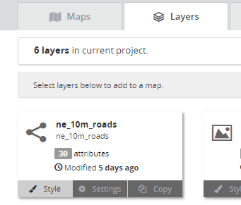
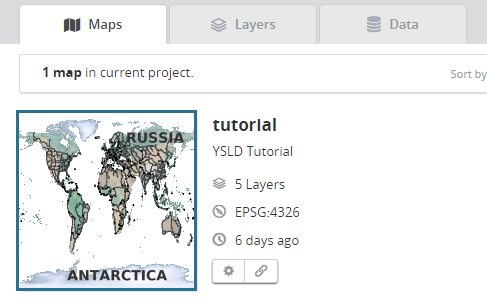
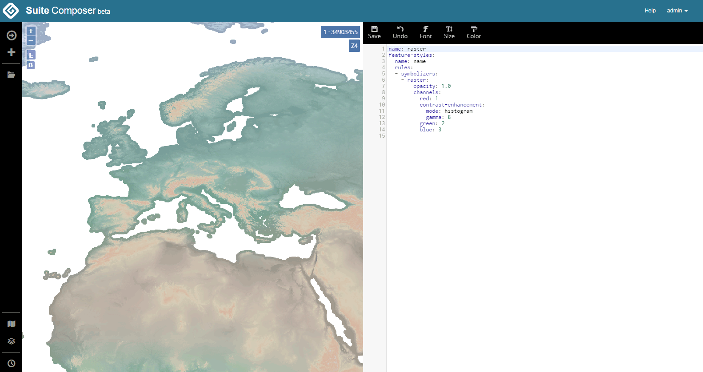
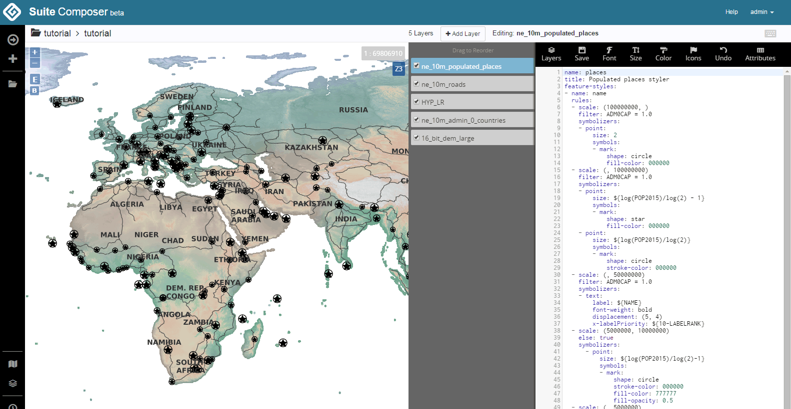

.. _webmaps.composer.styleview:

Viewing and styling maps and layers
===================================

Once layers and maps have been published and created, the next step is to view and style them appropriately. Composer makes this easy by offering a single editing environment where layers can be viewed, styles edited, and the view refreshed, all without leaving the page.

Accessing the Style Editor
--------------------------

The Style Editor can be accessed for a single layer or for a map.

To view a single layer, select the layer in the appropriate :ref:`webmaps.composer.configuration` page and then click :guilabel:`Style`.

   Link to view/style a layer

To view a map, navigate to the map in the appropriate :ref:`webmaps.composer.configuration` page and click the preview image.

   Link to view/style a map

Style Editor
------------

The Style Editor is mostly the same whether styling a layer or a map. The only difference is the existence of the layer panel in the middle of the screen.

   Styling a single layer

   Styling a map (with layer panel)

The Style Editor page consists of a navigation bar and two (or three) panels.

The navigation bar sits above the panels and displays the following information:

* To the left is a breadcrumb navigation, consisting of the workspace name (which links back to the project workspace page) and the map or layer name (which shows the map or layer settings)
* For maps only, the number of layers, a button to add layers to the map, and the name of the current layer are all shown on the right side of the toolbar.
* For both maps and layers, there is a keyboard icon (which shows the :ref:`keyboard shortcuts<webmaps.composer.keys>` for the style editor), and a gear icon (which also shows the map or layer settings).

The main part of the window displays the following:

* The **viewer** on the left side shows the current style of layer or map. In this panel there are buttons for zoom in/out, zoom to extent, and copy bounds. There is also the current scale and zoom level. This panel is seperated from the other panels by a horizontal gray bar, which can be dragged to adjust the relative size of the panels.
* For maps only, there is a **layer panel**. This contains a list with elements that can be dragged to adjust layer drawing order. Each layer can be toggled on or off in visibility (without removing them from the map).
* The **style** panel shows the current style for the selected layer. Even if viewing a map, only one layer's style will be shown at a time.

.. todo:: Names are made up.

Style toolbar
~~~~~~~~~~~~~

On the style panel there is a toolbar with the following buttons:

.. list-table::
   :class: non-responsive
   :header-rows: 1
   :stub-columns: 1

   * - Button
     - Description
   * - :guilabel:`Fullscreen`
     - Toggle fulscreen editing mode, where the **style** and **layer list** panels float above the **viewer**, which expands to the full screen size.
   * - :guilabel:`Layers`
     - Shows/hides the layers panel. Only shown when viewing a map.
   * - :guilabel:`Save`
     - Saves the current style.
   * - :guilabel:`Undo`
     - Returns to a previous version of the style.
   * - :guilabel:`Display`
     - Provides a list of options for changing how the map and style code are displayed. The background color, font, and font size of the style section can be changed, while the map controls can be changed, as well as a basemap added.
   * - :guilabel:`Color`
     - Allows a color to be chosen from a color picker and subsequently inserted into the style.
   * - :guilabel:`Icons`
     - Allows for icons (graphics) to be chosen and inserted into a style. Icons can be uploaded from this dialog as well. See the section on :ref:`webmaps.composer.styleview.icons`.
   * - :guilabel:`Attributes`
     - Shows a list of the available attributes. Useful when creating :ref:`style filters <cartography.ysld.reference.filters>`.
   * - :guilabel:`SLD`
     - Shows the SLD equivalent of the saved YSLD style.

Editing styles
~~~~~~~~~~~~~~

Styles are written in the :ref:`YSLD <cartography.ysld>` markup language, which is compatible with, but simpler than, SLD, which is the standard style language used with GeoServer. For more information about YSLD syntax, please see the section on :ref:`cartography.ysld`.

.. _webmaps.composer.styleview.icons:

Using icons in a style
~~~~~~~~~~~~~~~~~~~~~~

Composer has the ability to upload icons and other graphics and associate them with a given layer's style.

To upload an image file to be used as a graphic in a style:

#. In the style toolbar, click :guilabel:`Icons`.

   .. figure:: img/icons_button.png

      Icons button in the style toolbar

#. A list of the available icons in that project workspace will be shown, if any.

   .. figure:: img/icons_list.png

      No icons available in the project workspace

#. Click :guilabel:`Upload icon`.

#. A file chooser will display. Select the file on your system to be uploaded.

#. The file will then be displayed in the list.

   .. figure:: img/icons_new.png

      Newly uploaded icon available

#. To add this icon to the current style, select the icon and then click :guilabel:`Copy selected to Clipboard`.

#. The dialog will close automatically. Paste the text in the appropriate location, such as:

   .. code-block:: yaml
      :emphasize-lines: 3-5

      point:
        symbols:
        - external:
            url: smileyface.png
            format: image/png

   .. figure:: img/icons_pasted.png

      Icon location added to style

.. note:: All web-friendly file formats are supported through this interface.

