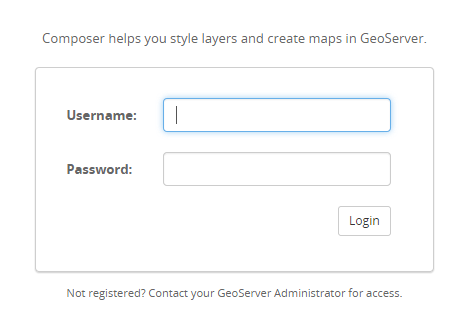
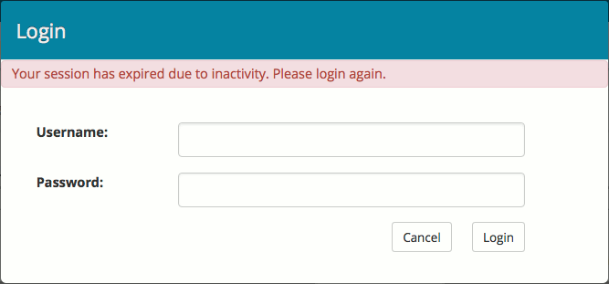
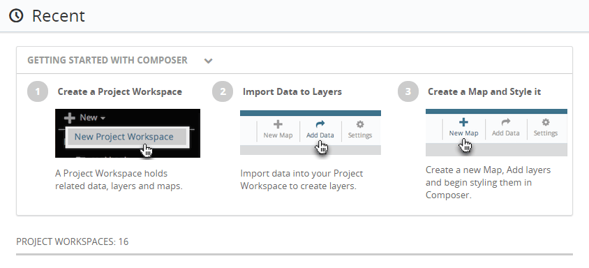
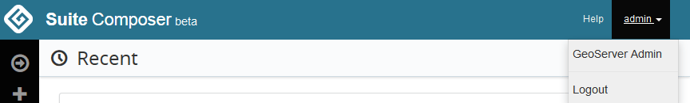
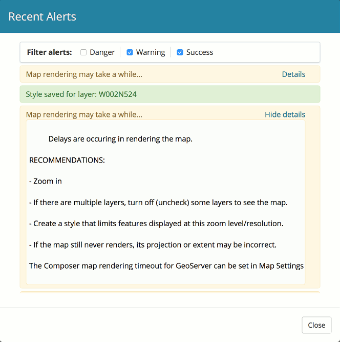
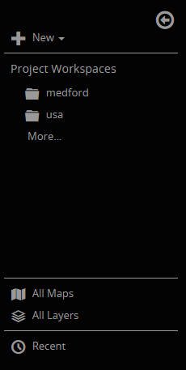

.. _webmaps.composer.tour:

A tour of Composer
==================

This section will introduce the Composer interface.

The Composer interface consists of two main sections:

* :ref:`Configuration <webmaps.composer.configuration>` 
* :ref:`Style Editor <webmaps.composer.styleview>`

The Configuration pages regard the composition of maps, the availability of layers, and the data that comprises them. The Style Editor page provides an interface for viewing and styling layers and maps, with the view updating in real-time.

Logging in
----------

Because of the ability to make low-level configuration changes to GeoServer, **access to Composer is only granted to users with administrative rights to GeoServer**.

   Login page for Composer

Enter an administrative user name and password and click :guilabel:`Login` to access Composer. When you first log in, you will be in the Configuration section.

.. note:: The default GeoServer administrator credentials are ``admin`` / ``geoserver``.

Composer is aware of the GeoServer Admin interface log in, so if you are already logged in there using the same browser, Composer will log you in as well without prompting. 

Session expiration and logging out
----------------------------------

If you leave Composer unattended for more than **30 minutes**, you will be automatically logged out, and the dialog will appear again. After logging back in, you will be able to continue right where you left off—any unsaved data will be preserved.

   Session expired dialog

Because Composer login information is tied to GeoServer, if you log out of the GeoServer Admin, you will be automatically be logged out of Composer as well.

Home page / Recent
------------------

This page is shown when first logging in to Composer. It contains a list of recently accessed resources (if any), and also includes a three-step section on :guilabel:`Getting Started with Composer`.

   Home page showing Getting Started with Composer

.. note:: See the :ref:`webmaps.composer.tutorial` for more details on the Composer workflow.

Toolbar
-------

When logged in, the top of the application will always contain four links:

* Composer Home, accessible by clicking the :guilabel:`Suite Composer` logo and title on the left
* :guilabel:`Help`, to bring up this documentation
* :guilabel:`Recent Alerts`, to display a list of recent errors and other messages
* User settings, usually noted with the user name :guilabel:`admin`, links to the GeoServer Admin interface and logout

   Toolbar

Recent Alerts
~~~~~~~~~~~~~

Clicking the :guilabel:`Recent Alerts` link in the toolbar will display the Recent Alerts dialog. This window lists all alerts, warnings, and messages for the current browser session. This list can be filtered by type using the three checkboxes: :guilabel:`Danger`, :guilabel:`Warning`, and :guilabel:`Success`.

If an alert contains additional details, they can be shown or hidden by clicking the :guilabel:`Details` and :guilabel:`Hide Details` links.

   Recent Alerts dialog

Navigation panel
----------------

All Configuration pages contain the same Navigation panel on the left side of the screen. This panel contains the following options:

* :guilabel:`New` menu: Creates a new project workspace.
* :guilabel:`Project Workspaces`: Lists all project workspaces available on the server. If the screen size is small, or if the list of project workspaces is large, a :guilabel:`More` link will appear, which will take you to the :guilabel:`All Project Workspaces` page.

   * Within each individual project workspace listing, there are links to view its :guilabel:`Maps`, :guilabel:`Layers`, and :guilabel:`Data`.

* :guilabel:`All Maps`: Lists all maps in all project workspaces.
* :guilabel:`All Layers`: Lists all published layers
* :guilabel:`Recent`: Shows all recently accessed resources.

   Navigation panel

The Navigation panel can be collapsed and expanded by clicking the arrow at the top of the panel. While collapsed, all of the functionality is still available.

Terminology
-----------

In order to simplify map-making for those new to the tools, some of the terms used in Composer may be different from what you are used to. The following table may make using Composer easier:

.. list-table::
   :class: non-responsive
   :header-rows: 1
   :stub-columns: 1

   * - Term
     - Description
     - GeoServer equivalent
   * - Project Workspace
     - A container for layers and maps. All work in Composer happens inside a given project workspace
     - Workspace (or namespace)
   * - Maps
     - A collection of one or more (styled) layers to be viewed simultaneously. Composer is intended to make map creation easier.
     - Layer groups
   * - Layers
     - A collection of geospatial features, all from a common source
     - Layers
