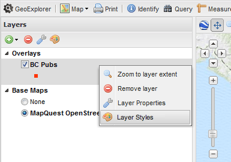
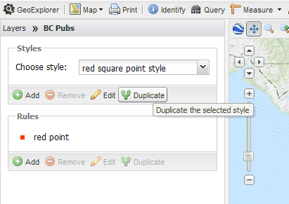

.. _webmaps.basic.style:

Style your layers
=================

After uploading, GeoExplorer will automatically bring up the styling dialog. While a simple style has been generated for your layer by default, you may wish to customize this style. GeoExplorer contains a tool to create and edit styles graphically.

.. warning:: All style changes will apply and persist on the server immediately. It is recommended to make a backup of a style before making any changes.

You can reach the Styles dialog at a later time by selecting a layer in the Layer list and then clicking on the Palette icon, or by right-clicking on the layer and selecting :guilabel:`Edit Styles`.

   *Select this menu item to edit the layer style*

To edit a style for a given layer:

#. In the Styles dialog you will see a default Style containing a single Rule. We'll leave the existing Style alone, but will create a duplicate where we will make edits. Click on the :guilabel:`Duplicate` button underneath the Style name.

   *Duplicating the Style*

#. A dialog will appear for entering a new Title and Abstract. Enter this information and click :guilabel:`Save`.

   .. figure:: img/style_metadata.png

      *Style metadata*

   .. figure:: img/style_savebutton.png

      *Click Save when done*

#. Make sure the duplicated Style is selected in the :guilabel:`Choose style` dialog.

   .. figure:: img/style_styleselect.png

      *Selecting the new style*

#. Click on the existing rule in the :guilabel:`Rules` box, and then click the :guilabel:`Edit` button underneath.

   .. figure:: img/style_editrulebutton.png

      *Click this button to edit the style rule*

#. Change the style as you see fit, selecting from a range of options including size, color, opacity, filters, and much more.

   .. note:: Please see the `GeoExplorer Documentation <../../geoexplorer/>`_  for more about what can be styled here.

   .. figure:: img/style_ruleedit.png

      *Editing the style*

   .. figure:: img/style_colorpicker.png

      *Using the color picker* 

#. Click :guilabel:`Save` to persist your changes. To go back to the main Layers List, click on the :guilabel:`Layers` title in the Layers Panel at the top where it says :guilabel:`Layers >> <your layer>`.

   .. figure:: img/style_editcomplete.png

      *A new style for the layer*

#. Repeat this process for any layers that you wish to style. To edit styles for another layer, select the layer in the Layers Panel and then click on the Palette icon, or right-click on the layer and select :guilabel:`Edit Styles` as shown above.

.. note::  If you need a more customized or complex style than what is possible through GeoExplorer, you can code your own style. See the `Styling section <../../geoserver/styling/>`_ of the `GeoServer documentation <../../geoserver/>`_ for more information.

Now that your layers are styled, the next step is to :ref:`webmaps.basic.edit`.